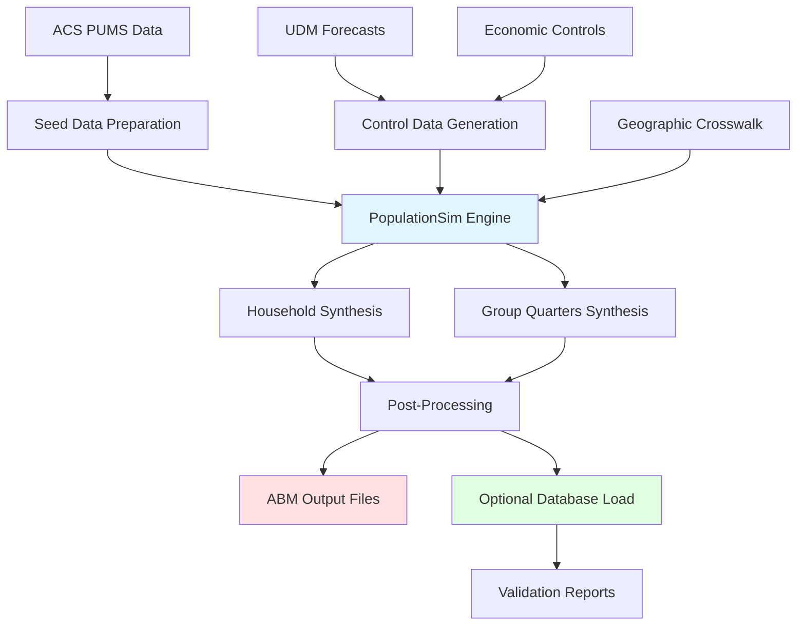
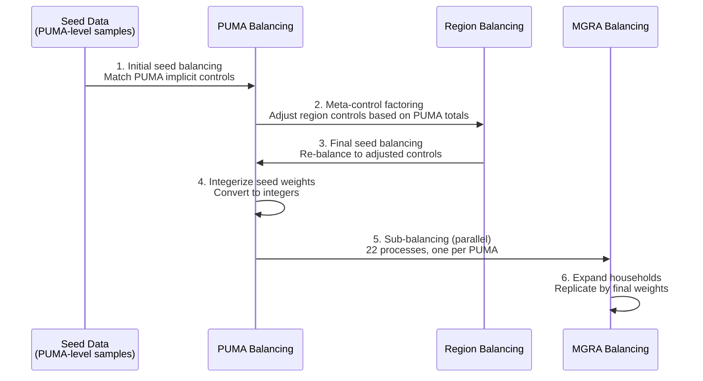
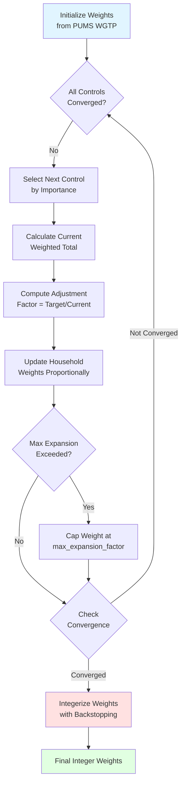
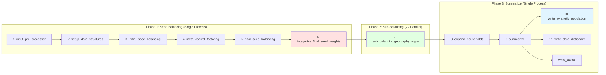
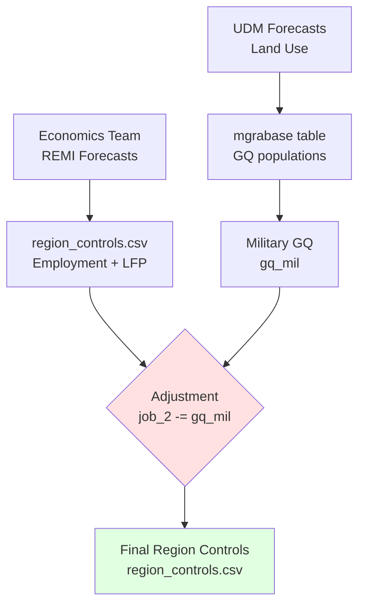
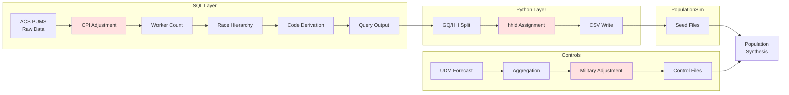
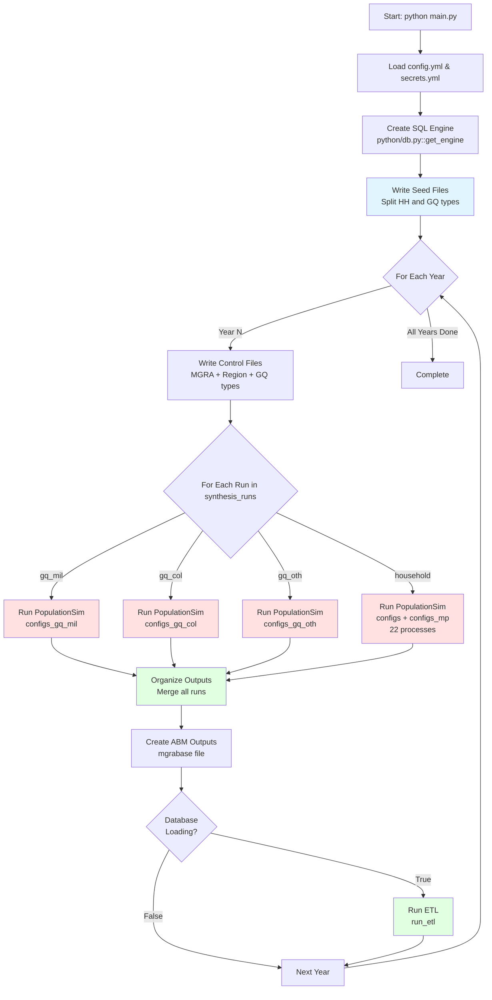

# SANDAG Population Synthesizer Documentation

**Version:** tbd
**Date:** June 2, 2026  
**Seed Data:** ACS PUMS 5-year 2017-2021  

---

## Table of Contents

1. [Introduction & Overview](#1-introduction--overview)
2. [SANDAG Population Synthesizer](#2-sandag-population-synthesizer)
3. [Data Preparation](#3-data-preparation)
4. [Application & Execution](#4-application--execution)
5. [Validation & Quality Assurance](#5-validation--quality-assurance)
6. [Database Integration (Optional)](#6-database-integration-optional)
7. [Appendices](#7-appendices)

---

## 1. Introduction & Overview

### 1.1 Purpose and Scope

This documentation provides comprehensive technical guidance for SANDAG's PopulationSim implementation, a sophisticated demographic simulation system that generates synthetic populations for the San Diego region. The system translates marginal control totals produced by SANDAG's Estimates & Forecast team into micro-simulated households and persons for use by the Activity-Based Model (ABM) team.

PopulationSim is essential for urban planning and transportation modeling, enabling detailed analysis at the household and person level while maintaining consistency with aggregate forecasts. This implementation serves multiple forecast years (2022, 2026, 2029, 2032, 2035, 2040, 2050) and covers approximately 23,000 micro-geographic areas (MGRAs) across San Diego County.

**Primary Users:**
- Technical staff responsible for executing population synthesis runs
- Activity-Based Model team consuming synthetic population outputs
- Quality assurance analysts validating results
- Data management staff maintaining the production database

**Documentation Scope:**
- Complete methodology and algorithm descriptions
- Data sources, preparation, and transformations
- Step-by-step execution procedures
- Output specifications and file formats
- Validation procedures and quality metrics
- Optional database integration for production environments

### 1.2 System Architecture Overview

The SANDAG PopulationSim system integrates multiple components into a cohesive pipeline:



**Key Components:**

1. **Data Preparation Layer** (`python/` modules):
   - Seed data extraction from ACS PUMS 2017-2021 (5-year estimates)
   - Control total generation from UDM staged forecasts
   - Economic controls integration from SANDAG Economics Team
   - Geographic crosswalk management

2. **Population Synthesis Engine** (`populationsim/` directory):
   - ActivitySim PopulationSim package v0.10.0
   - Iterative Proportional Fitting (IPF) with integerization
   - Hierarchical balancing across geographic levels
   - Multiprocessing architecture (22 parallel PUMA processes)
   - Separate group quarters sampling module

3. **Output Processing Layer** (`python/outputs.py`, `python/etl.py`):
   - File combination and household ID renumbering
   - Data cleaning and NULL value handling
   - ABM-specific file formatting
   - Optional database ETL with metadata tracking

4. **Validation Layer** (`report/` directory):
   - Streamlit interactive dashboard
   - Control vs. result comparisons
   - Geographic and demographic visualizations
   - Summary statistics and outlier detection

### 1.3 Key Features

**Geographic Detail:**
- **Three-level hierarchy:** Region (1) → PUMA (22) → MGRA (~23,000)
- **Fine-grained spatial resolution:** Average ~150 population per MGRA
- **Consistent aggregation:** Controls sum correctly across all geographic levels

**Demographic Richness:**
- **54 control variables** covering household and person characteristics
- **36 MGRA-level controls:** Age, sex, race/ethnicity, household size, income, workers
- **14 regional employment controls** by NAICS industry sector
- **4 regional labor force participation controls** by race/ethnicity

**Dual Processing Paths:**
- **Regular Households:** Weight-based IPF balancing with integerization
- **Group Quarters:** Separate per-type PopulationSim runs for military, college, and other populations
- **Combined outputs:** Seamlessly merged with unique household identifiers

**Production Capabilities:**
- **Multiple forecast years:** Processes 7 years in sequence using same seed data
- **High performance:** 22-way parallelization for MGRA-level sub-balancing
- **Reproducibility:** Fixed random seeds for consistent results
- **Version tracking:** Metadata capture for run provenance

**Quality Assurance:**
- **Built-in validation:** Summary files compare controls vs. results
- **Interactive reporting:** Streamlit app for visual validation
- **Backstopping:** Ensures critical controls are exactly met
- **Configurable importance weights:** Prioritizes key demographic totals

### 1.4 Software Dependencies

**Core Environment:**
- **Python:** 3.9 to 3.12
- **Package Manager:** [uv](https://docs.astral.sh/uv/) for dependency management
- **Operating System:** Windows (with ODBC Driver 17 for SQL Server)

**Primary Python Packages:**
```
populationsim==0.10.0        # Core synthesis engine
pandas>=2.2.0                # Data manipulation
numpy>=1.16.1                # Numerical computing
cvxpy>=1.6.5                 # Optimization solver
ortools>=9.14.6206           # Operations research tools
sqlalchemy>=2.0.25           # Database connectivity
pyodbc>=5.0.1                # SQL Server ODBC interface
streamlit>=1.20.0            # Validation dashboard
numba>=0.60.0                # JIT compilation for performance
orca>=1.8                    # Pipeline orchestration
```

**Database Requirements:**
- **SQL Server** with access to:
  - ACS PUMS data views (household and person tables)
  - UDM staged forecast tables (pop_ase_mgra, hh_characteristics_mgra, mgrabase)
  - Optional production database for output storage
- **ODBC Driver 18 for SQL Server**

**Development Tools (Optional):**
- **Version Control:** Git for repository management
- **IDE:** VS Code or similar for editing configuration files
- **Data Analysis:** Excel or similar for reviewing CSV outputs

### 1.5 Documentation Conventions

**File Path References:**
- Paths use Windows backslash convention: `c:\Users\...\`
- Relative paths from repository root: `python/`, `sql/`, `populationsim/`

**Code Examples:**
- PowerShell commands for Windows environment
- Python code snippets included where illustrative
- SQL query examples with placeholder schema names

**Geographic Terms:**
- **MGRA:** Micro-Geographic Area, SANDAG's finest planning zone (~23,000 zones)
- **PUMA:** Public Use Microdata Area, Census geography (~100K+ population, 22 in San Diego)
- **Region:** San Diego County as single region (region ID = 1)

**Abbreviations:**
- **ABM:** Activity-Based Model
- **ACS PUMS:** American Community Survey Public Use Microdata Sample
- **UDM:** Urban Development Model
- **IPF:** Iterative Proportional Fitting
- **GQ:** Group Quarters
- **CPI:** Consumer Price Index
- **NAICS:** North American Industry Classification System

---

## 2. SANDAG Population Synthesizer

### 2.1 PopulationSim Conceptual Framework

SANDAG's population synthesizer builds upon the **ActivitySim PopulationSim** framework (version 0.10.0), implementing a state-of-the-art sample-free population synthesis approach. Unlike traditional synthetic reconstruction methods, PopulationSim uses **reweighting** to expand a sample population (from ACS PUMS) to match forecast control totals across multiple geographic levels and demographic dimensions.

#### 2.1.1 Fundamental Approach

The synthesis process follows these principles:

**1. Sample-Based Expansion**  
Rather than creating synthetic households from scratch, the system:
- Starts with real household and person records from ACS PUMS (2017-2021, 5-year)
- Assigns integer weights to each sample household
- Replicates households according to their weights to create the synthetic population
- Preserves realistic joint distributions of characteristics within households

**2. Hierarchical Balancing**  
Controls are satisfied at multiple geographic levels simultaneously:
- **Region level:** Employment by industry, labor force participation by race/ethnicity
- **PUMA level:** Implicit balancing during seed weight calculation (22 PUMAs)
- **MGRA level:** Detailed demographic and household controls (~23,000 zones)

**3. Iterative Proportional Fitting (IPF)**  
The core algorithm uses IPF with enhancements:
- Adjusts household weights iteratively to match control totals
- Prioritizes controls using importance weights (range: 100,000 to 1,225,000,000)
- Handles constraints like maximum expansion factors
- Converges to solution minimizing overall deviation

**4. Integerization with Backstopping**  
Final step converts fractional weights to integers:
- Uses simultaneous integerization algorithm (considers all controls together)
- Employs backstopping to guarantee critical controls are exactly met
- Higher importance controls (e.g., Total_HH = 1,000,000,000) take precedence
- Allows minor flexibility on lower importance controls if conflicts arise

#### 2.1.2 Multi-Run Processing Architecture

The system uses separate PopulationSim runs for different population types:

**Regular Households (Weight-Based IPF):**
- Full IPF balancing and integerization process
- Satisfies 36 MGRA-level controls
- Handles ~91% of total households (remainder is GQ)
- 22-way parallelization across PUMAs
- Output: `output/synthetic_households.csv`, `output/synthetic_persons.csv`

**Group Quarters (Separate Per-Type Runs):**
- Each GQ type runs as independent PopulationSim execution
- Three types processed separately:
  - **gq_mil** (Military, gq_type=1) → `output_gq_mil/synthetic_households_gq.csv`
  - **gq_col** (College, gq_type=2) → `output_gq_col/synthetic_households_gq.csv`
  - **gq_oth** (Other institutional, gq_type=3) → `output_gq_oth/synthetic_households_gq.csv`
- Each run uses filtered seed data containing only its GQ type
- Separate control files created per type (single Total_GQ control per type)
- Single-process execution (no parallelization needed for smaller populations)
- Outputs merged during post-processing with sequential household ID numbering

#### 2.1.3 Key Algorithm Parameters

Configuration in `populationsim/configs/settings.yaml`:

```yaml
# Integerization approach
INTEGERIZE_WITH_BACKSTOPPED_CONTROLS: True
USE_SIMUL_INTEGERIZER: True

# Balancing behavior
SUB_BALANCE_WITH_FLOAT_SEED_WEIGHTS: False
GROUP_BY_INCIDENCE_SIGNATURE: False

# Optimization solver
USE_CVXPY: False  # Uses linear programming instead

# Constraints
max_expansion_factor: 30  # Maximum weight per household
```

**Rationale for Settings:**
- **Backstopped controls:** Ensures Total_HH and other critical totals are exactly met
- **Simultaneous integerizer:** More accurate than sequential rounding, minimizes global deviation
- **Integer seed weights for sub-balancing:** Faster convergence at MGRA level
- **Max expansion of 30:** Prevents single households from representing extreme weights

### 2.2 Three-Level Geographic Hierarchy

The geographic structure defines how controls are applied and balanced:

```
┌─────────────────────────────────────────────────────────┐
│                      REGION (1 zone)                    │
│  Controls: 18 (employment + labor force participation)  │
└────────────────────┬────────────────────────────────────┘
                     │
         ┌───────────┴───────────┐
         │                       │
    ┌────▼─────┐           ┌────▼─────┐
    │ PUMA 7301│    ...    │ PUMA 7322│
    │ (22 PUMAs total)                │
    │ Seed geography for balancing    │
    └────┬─────┘           └────┬─────┘
         │                       │
    ┌────▼────┐            ┌────▼────┐
    │ MGRA 1  │   ...      │MGRA 24K │
    │ (~24,321 MGRAs)                │
    │ Controls: 36 per MGRA          │
    └─────────┘            └─────────┘
```

#### 2.2.1 Geographic Definitions

**Region (Top Level)**
- **Identifier:** `region = 1`
- **Coverage:** Entire San Diego County
- **Purpose:** Ensures regional employment totals match economic forecasts
- **Controls:** 14 job categories (NAICS-based) + 4 labor force participation rates by race/ethnicity
- **Why regional?** Employment data from Economics Team is at county level; individual MGRAs don't have employment controls

**PUMA (Seed Geography)**
- **Identifier:** 22 PUMAs (codes 7301-7322)
- **Coverage:** Census-defined Public Use Microdata Areas (~100,000+ population each)
- **Purpose:** Defines geographic units for seed sample reweighting
- **Rationale:** 
  - ACS PUMS data is only released at PUMA level (smallest available geography)
  - Sufficient sample size (~2,000-5,000 households per PUMA) for robust balancing
  - Enables 22-way parallelization during MGRA sub-balancing
- **Controls:** No explicit controls, but seed balancing ensures PUMA totals are internally consistent

**MGRA (Target Geography)**
- **Identifier:** 24,321 MGRAs (numbered 1 to 24321)
- **Coverage:** Micro-Geographic Analysis zones (SANDAG's finest planning geography)
- **Average Size:** ~150 population, though highly variable (some <10, others >1,000)
- **Purpose:** Provides spatial detail needed for activity-based transportation modeling
- **Controls:** 36 variables per MGRA covering demographics, household characteristics, income, GQ

#### 2.2.2 Geographic Crosswalk

The file `populationsim/data/geo_cross_walk.csv` defines relationships:

```csv
mgra,PUMA,region
1,7317,1
2,7316,1
3,7316,1
...
23000,7322,1
```

**Key Functions:**
1. **Hierarchy Definition:** Maps each MGRA to its parent PUMA and region
2. **Sample Pool Selection:** When assigning households to MGRA, system draws from appropriate PUMA's seed
3. **Fallback Logic:** If PUMA has <200 samples, expands search to all PUMAs
4. **Multiprocessing Slicing:** Each PUMA becomes a separate processing slice

**Non-Nested Geography Note:**  
MGRAs don't nest perfectly within PUMAs (boundaries don't align), but crosswalk assigns each MGRA to its "best fit" PUMA based on population overlap. This is acceptable because:
- Only affects sample pool selection, not control totals
- System can draw from other PUMAs if needed
- Final households are assigned to MGRA regardless of origin PUMA

#### 2.2.3 Balancing Sequence

The hierarchy determines processing order:



**Why This Order?**
1. Start at seed geography (PUMA) where sample exists
2. Factor in regional constraints to ensure top-level consistency
3. Subdivide to MGRAs while respecting seed weights (hierarchical consistency)
4. Parallelization possible because PUMAs are independent after seed balancing

### 2.3 Control Specifications

Controls define the target marginal distributions that the synthetic population must match. SANDAG uses **54 control variables** specified in `populationsim/configs/controls.csv`.

#### 2.3.1 Control File Structure

Each control is defined by five attributes:

```csv
target,geography,seed_table,importance,expression
Total_HH,mgra,households,1000000000,(households.WGTP > 0) & (households.WGTP < np.inf)
```

**Field Definitions:**
- **target:** Control variable name (used in control data files)
- **geography:** Level where control applies (`mgra` or `region`)
- **seed_table:** Which seed data to evaluate (`households` or `persons`)
- **importance:** Priority weight for balancing algorithm (higher = more important)
- **expression:** Pandas query expression to identify matching records

#### 2.3.2 MGRA-Level Controls (36 controls)

**Household Size (4 controls, importance: 250,000)**
```csv
HHSize_1,mgra,households,250000,households.NP == 1
HHSize_2,mgra,households,250000,households.NP == 2
HHSize_3,mgra,households,250000,households.NP == 3
HHSize_4Plus,mgra,households,250000,households.NP >= 4
```

**Household Income (7 controls, importance: 100,000)**
```csv
HHInc_0to14999,mgra,households,100000,(households.HHADJINC >= 0) & (households.HHADJINC <= 14999)
HHInc_15000to29999,mgra,households,100000,(households.HHADJINC >= 15000) & (households.HHADJINC <= 29999)
HHInc_30000to59999,mgra,households,100000,(households.HHADJINC >= 30000) & (households.HHADJINC <= 59999)
HHInc_60000to99999,mgra,households,100000,(households.HHADJINC >= 60000) & (households.HHADJINC <= 99999)
HHInc_100000to149999,mgra,households,100000,(households.HHADJINC >= 100000) & (households.HHADJINC <= 149999)
HHInc_150000to199999,mgra,households,100000,(households.HHADJINC >= 150000) & (households.HHADJINC <= 199999)
HHInc_200000Plus,mgra,households,100000,(households.HHADJINC >= 200000) & (households.HHADJINC <= np.inf)
```
*Note: Income in 2022 dollars after CPI adjustment*

**Workers per Household (4 controls, importance: 100,000)**
```csv
HHWork_0,mgra,households,100000,households.workers == 0
HHWork_1,mgra,households,100000,households.workers == 1
HHWork_2,mgra,households,100000,households.workers == 2
HHWork_3Plus,mgra,households,100000,households.workers >= 3
```

**Sex (2 controls, importance: 1,000,000)**
```csv
Male,mgra,persons,1000000,persons.SEX == 1
Female,mgra,persons,1000000,persons.SEX == 2
```

**Age Groups (12 controls, importance: 100,000)**
```csv
Age_LT5,mgra,persons,100000,(persons.AGEP >= 0) & (persons.AGEP <= 4)
Age_5to9,mgra,persons,100000,(persons.AGEP >= 5) & (persons.AGEP <= 9)
Age_10to14,mgra,persons,100000,(persons.AGEP >= 10) & (persons.AGEP <= 14)
Age_15to17,mgra,persons,100000,(persons.AGEP >= 15) & (persons.AGEP <= 17)
Age_18to24,mgra,persons,100000,(persons.AGEP >= 18) & (persons.AGEP <= 24)
Age_25to34,mgra,persons,100000,(persons.AGEP >= 25) & (persons.AGEP <= 34)
Age_35to44,mgra,persons,100000,(persons.AGEP >= 35) & (persons.AGEP <= 44)
Age_45to54,mgra,persons,100000,(persons.AGEP >= 45) & (persons.AGEP <= 54)
Age_55to64,mgra,persons,100000,(persons.AGEP >= 55) & (persons.AGEP <= 64)
Age_65to74,mgra,persons,100000,(persons.AGEP >= 65) & (persons.AGEP <= 74)
Age_75to84,mgra,persons,100000,(persons.AGEP >= 75) & (persons.AGEP <= 84)
Age_85Plus,mgra,persons,100000,persons.AGEP >= 85
```

**Race/Ethnicity (6 controls, importance: 200,000)**
```csv
Asian,mgra,persons,200000,persons.race == 'Asian alone'
Black,mgra,persons,200000,persons.race == 'Black or African American alone'
Hispanic,mgra,persons,200000,persons.race == 'Hispanic'
Other,mgra,persons,200000,persons.race == 'Other'
Two_or_more,mgra,persons,200000,persons.race == 'Two or More Races'
White,mgra,persons,200000,persons.race == 'White alone'
```
*Note: `race` field is derived variable (see Section 3.1.4)*

**Total Households (1 control, importance: 1,000,000,000)**
```csv
Total_HH,mgra,households,1000000000,(households.WGTP > 0) & (households.WGTP < np.inf)
```
*Highest importance ensures household totals are exactly met*

#### 2.3.3 Region-Level Controls (14 controls)

**Employment by Industry (14 controls, importance: 350,000)**

Based on 2-digit NAICS codes:
```csv
job_1,region,persons,350000,(persons.NAICS2 == '92') & (persons.laborforce == 1)  # Public administration
job_2,region,persons,350000,(persons.NAICS2 == 'MIL') & (persons.laborforce == 1)  # Military
job_3,region,persons,350000,((persons.NAICS2 == '11') | (persons.NAICS2 == '21')) & (persons.laborforce == 1)  # Ag/Mining
job_4,region,persons,350000,((persons.NAICS2 == '51') | (persons.NAICS2 == '54') | (persons.NAICS2 == '56')) & (persons.laborforce == 1)  # Info/Prof/Admin
job_5,region,persons,350000,((persons.NAICS2 == '52') | (persons.NAICS2 == '53') | (persons.NAICS2 == '55')) & (persons.laborforce == 1)  # Finance/RE
job_6,region,persons,350000,(persons.NAICS2 == '61') & (persons.laborforce == 1)  # Education
job_7,region,persons,350000,(persons.NAICS2 == '62') & (persons.laborforce == 1)  # Healthcare
job_8,region,persons,350000,((persons.NAICS2 == '44') | (persons.NAICS2 == '45') | (persons.NAICS2 == '4M')) & (persons.laborforce == 1)  # Retail
job_9,region,persons,350000,((persons.NAICS2 == '23') | (persons.NAICS2 == '48') | (persons.NAICS2 == '49')) & (persons.laborforce == 1)  # Construction/Transport
job_10,region,persons,350000,((persons.NAICS2 == '22') | (persons.NAICS2 == '31') | (persons.NAICS2 == '32') | (persons.NAICS2 == '33') | (persons.NAICS2 == '42') | (persons.NAICS2 == '3M')) & (persons.laborforce == 1)  # Utilities/Manufacturing/Wholesale
job_11,region,persons,350000,(persons.NAICS2 == '71') & (persons.laborforce == 1)  # Arts/Entertainment
job_12,region,persons,350000,(persons.NAICS2 == '721') & (persons.laborforce == 1)  # Accommodation
job_13,region,persons,350000,(persons.NAICS2 == '722') & (persons.laborforce == 1)  # Food services
job_14,region,persons,350000,(persons.NAICS2 == '81') & (persons.laborforce == 1)  # Other services
```

**Labor Force Participation by Race (4 controls, importance: 1,225,000)**
```csv
lfp_black,region,persons,1225000,(persons.race == 'Black or African American alone') & ((persons.ESR == 1) | (persons.ESR == 2) | (persons.ESR == 3))
lfp_hispanic,region,persons,1225000,(persons.race == 'Hispanic') & ((persons.ESR == 1) | (persons.ESR == 2) | (persons.ESR == 3))
lfp_other,region,persons,1225000,((persons.race == 'Other') | (persons.race == 'Two or More') | (persons.race == 'Asian alone')) & ((persons.ESR == 1) | (persons.ESR == 2) | (persons.ESR == 3))
lfp_white,region,persons,1225000,(persons.race == 'White alone') & ((persons.ESR == 1) | (persons.ESR == 2) | (persons.ESR == 3))
```
*ESR: Employment status recode (1=civilian employed, 2=civilian unemployed, 3=armed forces, 4/5/6=not in labor force)*  
*Highest importance controls to ensure labor force totals are exactly met*

#### 2.3.4 Group Quarters Controls (3 additional controls)

Not in controls.csv but loaded from settings.yaml during ETL:
```yaml
gq_mil_pop    # Military group quarters population
gq_college_pop  # College dormitory population
gq_other_pop   # Other institutional group quarters
```

These are handled separately by the GQ sampling module (Section 2.6).

#### 2.3.5 Importance Weight Strategy

The importance values create a hierarchy:

| Importance | Purpose | Example Controls |
|------------|---------|------------------|
| 1,225,000,000 | **Critical totals** - Must be exactly met | Labor force participation rates |
| 1,000,000,000 | **Total households** - Absolute priority | Total_HH |
| 1,000,000 | **Major demographics** - Very high priority | Male, Female |
| 350,000 | **Employment** - High priority | job_1 through job_14 |
| 250,000 | **Household structure** - Medium-high priority | Household size categories |
| 200,000 | **Race/ethnicity** - Medium priority | Asian, Black, Hispanic, etc. |
| 100,000 | **Detailed breakdowns** - Standard priority | Age groups, income, workers |

**Balancing Strategy:**
- Higher importance controls are satisfied first and more precisely
- Lower importance controls may show small deviations to accommodate higher priorities
- Backstopping ensures importance >500,000,000 controls are exactly met (integer constraint)
- System minimizes weighted sum of squared deviations across all controls

### 2.4 Seed Data Structure

The seed data provides the sample population that will be reweighted and expanded to create the synthetic population. SANDAG uses **ACS PUMS 5-year estimates (2017-2021)** for San Diego County.

#### 2.4.1 Data Source Characteristics

**American Community Survey (ACS) Public Use Microdata Sample (PUMS):**
- **Time Period:** 5-year pooled sample (2017-2021) for maximum sample size and stability
- **Geography:** San Diego County, organized by 22 PUMAs
- **Sample Size:** 
  - ~350,000 household records (households)
  - ~950,000 person records (regular household members)
  - ~50,000 group quarters records (GQ households and persons)
- **Weighting:** Each record has PUMS weight (WGTP for households, PWGTP for persons) representing ~30-100 actual households/persons
- **Vintage:** Represents demographic characteristics from 2017-2021 period

**Why 5-Year Estimates?**
- Larger sample size than 1-year estimates
- More stable estimates for small geographic areas (PUMAs)
- Better representation of rare household types
- Sufficient records for all PUMAs to support balancing

**Why 2017-2021 vs. Forecast Year?**
- Seed represents the **joint distributions** of characteristics within households
- Controls determine the **marginal distributions** for each forecast year
- Assumption: Correlations between characteristics remain stable over forecast horizon
- Example: Relationship between income and household size may be similar in 2050, even though overall distributions change

#### 2.4.2 Household Seed Files

Four household seed files are created by `python/build_seed_data.py`:

**seed_households_hh.csv** (Regular Households)
- ~52,000 records
- TYPEHUGQ = 1 (housing units)
- Key fields:
  - `hhid`: Unique household identifier (assigned sequentially)
  - `SERIALNO`: Original ACS household serial number
  - `PUMA`: Geographic identifier for sample location
  - `NP`: Number of persons in household
  - `HHADJINC`: Adjusted household income (2022 dollars)
  - `WGTP`: Household weight from PUMS
  - `HHT`, `HUPAC`, `VEH`, `BLD`: Household type, presence of children, vehicles, building type
  - `workers`: Derived field counting employed persons in household
  - `gq_type`: Set to 0 for regular households

**seed_households_gq.csv** (Group Quarters)
- ~7,750 records (sample pool)
- TYPEHUGQ = 2 (institutionalized GQ) or 3 (non-institutionalized GQ)
- Key fields same as above, except:
  - `gq_type`: 1=military, 2=college, 3=other
  - `WGTP`: Uses PWGTP (person weight) since GQ "households" are individuals
- **Note:** This is the sample pool, not the final output. Synthetic output (~116,000+ for 2022) is created by sampling with replacement from these ~7,750 seed records to match control totals. Each seed record may appear multiple times in the synthetic population

#### 2.4.3 Person Seed Files

Four person seed files created simultaneously:

**seed_persons_hh.csv** (Regular Household Members)
- ~136,000 records
- TYPEHUGQ = 1
- Links to households via `hhid` and `SERIALNO`
- Key fields:
  - `hhid`: Links to household record
  - `SERIALNO`: Links to household
  - `SPORDER`: Person number within household (1, 2, 3...)
  - `AGEP`: Age in years
  - `SEX`: 1=Male, 2=Female
  - `race`: Derived race/ethnicity field (Hispanic, White, Black, Asian, Two or More, Other)
  - `ESR`: Employment status recode
  - `COW`, `WKHP`: Class of worker, usual hours worked
  - `SCHG`, `SCHL`: School enrollment grade, educational attainment
  - `NAICS2`, `NAICSP`: Industry codes (2-digit and detailed)
  - `OCCP`, `SOC2`: Occupation codes
  - `laborforce`, `worker`: Derived employment flags

**seed_persons_gq.csv** (Group Quarters Persons)
- ~7,750 records (sample pool, matches household count since GQ "households" are individuals)
- TYPEHUGQ = 2 or 3
- Same structure as regular persons
- Typically younger (college students, military recruits) or older (nursing home residents)
- **Note:** These seed persons are linked to GQ households via `hhid`. When households are sampled with replacement during synthesis, the corresponding persons are retrieved to create the synthetic GQ population

#### 2.4.4 Key Derived Variables

Several important fields are calculated during seed data extraction (in SQL queries):

**HHADJINC (Adjusted Household Income):**
```sql
-- CPI adjustment to 2022 dollars by survey year
CASE survey_year
  WHEN 2017 THEN HINCP * 1.1567  -- San Diego CPI multiplier
  WHEN 2018 THEN HINCP * 1.1243
  WHEN 2019 THEN HINCP * 1.1037
  WHEN 2020 THEN HINCP * 1.0873
  WHEN 2021 THEN HINCP * 1.0333
END AS HHADJINC
```

**workers (Workers per Household):**
```sql
-- Count employed persons in household
COUNT(CASE WHEN ESR IN (1,2,4,5) THEN 1 END) AS workers
```

**race (Race/Ethnicity Classification):**
```sql
-- Hierarchy: Hispanic takes precedence, then detailed race
CASE
  WHEN HISP != '01' THEN 'Hispanic'
  WHEN RAC1P = '1' THEN 'White alone'
  WHEN RAC1P = '2' THEN 'Black or African American alone'
  WHEN RAC1P = '6' THEN 'Asian alone'
  WHEN RAC1P = '9' THEN 'Two or More Races'
  ELSE 'Other'
END AS race
```

**gq_type (Group Quarters Classification):**
```sql
CASE
  WHEN TYPEHUGQ = '1' THEN 0  -- Housing unit
  WHEN TYPEHUGQ = '3' AND MIL = '1' THEN 1  -- Military GQ
  WHEN TYPEHUGQ = '3' AND SCHG IN ('15','16') THEN 2  -- College dorm
  WHEN TYPEHUGQ IN ('2','3') THEN 3  -- Other GQ
END AS gq_type
```

**laborforce and worker flags:**
```sql
-- In civilian labor force (employed or unemployed seeking work)
laborforce = (ESR IN (1,2,3,4,5))
-- Actually employed
worker = (ESR IN (1,2,4,5))
```

**NAICS2 (2-Digit Industry Code):**
```sql
-- Special handling for military and accommodation/food
CASE
  WHEN MIL = '1' THEN 'MIL'  -- Military
  WHEN NAICSP LIKE '72%' THEN SUBSTRING(NAICSP, 1, 3)  -- 3-digit for accommodation/food
  ELSE SUBSTRING(NAICSP, 1, 2)  -- 2-digit for others
END AS NAICS2
```

#### 2.4.5 Data Quality and Completeness

**Missing Value Handling:**
- Census top-codes high incomes (HINCP capped at $9,999,999)
- Some employment fields NULL for children and non-workers
- NULLs preserved in seed; filled with 0 in final outputs for ABM team

**Consistency Checks:**
- Household-person linkage verified via SERIALNO
- Sum of person weights approximately equals household weight × NP
- PUMA codes validated against crosswalk file

**Sample Representativeness:**
- Weights (WGTP) sum to ~3.3 million households (2021 population)
- Distribution across PUMAs roughly proportional to actual population
- Sufficient rare household types (e.g., 7+ person households) for synthesis

### 2.5 Balancing Algorithm Details

The core of PopulationSim is the **balancing algorithm** that adjusts household weights to match control totals. SANDAG's implementation uses a sophisticated variant of Iterative Proportional Fitting (IPF).

#### 2.5.1 Algorithm Overview



#### 2.5.2 Iterative Proportional Fitting (IPF) Process

**Step-by-Step Execution:**

1. **Initialization (Region/PUMA Level)**
   ```
   For each household h in seed:
       weight[h] = WGTP[h]  // Start with original PUMS weight
   ```

2. **Control Loop** (repeated until convergence)
   ```
   For each control c in sorted_by_importance:
       // Calculate current total
       current[c] = SUM(weight[h] * incidence[h,c] for all h)
       
       // Compute adjustment factor
       adjustment[c] = target[c] / current[c]
       
       // Update weights for households matching control
       For each household h where incidence[h,c] == 1:
           weight[h] = weight[h] * adjustment[c]
           
       // Apply maximum expansion constraint
       For each household h:
           IF weight[h] > max_expansion_factor * WGTP[h]:
               weight[h] = max_expansion_factor * WGTP[h]
   ```

3. **Convergence Check**
   ```
   For each control c:
       relative_diff[c] = ABS(current[c] - target[c]) / target[c]
   
   IF MAX(relative_diff) < tolerance:  // Default tolerance = 0.0001
       CONVERGED = True
   ELSE IF iterations > max_iterations:  // Default = 1000
       FORCE_STOP = True
   ```

4. **Integerization** (after IPF converges)
   ```
   Convert fractional weights to integers while:
       - Minimizing deviation from IPF solution
       - Exactly meeting backstopped controls (importance > 500M)
       - Satisfying max_expansion_factor constraint
   ```

#### 2.5.3 Key Algorithm Parameters

From `populationsim/configs/settings.yaml`:

```yaml
# Core algorithm settings
INTEGERIZE_WITH_BACKSTOPPED_CONTROLS: True
  # Ensures high-importance controls (Total_HH, labor force) are exactly met
  
SUB_BALANCE_WITH_FLOAT_SEED_WEIGHTS: False
  # Use integer seed weights during MGRA sub-balancing for faster convergence
  
USE_SIMUL_INTEGERIZER: True
  # Use simultaneous integerization (considers all controls together)
  # Alternative: sequential integerization (one control at a time)
  
USE_CVXPY: False
  # Don't use convex optimization solver
  # Uses linear programming with GLPK or OR-Tools instead
  
max_expansion_factor: 30
  # Maximum weight = 30 × original WGTP
  # Prevents single households from representing extreme numbers
  # Balance: Too low → can't meet controls; Too high → less realistic variation

NO_INTEGERIZATION_EVER: False
  # Always integerize (required for household expansion)
  
GROUP_BY_INCIDENCE_SIGNATURE: False
  # Don't pre-group households by which controls they satisfy
  # Allows more flexible weight adjustments
```

**Why These Settings?**

- **Backstopped controls:** Critical for production use; ensures key totals (Total_HH, LFP rates) are exact, not approximate
- **Integer seed weights:** Speeds up MGRA sub-balancing; floating point offers minimal benefit at cost of performance
- **Simultaneous integerization:** More accurate global solution; sequential can accumulate errors across controls
- **max_expansion_factor=30:** Empirically determined balance for San Diego; allows flexibility without extreme outliers
- **No CVXPY:** Linear programming sufficient for this problem structure; CVXPY adds overhead without benefit

#### 2.5.4 Hierarchical Balancing Sequence

The algorithm executes in phases to respect geographic hierarchy:

**Phase 1: Initial Seed Balancing (PUMA-level)**
```
Geography: PUMA (22 zones)
Controls: Implicit PUMA controls derived from MGRA controls
Purpose: Create base weights that sum correctly at PUMA level
Output: initial_seed_weights
```

**Phase 2: Meta-Control Factoring (Region-level)**
```
Geography: Region (1 zone)
Controls: 18 regional controls (jobs + labor force)
Purpose: Adjust regional control targets based on PUMA seed totals
Logic: If PUMA-level IPF produces totals slightly different from 
       region targets, adjust region targets to be consistent
Output: adjusted_region_controls
```

**Phase 3: Final Seed Balancing (PUMA-level)**
```
Geography: PUMA (22 zones)
Controls: MGRA controls + adjusted regional controls
Purpose: Re-balance with fully consistent control set
Output: final_seed_weights (still fractional)
```

**Phase 4: Seed Weight Integerization**
```
Geography: PUMA (22 zones)
Process: Convert final_seed_weights to integers
Constraints: 
  - Meet Total_HH exactly at each PUMA
  - Respect max_expansion_factor
  - Minimize deviation from fractional solution
Output: integer_seed_weights
```

**Phase 5: Sub-Balancing (MGRA-level, Parallelized)**
```
Geography: MGRA (~23,000 zones, processed 22 ways in parallel by PUMA)
Starting point: integer_seed_weights from Phase 4
Controls: 36 MGRA-level controls per zone
Purpose: Allocate PUMA seed households to individual MGRAs
Process: For each MGRA, run IPF starting from PUMA weights
Output: mgra_weights (fractional)
```

**Phase 6: MGRA Weight Integerization**
```
Geography: MGRA
Process: Convert mgra_weights to integers
Output: final_mgra_weights (integers ready for expansion)
```

#### 2.5.5 Integerization with Backstopping

The integerization step is critical because:
- IPF produces fractional weights (e.g., household has weight 15.7)
- Need integer weights to physically replicate households
- Must maintain control totals as closely as possible

**Simultaneous Integerization Algorithm:**

```
Problem Formulation:
  Minimize: SUM over controls c of importance[c] * (target[c] - result[c])²
  
  Subject to:
    For each household h:
      integer_weight[h] ∈ [0, 1, 2, ..., max_expansion_factor * WGTP[h]]
    
    For each backstopped control c:
      SUM(integer_weight[h] * incidence[h,c]) = target[c]  // Exact match
    
    For each non-backstopped control c:
      SUM(integer_weight[h] * incidence[h,c]) ≈ target[c]  // Close match
```

**Solver Approach:**
- Formulated as Mixed Integer Linear Program (MILP)
- Solved using OR-Tools or GLPK solver
- Runtime: ~1-5 minutes per PUMA for seed balancing, <1 minute per MGRA for sub-balancing

**Backstopped Controls (importance > 500,000,000):**
- `Total_HH` (1,000,000,000) → Household totals exactly correct
- `lfp_black`, `lfp_hispanic`, `lfp_other`, `lfp_white` (1,225,000) → Labor force exactly correct

**Non-Backstopped Controls:**
- May show small deviations (typically <1%) after integerization
- Deviations weighted by importance in objective function
- Higher importance → smaller deviation tolerated

#### 2.5.6 List Balancing for MGRA Sub-Balancing

At MGRA level, system uses **list balancing** algorithm (variant of IPF):

**Key Difference from Standard IPF:**
- Start with integer seed weights from PUMA-level balancing
- Maintain list of eligible households for each MGRA
- Weights can only be 0 or positive integers
- More constrained problem → faster convergence

**Advantages:**
- Respects PUMA-level totals (seed weights are already balanced)
- Computational efficiency for 24,321 MGRAs
- Natural parallelization by PUMA (22 independent processes)
- Maintains realistic household distributions within PUMAs

**Fallback Logic:**
- If MGRA controls cannot be satisfied from its PUMA's seed (PUMA has <200 samples)
- System expands search to all PUMAs
- Ensures even small MGRAs get appropriate household types

### 2.6 Group Quarters Handling

Group quarters populations (military barracks, college dormitories, nursing homes, etc.) require different treatment than regular households due to their unique characteristics. SANDAG implements a **separate per-type PopulationSim run approach** for each GQ category.

#### 2.6.1 Why Separate GQ Processing?

**Characteristics of Group Quarters:**
- **Significant populations:** ~9-13% of total population (2022 synthetic: 116,411 GQ vs. 1,160,472 regular households = 9.1%; seed sample: 7,752 GQ vs. 52,105 regular households = 13.0%)
- **Geographically concentrated:** Specific MGRAs have military bases, colleges, or institutions
- **Homogeneous:** Within each GQ type, individuals are demographically similar
- **Sparse controls:** Only 3 control totals (military, college, other) vs. 42 for households

**Split Run Architecture:**
- Each GQ type runs as independent PopulationSim execution with type-specific configuration
- Avoids mixing heterogeneous GQ types in single IPF balancing process
- Each run sees only its relevant seed data and control variables
- Simpler control structure (single Total_GQ control per run)
- Enables independent optimization of each GQ type
- Maintains realistic GQ person characteristics from PUMS data
- Facilitates debugging and validation of individual GQ types

#### 2.6.2 GQ Type Classification

Three GQ types are recognized:

**gq_type = 1: Military Group Quarters**
- Barracks, military bases, ships
- Identification: `TYPEHUGQ = 3` (non-institutional GQ) AND `MIL = 1` (active duty military)
- Control variable: `gq_mil_pop`
- Typical age: 18-35, predominantly male
- Example MGRAs: Military installations in region

**gq_type = 2: College Group Quarters**
- Dormitories, on-campus student housing
- Identification: `TYPEHUGQ = 3` AND `SCHG IN (15, 16)` (enrolled in college/graduate school)
- Control variable: `gq_college_pop`
- Typical age: 18-24
- Example MGRAs: SDSU, UCSD, other college campuses

**gq_type = 3: Other Group Quarters**
- Nursing homes, correctional facilities, group homes
- Identification: `TYPEHUGQ = 2` (institutional) OR `TYPEHUGQ = 3` (non-institutional, not military/college)
- Control variable: `gq_other_pop`
- Mixed demographics depending on facility type
- Example MGRAs: Hospital zones, correctional facilities

#### 2.6.3 Split GQ Synthesis Architecture

The GQ synthesis workflow splits processing into three independent PopulationSim runs, one for each GQ type. This is orchestrated by the `main.py` workflow through the `GQ_TYPES` registry and `synthesis_runs` configuration.

**GQ_TYPES Registry** (in `main.py`):
```python
GQ_TYPES = {
    "gq_mil": {
        "seed_type_code": 1, 
        "control_column": "gq_mil_pop", 
        "control_name": "GQ_Military"
    },
    "gq_col": {
        "seed_type_code": 2, 
        "control_column": "gq_college_pop", 
        "control_name": "GQ_College"
    },
    "gq_oth": {
        "seed_type_code": 3, 
        "control_column": "gq_other_pop", 
        "control_name": "GQ_Other"
    },
}
```

**Step 1: Seed Data Splitting** (function `write_seed_files()`)

The workflow extracts GQ seed data from SQL, then splits it into type-specific files:

```python
# Extract combined GQ seed from database
gq_households = seed_households["gq"]  # TYPEHUGQ = 2 or 3
gq_persons = seed_persons["gq"]

# Split by gq_type into separate files
for name, spec in GQ_TYPES.items():
    hh_subset = gq_households[gq_households["gq_type"] == spec["seed_type_code"]]
    persons_subset = gq_persons[gq_persons["hhid"].isin(hh_subset["hhid"])]
    
    hh_subset.to_csv(DATA_DIR / f"seed_households_{name}.csv", index=False)
    persons_subset.to_csv(DATA_DIR / f"seed_persons_{name}.csv", index=False)
```

**Output Files:**
- `populationsim/data/seed_households_gq_mil.csv` (~2,500 records, gq_type=1)
- `populationsim/data/seed_persons_gq_mil.csv` (~2,500 persons)
- `populationsim/data/seed_households_gq_col.csv` (~2,500 records, gq_type=2)
- `populationsim/data/seed_persons_gq_col.csv` (~2,500 persons)
- `populationsim/data/seed_households_gq_oth.csv` (~2,700 records, gq_type=3)
- `populationsim/data/seed_persons_gq_oth.csv` (~2,700 persons)

**Step 2: Control File Splitting** (function `write_gq_control_files()`)

Each GQ type gets its own MGRA control file containing only MGRAs with that GQ type:

```python
for name, spec in GQ_TYPES.items():
    pop_col = spec["control_column"]  # e.g., "gq_mil_pop"
    
    # Extract MGRAs with non-zero population for this type
    subset = mgra_controls.loc[mgra_controls[pop_col] > 0, ["mgra", pop_col]].copy()
    subset = subset.rename(columns={pop_col: "Total_GQ"})
    
    subset.to_csv(DATA_DIR / f"mgra_controls_{name}.csv", index=False)
```

**Output Files:**
- `populationsim/data/mgra_controls_gq_mil.csv` (only MGRAs with military GQ)
- `populationsim/data/mgra_controls_gq_col.csv` (only MGRAs with college GQ)
- `populationsim/data/mgra_controls_gq_oth.csv` (only MGRAs with other GQ)

**Example Control File Structure:**
```csv
mgra,Total_GQ
1234,150
5678,85
```

Note: The `Total_GQ` control represents the specific GQ type population for this run (e.g., military GQ only for the gq_mil run). PopulationSim uses this as the `total_hh_control` setting.

**Step 3: Separate PopulationSim Runs** (function `run_simulation()`)

The `config.yml` defines four synthesis runs executed sequentially for each year:

```yaml
synthesis_runs:
  - name: gq_mil
    configs: [configs_gq_mil, configs_common]
    data: data
    output: output_gq_mil
    num_processes: 1
  - name: gq_col
    configs: [configs_gq_col, configs_common]
    data: data
    output: output_gq_col
    num_processes: 1
  - name: gq_oth
    configs: [configs_gq_oth, configs_common]
    data: data
    output: output_gq_oth
    num_processes: 1
  - name: household
    configs: [configs_mp, configs, configs_common]
    data: data
    output: output
    num_processes: 22
```

The `process_year()` function loops through these runs:

```python
for run in config["synthesis_runs"]:
    run_simulation(
        configs_dirs=[POPSIM_DIR / c for c in run["configs"]],
        data_dir=POPSIM_DIR / run["data"],
        output_dir=POPSIM_DIR / run["output"],
        num_processes=run.get("num_processes", 1)
    )
```

Each run invokes PopulationSim with its specific configuration:
```bash
python run_populationsim.py \
  -c ./configs_gq_mil \
  -c ./configs_common \
  -d ./data \
  -o ./output_gq_mil
```

**Type-Specific Configurations:**

Each `configs_gq_*/settings.yaml` specifies:
```yaml
# configs_gq_mil/settings.yaml
seed_households_file: seed_households_gq_mil.csv
seed_persons_file: seed_persons_gq_mil.csv
control_file_name: mgra_controls_gq_mil.csv
total_hh_control: Total_GQ
```

And corresponding `configs_gq_mil/controls.csv`:
```csv
target,geography,seed_table,importance,expression
Total_GQ,mgra,households,1000000000,households.gq_type == 1
```

**Runtime:** Each GQ run takes ~1-2 minutes (vs. ~40-50 minutes for household run with 22 processes)

**Step 4: Output Merging** (function `merge_synthetic_population()`)

After all four runs complete, `organize_outputs()` combines results into unified files:

```python
household_frames = []
person_frames = []
id_offset = 0

for run in config["synthesis_runs"]:
    run_output_dir = popsim_dir / run["output"]
    hh_file, persons_file = _synthetic_filenames(run["name"])
    
    hh = pd.read_csv(run_output_dir / hh_file)
    persons = pd.read_csv(run_output_dir / persons_file)
    
    # Renumber household IDs to avoid conflicts
    hh["household_id"] += id_offset
    persons["household_id"] += id_offset
    
    household_frames.append(hh)
    person_frames.append(persons)
    
    id_offset += len(hh)  # Next run starts after this run's IDs

# Combine all runs
pd.concat(household_frames, ignore_index=True).to_csv(
    year_output_dir / "synthetic_households.csv", index=False
)
pd.concat(person_frames, ignore_index=True).to_csv(
    year_output_dir / "synthetic_persons.csv", index=False
)
```

**Household ID Sequencing Example:**
- gq_mil: household_ids 1 to 5,000
- gq_col: household_ids 5,001 to 12,000 (offset by 5,000)
- gq_oth: household_ids 12,001 to 25,000 (offset by 12,000)
- household: household_ids 25,001 to 1,185,472 (offset by 25,000)

This ensures no household ID conflicts in merged output.

#### 2.6.4 GQ Configuration Files

Each GQ type has its own configuration directory with type-specific settings:

**Directory Structure:**
```
populationsim/
  configs_gq_mil/
    settings.yaml     # Military-specific settings
    controls.csv      # Total_GQ control (military GQ only)
  configs_gq_col/
    settings.yaml     # College-specific settings
    controls.csv      # Total_GQ control (college GQ only)
  configs_gq_oth/
    settings.yaml     # Other-specific settings
    controls.csv      # Total_GQ control (other GQ only)
  configs_common/
    logging.yaml      # Shared logging configuration
```

**Example settings.yaml (configs_gq_mil/settings.yaml):**
```yaml
inherit_settings: True

# Data files
seed_households_file: seed_households_gq_mil.csv
seed_persons_file: seed_persons_gq_mil.csv
control_file_name: mgra_controls_gq_mil.csv

# Control specification
total_hh_control: Total_GQ  # Column name for total control

# Simplified balancing (single process for GQ)
multiprocess: False

# Standard integerization settings
INTEGERIZE_WITH_BACKSTOPPED_CONTROLS: True
USE_SIMUL_INTEGERIZER: True
```

**Example controls.csv (configs_gq_mil/controls.csv):**
```csv
target,geography,seed_table,importance,expression
Total_GQ,mgra,households,1000000000,households.gq_type == 1
```

**Key Differences from Household Run:**
- `multiprocess: False` - GQ populations small enough for single-process
- Only 1 control (Total_GQ for the specific GQ type) vs. 36 for households
- Type-specific seed files eliminate need for filtering expressions
- Simpler configuration, faster execution

#### 2.6.5 GQ Output Integration

After all four synthesis runs complete (gq_mil, gq_col, gq_oth, household), the `organize_outputs()` function merges results:

**Post-Processing Steps** (in `python/outputs.py`):

1. **Sequential Household ID Assignment:**
   ```python
   id_offset = 0
   for run in config["synthesis_runs"]:
       hh["household_id"] += id_offset
       persons["household_id"] += id_offset
       id_offset += len(hh)
   ```
   
   This ensures unique household IDs across all runs without conflicts.

2. **File Combination:**
   ```python
   # Concatenate all runs (gq_mil, gq_col, gq_oth, household)
   synthetic_households = pd.concat(household_frames, ignore_index=True)
   synthetic_persons = pd.concat(person_frames, ignore_index=True)
   ```

3. **NULL Value Cleaning:**
   ```python
   # GQ households may lack some fields
   households.assign(
       HHADJINC=lambda x: x["HHADJINC"].clip(0, None),
       HHT=lambda x: x["HHT"].fillna(0),
       HUPAC=lambda x: x["HUPAC"].fillna(0),
       BLD=lambda x: x["BLD"].fillna(0)
   )
   
   # GQ persons may lack employment/education fields
   persons.assign(
       ESR=lambda x: x["ESR"].fillna(0),
       COW=lambda x: x["COW"].fillna(0),
       WKHP=lambda x: x["WKHP"].fillna(0),
       SCHG=lambda x: x["SCHG"].fillna(0),
       MIL=lambda x: x["MIL"].fillna(0),
       SCHL=lambda x: x["SCHL"].fillna(0),
       OCCP=lambda x: x["OCCP"].fillna(0),
       WKW=lambda x: x["WKW"].fillna(0)
   )
   ```

4. **Drop PUMA Column:**
   ```python
   # PUMA not needed in final output
   households.drop(columns="PUMA")
   persons.drop(columns="PUMA")
   ```

**Final Output Files** (in `output/{year}/`):
- `synthetic_households.csv` - Combined households (all types, sequential IDs)
- `synthetic_persons.csv` - Combined persons (all types, matching household_ids)
- `final_summary_mgra.csv` - Household controls vs. results
- `final_summary_mgra_PUMA.csv` - PUMA-level summaries
- `final_summary_region_1.csv` - Regional summaries

**Combined File Structure:**
- Households from all runs merged with `gq_type` field distinguishing:
  - `gq_type = 0` - Regular households
  - `gq_type = 1` - Military GQ
  - `gq_type = 2` - College GQ
  - `gq_type = 3` - Other GQ
- ABM team can filter as needed: `households[households.gq_type == 0]`

**Summary File Copying:**

Additional files are copied from individual run outputs to the year directory:
```python
ancillary_files = [
    "timing_log.csv",
    "final_summary_mgra.csv",
    "final_summary_mgra_PUMA.csv",
    "final_summary_region_1.csv",
]
# Copied from output/ directory (household run) only
# GQ summaries remain in output_gq_mil/, output_gq_col/, output_gq_oth/
```

#### 2.6.6 GQ Validation

**Validation Checks:**

Each GQ run produces its own summary files for validation:

**Individual Run Summaries:**
- `output_gq_mil/final_summary_mgra.csv` - Military GQ controls vs. results
- `output_gq_col/final_summary_mgra.csv` - College GQ controls vs. results
- `output_gq_oth/final_summary_mgra.csv` - Other GQ controls vs. results

**Summary File Format:**
```csv
id,geography,Total_GQ_control,Total_GQ_result
1234,mgra,150,150
5678,mgra,85,85
```

**Key Validation Points:**

1. **Exact Control Matching:**
   ```python
   # PopulationSim balancing should achieve exact or near-exact match
   assert (summary.Total_GQ_control == summary.Total_GQ_result).all()
   ```

2. **Person-to-Household Consistency:**
   ```python
   # Every person must belong to a valid household
   assert all(persons.household_id.isin(households.household_id))
   ```

3. **No Household ID Conflicts:**
   ```python
   # After merging, all household IDs must be unique
   assert len(combined_households.household_id.unique()) == len(combined_households)
   ```

4. **Type Consistency:**
   ```python
   # Each run's output should only contain its designated gq_type
   assert (gq_mil_households.gq_type == 1).all()
   assert (gq_col_households.gq_type == 2).all()
   assert (gq_oth_households.gq_type == 3).all()
   ```

5. **Sum Validation:**
   ```python
   # Combined GQ population should equal sum of individual types
   total_gq = len(gq_mil_hh) + len(gq_col_hh) + len(gq_oth_hh)
   assert total_gq == len(combined_households[combined_households.gq_type > 0])
   ```

**Typical Balancing Accuracy:**
- GQ runs typically achieve perfect or near-perfect matches due to:
  - Simplified control structure (only 1 control per run)
  - Higher importance weights ensure backstopping
  - Smaller populations easier to balance than full household run
- Household run may have minor deviations on lower-importance controls

### 2.7 Multiprocessing Architecture

To handle 24,321 MGRAs efficiently, SANDAG employs aggressive parallelization using PopulationSim's multiprocessing capabilities.

#### 2.7.1 Multiprocessing Configuration

Configuration in `populationsim/configs_mp/settings.yaml`:

```yaml
multiprocess: True
num_processes: 22  # One per San Diego PUMA

slice_geography: PUMA  # Divide work by PUMA boundaries

multiprocess_steps:
  - name: mp_seed_balancing
    begin: input_pre_processor
    # Single process for seed-level work
    
  - name: mp_sub_balancing_mgra
    begin: sub_balancing.geography=mgra
    slice:
      tables:
        - slice_crosswalk
        - crosswalk
      except: True  # Don't slice other tables
      coalesce:
        - mgra_weights
        - mgra_weights_sparse
        - trace_mgra_weights
        
  - name: mp_summarize
    begin: expand_households
    # Single process for final aggregation
```

#### 2.7.2 Three-Phase Execution

**Phase 1: mp_seed_balancing (Single Process)**
```
Input: Full seed data + all controls
Steps:
  1. input_pre_processor
  2. setup_data_structures
  3. initial_seed_balancing (PUMA-level IPF)
  4. meta_control_factoring (adjust region controls)
  5. final_seed_balancing (re-balance with adjusted controls)
  6. integerize_final_seed_weights
Output: integer_seed_weights table (one weight per seed household per PUMA)
Runtime: ~10-15 minutes
```

**Why Single Process?**
- Seed balancing requires global coordination across PUMAs
- Region-level controls must be satisfied across all PUMAs simultaneously
- Meta-control factoring needs full dataset visibility
- Not the computational bottleneck (only 22 PUMAs)

**Phase 2: mp_sub_balancing_mgra (22 Parallel Processes)**
```
Input: integer_seed_weights + MGRA controls
Slice Strategy:
  - Process 1: MGRAs in PUMA 7301
  - Process 2: MGRAs in PUMA 7302
  - ...
  - Process 22: MGRAs in PUMA 7322

Each process independently:
  1. Load seed households for its PUMA
  2. For each MGRA in PUMA:
     - Run list balancing with MGRA controls
     - Integerize MGRA weights
  3. Write mgra_weights_PUMA{code} table

Runtime per process: ~15-30 minutes (varies by PUMA size)
Total wall-clock time: ~30-40 minutes (limited by slowest PUMA)
```

**Why Parallel?**
- Sub-balancing is independent across PUMAs (no cross-PUMA constraints)
- Each PUMA-MGRA combination self-contained
- 22x speedup: ~11 hours sequential → ~30 minutes parallel
- Critical for production: Reduces total runtime from days to hours for all years

**Phase 3: mp_summarize (Single Process)**
```
Input: Coalesced mgra_weights from all 22 processes
Steps:
  1. expand_households (replicate by final weights)
  2. summarize (compute control totals for validation)
  3. write_synthetic_population
  4. write_data_dictionary
  5. write_tables (summary files)
Output: synthetic_households.csv, synthetic_persons.csv, summaries
Runtime: ~5-10 minutes
```

**Why Single Process?**
- Expansion and output writing require aggregated results
- File I/O serialization avoids conflicts
- Summary statistics need full population view

#### 2.7.3 Data Slicing and Coalescing

**Slicing Strategy:**
```python
# Divide geo_cross_walk by PUMA
slice_crosswalk = geo_cross_walk[PUMA == assigned_puma]

# Each process sees only its MGRAs
process_1_mgras = slice_crosswalk[PUMA == 7301]['mgra']  # ~1,000 MGRAs
process_2_mgras = slice_crosswalk[PUMA == 7302]['mgra']  # ~1,100 MGRAs
...
```

**Coalescing Results:**
```python
# After all 22 processes complete, combine:
mgra_weights = concat([
    mgra_weights_7301,
    mgra_weights_7302,
    ...,
    mgra_weights_7322
])

# Full table ready for expansion step
assert len(mgra_weights) == num_seed_households * num_mgras  # Sparse representation
```

**Tables Sliced:**
- `slice_crosswalk`: Only MGRAs in this PUMA
- `crosswalk`: Full crosswalk (needed for fallback logic)

**Tables NOT Sliced (shared read-only):**
- `households` (seed data)
- `persons` (seed data)
- `mgra_control_data` (controls)
- `integer_seed_weights` (output from Phase 1)

**Tables Coalesced:**
- `mgra_weights`: Final weights after sub-balancing
- `mgra_weights_sparse`: Compressed version (only non-zero weights)
- `trace_mgra_weights`: Debugging traces for specified MGRAs

#### 2.7.4 Error Handling in Multiprocessing

**Process Independence:**
- Each PUMA process isolated in separate Python subprocess
- Failure in one process doesn't crash others
- Logs written to separate files: `populationsim.log`, etc.

**Common Failure Modes:**
1. **Memory exhaustion:** One PUMA has too many MGRAs or complex controls
   - Solution: Reduce num_processes or increase RAM
2. **Convergence failure:** MGRA controls cannot be satisfied
   - Solution: Check control totals, adjust importance weights, review max_expansion_factor
3. **File locking conflicts:** Multiple processes writing to same file
   - Solution: Ensure coalescing logic correctly configured

**Resume Capability:**
```yaml
# To resume after Phase 1 without re-running seed balancing:
resume_after: integerize_final_seed_weights
```

Useful for debugging MGRA-level issues without recomputing seed weights.

### 2.8 Model Pipeline Steps

The complete PopulationSim pipeline consists of 11 sequential steps, organized into three multiprocessing phases.

#### 2.8.1 Full Pipeline Overview



#### 2.8.2 Detailed Step Descriptions

**Step 1: input_pre_processor**
```
Purpose: Load and validate all input data
Inputs:
  - seed_households_hh.csv
  - seed_persons_hh.csv
  - geo_cross_walk.csv
  - mgra_controls.csv
  - region_controls.csv
Operations:
  - Read CSV files into DataFrames
  - Validate column names and data types
  - Check for missing required fields
  - Create incidence table (which households match which controls)
Outputs:
  - households (indexed by hhid)
  - persons (indexed by person_id)
  - crosswalk (MGRA-PUMA-region mapping)
  - control_spec (from controls.csv with expressions)
  - control_data (target values by geography)
Runtime: ~2 minutes
```

**Step 2: setup_data_structures**
```
Purpose: Initialize data structures for balancing
Operations:
  - Create control importance hierarchy
  - Build incidence matrix (sparse):
      Rows = households
      Columns = controls
      Values = 1 if household satisfies control, 0 otherwise
  - Initialize weight table with PUMS weights (WGTP)
  - Identify geographies and their hierarchical relationships
Outputs:
  - incidence_table (sparse matrix)
  - control_importance (sorted list)
  - geography_hierarchy
Runtime: ~1 minute
```

**Step 3: initial_seed_balancing**
```
Purpose: Balance seed weights at PUMA level
Geography: PUMA (22 zones)
Controls: Implicit PUMA controls (aggregated from MGRA controls)
Algorithm: IPF with max_expansion_factor constraint
Iterations: Typically 50-200 until convergence (tolerance=0.0001)
Outputs:
  - initial_seed_weights (fractional, one per seed household per PUMA)
Runtime: ~5-7 minutes
```

**Step 4: meta_control_factoring**
```
Purpose: Adjust regional controls to match PUMA-level totals
Logic:
  1. Sum initial_seed_weights across all PUMAs
  2. Calculate implied regional totals from PUMA balancing
  3. Compare to original regional control targets
  4. Compute adjustment factors: adjusted = original × (PUMA_total / original)
  5. Update region_control_data with adjusted values
Reason: Ensures hierarchical consistency between PUMA and region
Outputs:
  - adjusted_control_data (updated regional targets)
Runtime: <1 minute
```

**Step 5: final_seed_balancing**
```
Purpose: Re-balance PUMA weights with adjusted regional controls
Geography: PUMA (22 zones)
Controls: MGRA controls + adjusted regional controls (from step 4)
Algorithm: IPF with both PUMA-implied and explicit regional constraints
Outputs:
  - final_seed_weights (fractional, balanced to consistent control set)
Runtime: ~5-7 minutes
```

**Step 6: integerize_final_seed_weights**
```
Purpose: Convert fractional PUMA weights to integers
Algorithm: Simultaneous integerization with backstopping
Constraints:
  - Total_HH exactly met at each PUMA
  - Labor force participation exactly met at region
  - max_expansion_factor ≤ 30
  - Minimize deviation from fractional solution
Solver: Mixed Integer Linear Programming (OR-Tools or GLPK)
Outputs:
  - integer_seed_weights (integer, one per seed household per PUMA)
  - seed_balancing_summary (deviation statistics)
Runtime: ~3-5 minutes
```

**Step 7: sub_balancing.geography=mgra (Parallel)**
```
Purpose: Allocate PUMA households to MGRAs
Geography: MGRA (~23,000 zones, processed 22 ways in parallel)
Starting Weights: integer_seed_weights from step 6
Controls: 36 MGRA-level controls per MGRA
Algorithm: List balancing (IPF variant for integer starting weights)
Process per MGRA:
  1. Identify eligible seed households (from MGRA's PUMA)
  2. Start with PUMA integer weights
  3. Run IPF to match MGRA controls
  4. Integerize to final MGRA weights
Outputs (per process):
  - mgra_weights_PUMA{code} (fractional or integer depending on settings)
Coalesced Output:
  - mgra_weights (full table for all MGRAs)
Runtime: ~30-40 minutes (wall-clock, parallelized)
```

**Step 8: expand_households**
```
Purpose: Replicate households according to final integer weights
Operation:
  For each seed household h with final weight w[h]:
    Replicate household h exactly w[h] times
    Assign unique household_id to each replica
    Join corresponding persons from seed
Example:
  seed_household_123 with weight=5 →
    5 synthetic households (ids: 45001, 45002, 45003, 45004, 45005)
    Each inherits all attributes from seed_household_123
    Persons also replicated 5 times with corresponding household_ids
Outputs:
  - expanded_households (synthetic population)
  - expanded_persons (synthetic population)
  - Typical size: ~330K households, ~900K persons
Runtime: ~3-5 minutes
```

**Step 9: summarize**
```
Purpose: Calculate achieved control totals for validation
Operations:
  For each geography (region, PUMA, MGRA):
    For each control c:
      result[c] = SUM(synthetic population matching control expression)
      deviation[c] = result[c] - target[c]
      percent_diff[c] = deviation[c] / target[c] × 100
Outputs:
  - final_summary_mgra.csv (~23K rows × ~74 columns: 36 _control + 36 _result + id + geography)
  - final_summary_mgra_PUMA.csv (22 rows)
  - final_summary_region_1.csv (1 row)
Runtime: ~2 minutes
```

**Step 10: write_synthetic_population**
```
Purpose: Write final household and person files
Outputs:
  - synthetic_households.csv
    Columns: household_id, mgra, PUMA, SERIALNO, NP, HHADJINC, HHT, HUPAC, VEH, BLD, gq_type, workers
  - synthetic_persons.csv
    Columns: household_id, person_id, mgra, SERIALNO, SPORDER, AGEP, SEX, race, ESR, COW, WKHP, SCHG, MIL, SCHL, OCCP, NAICS2, SOC2, laborforce, worker
File size: ~150 MB households, ~400 MB persons (CSV format)
Runtime: ~2 minutes
```

**Step 11: write_data_dictionary & write_tables**
```
Purpose: Document outputs and write additional tables
Outputs:
  - data_dictionary.txt (describes all output fields)
  - summary files (already generated in step 9)
  - Optional: trace tables for debugging specific MGRAs
Runtime: <1 minute
```

#### 2.8.3 Pipeline Configuration

Complete model pipeline specified in settings.yaml:

```yaml
models:
  ### Phase 1: mp_seed_balancing (steps 1-6)
  - input_pre_processor
  - setup_data_structures
  - initial_seed_balancing
  - meta_control_factoring
  - final_seed_balancing
  - integerize_final_seed_weights
  
  ### Phase 2: mp_sub_balancing_mgra (step 7)
  - sub_balancing.geography=mgra
  
  ### Phase 3: mp_summarize (steps 8-11)
  - expand_households
  - summarize
  - write_synthetic_population
  - write_data_dictionary
  - write_tables
```

#### 2.8.4 Total Runtime Summary

**For Single Year (all 11 steps):**
- Phase 1 (Seed Balancing): ~10-15 minutes
- Phase 2 (Sub-Balancing): ~30-40 minutes (22 parallel processes)
- Phase 3 (Summarize & Output): ~5-10 minutes
- **Total: ~45-65 minutes per year**

**For All 7 Years (config.yml specifies 2022, 2026, 2029, 2032, 2035, 2040, 2050):**
- Total: ~5.5-7.5 hours
- Note: Seed data created once, controls rebuilt per year
- Each year runs sequentially (not parallelized across years)

**Breakdown by Resource:**
- Seed data queries (SQL): ~10% of time
- IPF balancing: ~40% of time
- Integerization: ~20% of time
- Expansion and I/O: ~30% of time

---

**Section 2 Complete.** The SANDAG Population Synthesizer methodology has been fully documented, covering the conceptual framework, geographic hierarchy, control specifications, seed data, balancing algorithms, group quarters handling, multiprocessing architecture, and complete model pipeline.

---

## 3. Data Preparation

Data preparation is the critical first phase where raw data from multiple sources is transformed into the structured inputs required by PopulationSim. This section documents the complete data pipeline from source databases to synthesis-ready files.

### 3.1 ACS PUMS Seed Data

The seed data provides the sample population that will be reweighted and expanded. SANDAG extracts this data from the American Community Survey Public Use Microdata Sample (ACS PUMS) database.

#### 3.1.1 Data Source and Extraction

**Source Database:**
```
Database: [acs].[pums]
Tables:
  - [vi_5y_2017_2021_households_sd]  -- Household records
  - [vi_5y_2017_2021_persons_sd]     -- Person records
Geography: San Diego County only
Vintage: 5-year estimates (2017-2021 pooled)
```

**Extraction Process:**
1. SQL queries executed by `python/build_seed_data.py`
2. Queries defined in `sql/seed_households.sql` and `sql/seed_persons.sql`
3. Results stored as CSV files in `populationsim/data/`
4. Automatic split into household (HH) and group quarters (GQ) versions

#### 3.1.2 Household Seed Query (sql/seed_households.sql)

**Query Structure:**

The household query performs several transformations:

**1. Income Adjustment (CPI-Based)**

Converts nominal income to 2022 dollars using San Diego Region CPI:

```sql
-- San Diego CPI values from FRED: https://fred.stlouisfed.org/series/CUUSA424SA0
ROUND(
    CASE WHEN LEFT(SERIALNO, 4) = '2017' THEN HINCP * 344.416/283.012  -- 21.7% increase
         WHEN LEFT(SERIALNO, 4) = '2018' THEN HINCP * 344.416/292.547  -- 17.7% increase
         WHEN LEFT(SERIALNO, 4) = '2019' THEN HINCP * 344.416/299.433  -- 15.0% increase
         WHEN LEFT(SERIALNO, 4) = '2020' THEN HINCP * 344.416/303.932  -- 13.3% increase
         WHEN LEFT(SERIALNO, 4) = '2021' THEN HINCP * 344.416/319.761  -- 7.7% increase
    END, 0) AS HHADJINC
```

**Rationale:**
- HINCP (household income) from survey is in dollars of the survey year
- Forecasts are in constant 2022 dollars
- Adjustment necessary for accurate income distribution matching
- Uses San Diego-specific CPI (not national) for regional accuracy

**Special Handling for Group Quarters:**
```sql
-- GQ uses person income (PINCP) instead of household income (HINCP)
CASE WHEN TYPEHUGQ IN (2,3) THEN PINCP * [CPI_adjustment]
     ELSE HINCP * [CPI_adjustment]
END AS HHADJINC
```

**2. Worker Count Calculation**

Aggregates person records to count employed workers per household:

```sql
-- Subquery joins person table
INNER JOIN (
    SELECT
        SERIALNO,
        SUM(CASE WHEN ESR IN (1,2,4,5) THEN 1 ELSE 0 END) AS workers
    FROM [acs].[pums].[vi_5y_2017_2021_persons_sd]
    GROUP BY SERIALNO
) AS hh_workers
ON households.SERIALNO = hh_workers.SERIALNO
```

**ESR (Employment Status Recode) Values:**
- 1 = Civilian employed, at work
- 2 = Civilian employed, with a job but not at work
- 4 = Unemployed (counted as potential worker)
- 5 = Armed forces (counted as worker)
- 3, 6 = Not in labor force (not counted)

**3. Group Quarters Type Classification**

```sql
CASE WHEN TYPEHUGQ = 1 THEN 0  -- Housing unit (regular household)
     WHEN TYPEHUGQ = 3 AND MIL = 1 THEN 1  -- Military GQ
     WHEN TYPEHUGQ = 3 AND SCHG IN (15,16) THEN 2  -- College GQ
     WHEN TYPEHUGQ IN (2,3) THEN 3  -- Other GQ
END AS gq_type
```

**TYPEHUGQ Classification:**
- 1 = Housing unit
- 2 = Institutional group quarters (nursing homes, correctional facilities)
- 3 = Non-institutional group quarters (college dorms, military barracks)

**MIL and SCHG Fields:**
- MIL = 1: Person on active duty military
- SCHG = 15: Enrolled in college undergraduate
- SCHG = 16: Enrolled in graduate/professional school

**4. Weight Selection**

```sql
CASE WHEN TYPEHUGQ = 1 THEN WGTP  -- Household weight for housing units
     WHEN TYPEHUGQ IN (2,3) THEN PWGTP  -- Person weight for GQ
END AS WGTP
```

**Rationale:**
- Housing units have household-level weights (WGTP)
- GQ "households" are single persons, use person weights (PWGTP)
- Ensures proper expansion factors during synthesis

**5. Data Filtering**

```sql
WHERE NP > 0  -- Remove vacant households
```

Vacant housing units (NP=0) are excluded as they don't contribute to population.

**Output Fields:**
```
SERIALNO      -- ACS household identifier
PUMA          -- Public Use Microdata Area code
NP            -- Number of persons
HINCP         -- Original household income (nominal)
HHADJINC      -- Adjusted income (2022 dollars)
HHT           -- Household/family type
workers       -- Derived: count of employed persons
HUPAC         -- Presence and age of own children
VEH           -- Vehicles available
BLD           -- Building type
TYPEHUGQ      -- Housing unit vs. GQ flag
gq_type       -- GQ type classification (0/1/2/3)
WGTP          -- Household or person weight
```

#### 3.1.3 Person Seed Query (sql/seed_persons.sql)

**Query Structure:**

The person query creates derived demographic and employment fields:

**1. Race/Ethnicity Hierarchy**

```sql
-- Hispanic ethnicity takes precedence over race
CASE 
    WHEN HISP != '01' THEN 'Hispanic'
    WHEN RAC1P = '1' THEN 'White alone'
    WHEN RAC1P = '2' THEN 'Black or African American alone'
    WHEN RAC1P = '6' THEN 'Asian alone'
    WHEN RAC1P = '9' THEN 'Two or More Races'
    ELSE 'Other'
END AS race
```

**ACS Field Mapping:**
- HISP: Hispanic origin (01 = Not Hispanic, 02-24 = Hispanic origins)
- RAC1P: Recoded detailed race (1=White, 2=Black, 6=Asian, 9=Two or more, etc.)

**Consolidation Logic:**
- Hispanic identified by HISP field regardless of race
- Non-Hispanic persons classified by RAC1P
- "Other" includes American Indian/Alaska Native (AIAN), Native Hawaiian/Pacific Islander (NHPI), and Some other race

**2. Labor Force Status Derivation**

```sql
-- In labor force (employed or seeking work)
laborforce = CASE WHEN ESR IN (1,2,3,4,5) THEN 1 ELSE 0 END

-- Currently employed
worker = CASE WHEN ESR IN (1,2,4,5) THEN 1 ELSE 0 END
```

**Distinction:**
- `laborforce`: Includes unemployed actively seeking work (ESR=3)
- `worker`: Only those currently employed or with job (ESR=1,2,4,5)
- Used for regional labor force participation controls

**3. Industry Code Processing (NAICS2)**

```sql
-- Special handling for military and detailed accommodation/food
CASE
    WHEN MIL = '1' THEN 'MIL'  -- Military personnel (not in NAICS system)
    WHEN NAICSP LIKE '72%' THEN SUBSTRING(NAICSP, 1, 3)  -- 3-digit for hotel/restaurant
    ELSE SUBSTRING(NAICSP, 1, 2)  -- 2-digit for all other industries
END AS NAICS2
```

**NAICSP Field:**
- 4-digit industry code from North American Industry Classification System
- Examples: '6211' = Offices of physicians, '7225' = Restaurants and other eating places

**Special Cases:**
- Military: Separate code 'MIL' (no NAICS equivalent)
- Accommodation (721) and Food Services (722): Kept at 3-digit for granularity
- Reason: Hotels (721) and restaurants (722) have different spatial patterns in ABM

**4. Occupation Code Processing**

```sql
SUBSTRING(SOCP, 1, 2) AS SOC2  -- 2-digit Standard Occupational Classification
```

**SOCP Field:**
- 6-digit detailed occupation code
- Example: '15-1252' = Software Developers
- Truncated to 2-digit major groups: '15' = Computer and Mathematical Occupations

**5. Group Quarters Type (Replicated from Household)**

```sql
CASE WHEN TYPEHUGQ = '1' THEN 0
     WHEN TYPEHUGQ = '3' AND MIL = '1' THEN 1
     WHEN TYPEHUGQ = '3' AND SCHG IN ('15','16') THEN 2
     WHEN TYPEHUGQ IN ('2','3') THEN 3
END AS gq_type
```

**Output Fields:**
```
SERIALNO      -- Links to household
SPORDER       -- Person number within household (1, 2, 3, ...)
AGEP          -- Age in years
SEX           -- 1=Male, 2=Female
race          -- Derived: Hispanic, White, Black, Asian, Two or More, Other
ESR           -- Employment status recode
laborforce    -- Derived: in labor force flag
worker        -- Derived: employed flag
COW           -- Class of worker
WKHP          -- Usual hours worked per week
SCHG          -- School enrollment grade level
MIL           -- Military service
SCHL          -- Educational attainment
NAICSP        -- Industry code (4-digit)
NAICS2        -- Derived: 2-digit industry
OCCP          -- Occupation code (4-digit)
SOCP          -- Standard occupation code (6-digit)
SOC2          -- Derived: 2-digit occupation
WKW           -- Weeks worked in past 12 months
PWGTP         -- Person weight
TYPEHUGQ      -- Housing unit vs. GQ
gq_type       -- GQ type classification
```

#### 3.1.4 Python Processing (python/build_seed_data.py)

After SQL extraction, Python modules split and format the data:

**Function: get_seed_households()**

```python
def get_seed_households(sql_engine: sql.engine, query_file: str) -> dict:
    """Get households seed files.
    
    Get the ACS PUMS households seed data, splitting by Group Quarters versus
    Households.
    
    Args:
        sql_engine (sql.engine): SQL Database connection
        query_file (str): SQL query file to return households seed data
    
    Returns:
        dict[pd.DataFrame, pd.DataFrame]: A two-element dictionary. The first
            element, "gq", containing the Group Quarters households seed data
            and the second element, "hh", containing the Households households
            seed data.
    """
    # Get seed data
    with sql_engine.connect() as connection:
        with open(query_file, "r") as query:
            households = pd.read_sql_query(sql.text(query.read()), connection)
    
    # Split into Group Quarters/non-Group Quarters
    households_gq = households[households["TYPEHUGQ"].isin(["2", "3"])]
    households_hh = households[households["TYPEHUGQ"] == "1"]
    
    # Add the hhid field by sorting SERIALNO
    households_gq = households_gq.sort_values(by="SERIALNO")
    households_gq["hhid"] = pd.factorize(households_gq["SERIALNO"])[0] + 1
    households_hh = households_hh.sort_values(by="SERIALNO")
    households_hh["hhid"] = pd.factorize(households_hh["SERIALNO"])[0] + 1
    
    return {"gq": households_gq, "hh": households_hh}
```

**Key Operations:**
1. **SQL Connection Management:** Uses context manager (`with sql_engine.connect() as connection`) for proper connection handling
2. **SQL Execution:** Reads query file and executes using `sql.text()` wrapper with connection object
3. **GQ/HH Split:** Separates by TYPEHUGQ field (2 or 3 = GQ, 1 = regular households)
4. **hhid Assignment:** Sequential numbering within each split
   - `pd.factorize()` converts SERIALNO to consecutive integers starting at 0
   - Add 1 to start at hhid=1 (not 0)
   - Sorting by SERIALNO ensures consistent ID assignment
5. **Output:** Dictionary with 'gq' and 'hh' DataFrames

**Function: get_seed_persons()**

```python
def get_seed_persons(sql_engine: sql.engine, query_file: str) -> dict:
    """Get persons seed files.
    
    Get the ACS PUMS persons seed data, splitting by Group Quarters versus
    Households.
    
    Args:
        sql_engine (sql.engine): SQL Database connection
        query_file (str): SQL query file to return persons seed data
    
    Returns:
        dict[pd.DataFrame, pd.DataFrame]: A two-element dictionary. The first
            element, "gq", containing the Group Quarters persons seed data and
            the second element, "hh", containing the Households persons seed
            data.
    """
    # Get seed data
    with sql_engine.connect() as connection:
        with open(query_file, "r") as query:
            persons = pd.read_sql_query(sql.text(query.read()), connection)
    
    # Split into Group Quarters/non-Group Quarters
    persons_gq = persons[persons["TYPEHUGQ"].isin(["2", "3"])]
    persons_hh = persons[persons["TYPEHUGQ"] == "1"]
    
    # Add the hhid field by sorting SERIALNO
    persons_gq = persons_gq.sort_values(by=["SERIALNO", "SPORDER"])
    persons_gq["hhid"] = pd.factorize(persons_gq["SERIALNO"])[0] + 1
    persons_hh = persons_hh.sort_values(by=["SERIALNO", "SPORDER"])
    persons_hh["hhid"] = pd.factorize(persons_hh["SERIALNO"])[0] + 1
    
    return {"gq": persons_gq, "hh": persons_hh}
```

**Critical Details:**
- **Connection Management:** Same context manager pattern as households function
- **Dual Sorting:** Persons sorted by SERIALNO **AND** SPORDER
  - SPORDER preserves person order within household (householder=1, spouse=2, etc.)
  - Critical for maintaining household structure in output
- **hhid Consistency:** hhid assignment uses same SERIALNO → factorize logic as households
  - Ensures persons link correctly to their households
  - Same SERIALNO gets same hhid in both functions

**Output Files:**
```
populationsim/data/seed_households_gq.csv   (~50,000 rows)
populationsim/data/seed_households_hh.csv   (~350,000 rows)
populationsim/data/seed_persons_gq.csv      (~50,000 rows)
populationsim/data/seed_persons_hh.csv      (~950,000 rows)
```

#### 3.1.5 Data Quality Checks

**Validation Performed:**

1. **Household-Person Linkage:**
   ```python
   # Verify all persons link to valid households
   assert persons['SERIALNO'].isin(households['SERIALNO']).all()
   ```

2. **Weight Consistency:**
   ```python
   # Check weight sums approximately match known population
   total_hh_weight = households['WGTP'].sum()
   # Should be ~1.2 million households for San Diego
   ```

3. **Missing Values:**
   ```python
   # Critical fields should not be NULL
   assert households['PUMA'].notna().all()
   assert households['NP'].notna().all()
   assert persons['AGEP'].notna().all()
   ```

4. **PUMA Coverage:**
   ```python
   # Verify all 22 PUMAs present
   assert households['PUMA'].nunique() == 22
   ```

**Common Data Issues:**

| Issue | Cause | Resolution |
|-------|-------|------------|
| NULL HINCP | Household didn't report income | Preserve NULL, will be handled in controls |
| NULL NAICSP | Person not employed | Expected; NULL for children/non-workers |
| WGTP = 0 | Data quality flag | Filter in WHERE clause (WGTP > 0) |
| Extreme incomes | Top-coded by Census | Cap at $9,999,999 (Census threshold) |

### 3.2 UDM Forecast Controls

Control totals define the target distributions for each forecast year. SANDAG generates these from Urban Development Model (UDM) staged forecast tables.

#### 3.2.1 Data Source and Structure

**Source Database:**
```
Database: [sr15_staging]
Schema: {staging_schema}  -- Varies by forecast series (e.g., [e_f].[series_15])
Tables:
  - [pop_ase_mgra]           -- Age/Sex/Ethnicity by MGRA
  - [hh_characteristics_mgra] -- Household characteristics by MGRA
  - [mgrabase]               -- Land use and employment by MGRA
Filter: [increment] = {year}  -- Forecast year (2022, 2026, 2029, etc.)
```

**Key Field: increment**
- Identifies forecast year in UDM tables
- Allows multiple years stored in same table
- Query filtered to specific year during processing

#### 3.2.2 MGRA Control Query (sql/mgra_controls.sql)

The query uses Common Table Expressions (CTEs) to combine three data sources:

**CTE 1: Age/Sex/Ethnicity Controls (ase_controls)**

```sql
SELECT
    mgra,
    SUM(CASE WHEN sex_id = 2 THEN hhp ELSE 0 END) AS 'Male',
    SUM(CASE WHEN sex_id = 1 THEN hhp ELSE 0 END) AS 'Female',
    SUM(CASE WHEN age_group_id = 1 THEN hhp ELSE 0 END) AS 'Age_LT5',
    SUM(CASE WHEN age_group_id = 2 THEN hhp ELSE 0 END) AS 'Age_5to9',
    ...
    SUM(CASE WHEN ethnicity_id = 1 THEN hhp ELSE 0 END) AS 'Hispanic',
    SUM(CASE WHEN ethnicity_id = 2 THEN hhp ELSE 0 END) AS 'White',
    ...
FROM [sr15_staging].{staging_schema}.[pop_ase_mgra]
WHERE [increment] = {year}
GROUP BY mgra
```

**Field Mappings:**

| UDM Field | Value | PopSim Control | Description |
|-----------|-------|----------------|-------------|
| sex_id | 1 | Female | Female population |
| sex_id | 2 | Male | Male population |
| age_group_id | 1 | Age_LT5 | Ages 0-4 |
| age_group_id | 2 | Age_5to9 | Ages 5-9 |
| age_group_id | 3 | Age_10to14 | Ages 10-14 |
| age_group_id | 4 | Age_15to17 | Ages 15-17 |
| age_group_id | 5-6 | Age_18to24 | Ages 18-24 (aggregated) |
| age_group_id | 7-8 | Age_25to34 | Ages 25-34 (aggregated) |
| age_group_id | 9-10 | Age_35to44 | Ages 35-44 (aggregated) |
| age_group_id | 11-12 | Age_45to54 | Ages 45-54 (aggregated) |
| age_group_id | 13-15 | Age_55to64 | Ages 55-64 (aggregated) |
| age_group_id | 16-17 | Age_65to74 | Ages 65-74 (aggregated) |
| age_group_id | 18-19 | Age_75to84 | Ages 75-84 (aggregated) |
| age_group_id | 20-21 | Age_85Plus | Ages 85+ (aggregated) |
| ethnicity_id | 1 | Hispanic | Hispanic or Latino |
| ethnicity_id | 2 | White | White alone, not Hispanic |
| ethnicity_id | 3 | Black | Black or African American alone |
| ethnicity_id | 5 | Asian | Asian alone |
| ethnicity_id | 4,6,7 | Other | AIAN, NHPI, Other (aggregated) |
| ethnicity_id | 8 | Two_or_more | Two or More Races |

**hhp Field:**
- Stands for "household population"
- Excludes group quarters population (handled separately)
- Summed across age/sex/ethnicity dimensions to get marginal totals

**CTE 2: Household Characteristics (hh_controls)**

```sql
SELECT
    mgra,
    SUM(hhs1) AS HHSize_1,
    SUM(hhs2) AS HHSize_2,
    SUM(hhs3) AS HHSize_3,
    SUM(hhs4 + hhs5 + hhs6 + hhs7) AS HHSize_4Plus,
    SUM(hhs1 + hhs2 + hhs3 + hhs4 + hhs5 + hhs6 + hhs7) AS Total_HH,
    SUM(hhworkers0) AS HHWork_0,
    SUM(hhworkers1) AS HHWork_1,
    SUM(hhworkers2) AS HHWork_2,
    SUM(hhworkers3) AS HHWork_3Plus
FROM [sr15_staging].{staging_schema}.[hh_characteristics_mgra]
WHERE [increment] = {year}
GROUP BY mgra
```

**Field Definitions:**

| UDM Field | PopSim Control | Description |
|-----------|----------------|-------------|
| hhs1 | HHSize_1 | 1-person households |
| hhs2 | HHSize_2 | 2-person households |
| hhs3 | HHSize_3 | 3-person households |
| hhs4-hhs7 | HHSize_4Plus | 4+ person households (aggregated) |
| hhworkers0 | HHWork_0 | Households with 0 workers |
| hhworkers1 | HHWork_1 | Households with 1 worker |
| hhworkers2 | HHWork_2 | Households with 2 workers |
| hhworkers3 | HHWork_3Plus | Households with 3+ workers |

**Aggregation Logic:**
- hhs4 through hhs7 collapsed to HHSize_4Plus (4, 5, 6, 7+ persons)
- Simplifies controls while maintaining important household size distinctions
- Total_HH computed as sum of all size categories (quality check)

**CTE 3: MGRA Base Controls (mgrabase_controls)**

```sql
SELECT
    mgra,
    i1 AS HHInc_0to14999,
    i2 AS HHInc_15000to29999,
    i3 + i4 AS HHInc_30000to59999,
    i5 + i6 AS HHInc_60000to99999,
    i7 + i8 AS HHInc_100000to149999,
    i9 AS HHInc_150000to199999,
    i10 AS HHInc_200000Plus,
    gq_civ_college AS gq_college_pop,
    gq_mil AS gq_mil_pop,
    gq_civ_other AS gq_other_pop
FROM [sr15_staging].{staging_schema}.[mgrabase]
WHERE [increment] = {year}
```

**Income Field Mappings:**

| UDM Field | Income Range | PopSim Control |
|-----------|--------------|----------------|
| i1 | $0-14,999 | HHInc_0to14999 |
| i2 | $15,000-29,999 | HHInc_15000to29999 |
| i3 + i4 | $30,000-59,999 | HHInc_30000to59999 (aggregated) |
| i5 + i6 | $60,000-99,999 | HHInc_60000to99999 (aggregated) |
| i7 + i8 | $100,000-149,999 | HHInc_100000to149999 (aggregated) |
| i9 | $150,000-199,999 | HHInc_150000to199999 |
| i10 | $200,000+ | HHInc_200000Plus |

**Group Quarters Fields:**
- `gq_civ_college`: College dormitory population
- `gq_mil`: Military group quarters population
- `gq_civ_other`: Other institutional group quarters

**Final JOIN and Output:**

```sql
SELECT
    ase_controls.mgra,
    Male, Female,
    Age_LT5, Age_5to9, ..., Age_85Plus,
    Asian, Black, Hispanic, Other, Two_or_more, White,
    HHSize_1, HHSize_2, HHSize_3, HHSize_4Plus,
    HHWork_0, HHWork_1, HHWork_2, HHWork_3Plus,
    HHInc_0to14999, ..., HHInc_200000Plus,
    Total_HH,
    gq_college_pop, gq_mil_pop, gq_other_pop,
    Total_HH + gq_college_pop + gq_mil_pop + gq_other_pop AS Total_HH_GQ
FROM ase_controls
INNER JOIN hh_controls ON ase_controls.mgra = hh_controls.mgra
INNER JOIN mgrabase_controls ON ase_controls.mgra = mgrabase_controls.mgra
ORDER BY mgra
```

**Output Structure:**
- One row per MGRA (~23,000 rows)
- 41 columns: 36 control variables + 3 GQ controls + Total_HH_GQ calculated field + mgra ID
- All MGRAs included, even those with zero population (controls = 0)

#### 3.2.3 Python Processing (python/build_controls.py)

**Function: get_mgra_controls()**

```python
def get_mgra_controls(sql_engine, query_file, schema, year):
    # Ensure schema wrapped in brackets
    if not re.fullmatch(r"^\[.+\]", schema):
        schema = "[" + schema + "]"
    
    # Execute parameterized query
    with sql_engine.connect() as connection:
        with open(query_file, 'r') as query:
            controls = pd.read_sql_query(
                sql.text(query.read().format(
                    staging_schema=schema,
                    year=year
                )),
                connection
            )
    
    return controls
```

**Key Features:**
1. **Schema Parameterization:** Allows different forecast series (e.g., `[e_f].[series_15]` vs. `[e_f].[series_16]`)
2. **Year Parameterization:** Same query works for all forecast years
3. **SQL Injection Prevention:** Uses parameterized queries via `.format()` (schema controlled by config)
4. **Error Handling:** Database connection managed with context manager

**Usage in main.py:**
```python
for year in config["years"]:  # [2022, 2026, 2029, 2032, 2035, 2040, 2050]
    mgra_controls = get_mgra_controls(
        sql_engine=engine,
        query_file="sql/mgra_controls.sql",
        schema=secrets["sql"]["schema"],  # From secrets.yml
        year=year
    )
    mgra_controls.to_csv("populationsim/data/mgra_controls.csv", index=False)
```

**Important:** Controls file is overwritten for each year (not cumulative).

#### 3.2.4 Data Validation

**Consistency Checks:**

1. **Total Household Verification:**
   ```sql
   -- Total_HH should equal sum of size categories
   Total_HH = HHSize_1 + HHSize_2 + HHSize_3 + HHSize_4Plus
   ```

2. **Person Totals Match:**
   ```python
   # Sum of age groups should equal sum of sex categories
   total_by_age = df[age_columns].sum(axis=1)
   total_by_sex = df[['Male', 'Female']].sum(axis=1)
   assert (total_by_age == total_by_sex).all()
   ```

3. **Race/Ethnicity Totals:**
   ```python
   # Sum of race/ethnicity should equal total persons
   total_by_race = df[race_columns].sum(axis=1)
   assert (total_by_race == total_by_sex).all()
   ```

4. **MGRA Completeness:**
   ```python
   # All MGRAs in crosswalk should have controls
   crosswalk_mgras = pd.read_csv('geo_cross_walk.csv')['mgra'].unique()
   control_mgras = controls['mgra'].unique()
   assert set(crosswalk_mgras).issubset(set(control_mgras))
   ```

**Typical Issues and Resolutions:**

| Issue | Symptom | Resolution |
|-------|---------|------------|
| Missing MGRA | Controls missing for some MGRAs | Add rows with zero controls for unpopulated MGRAs |
| Negative values | Negative control totals | Investigate UDM forecast; may indicate data error |
| Rounding errors | Total_HH ≠ sum of size categories | Accept small differences (<0.5); round if necessary |
| Extreme values | Unrealistic population for small MGRA | Validate with planning team; may be valid (e.g., new development) |

### 3.3 Economic Controls Integration

Regional employment and labor force controls come from SANDAG's Economics Team, requiring integration with SQL-based controls.

#### 3.3.1 Economic Team Controls File

**Source File:** `data/Economic Team Region Controls.csv`

**Structure:**
```csv
region,Control,Label,2022,2026,2029,2032,2035,2040,2050,2060
1,"Labor Force - Forestry, fishing, and hunting",job_3,9119.24,8946.85,9078.78,...
1,Labor Force - Mining,job_3,1250.21,1290,1309.46,...
1,Labor Force - Utilities,job_10,5186.08,4980.38,4812.92,...
1,Labor Force - Construction,job_9,71262.81,70396.44,72893.66,...
...
1,Labor Force - White-NonHispanic,lfp_white,652607.8,643158.63,638757.51,...
1,Labor Force - Black-NonHispanic,lfp_black,57959.13,56416.17,55922.87,...
1,Labor Force - Other-NonHispanic,lfp_other,277929.1,299097.02,313578.52,...
1,Labor Force - Hispanic,lfp_hispanic,506340.09,520963.61,530331.84,...
```

**Key Fields:**
- **region:** Always 1 (San Diego County)
- **Control:** Human-readable description
- **Label:** PopulationSim control variable name (job_1 through job_14, lfp_white, lfp_black, lfp_hispanic, lfp_other)
- **Year columns:** Forecast values for each year (2022-2060)

**Control Categories:**

**Employment by Industry (job_1 through job_14):**

| Label | NAICS Sectors | Description |
|-------|---------------|-------------|
| job_1 | 92 | Public administration (state, local, federal civilian) |
| job_2 | MIL | Federal military (not in NAICS system) |
| job_3 | 11, 21 | Agriculture, forestry, fishing, mining |
| job_4 | 51, 54, 56 | Information, professional services, admin support |
| job_5 | 52, 53, 55 | Finance, real estate, management |
| job_6 | 61 | Educational services (private) |
| job_7 | 62 | Healthcare and social assistance |
| job_8 | 44, 45 | Retail trade |
| job_9 | 23, 48, 49 | Construction, transportation, warehousing |
| job_10 | 22, 31-33, 42 | Utilities, manufacturing, wholesale |
| job_11 | 71 | Arts, entertainment, recreation |
| job_12 | 721 | Accommodation (hotels) |
| job_13 | 722 | Food services (restaurants) |
| job_14 | 81 | Other services |

**Labor Force Participation by Race/Ethnicity (lfp_*):**

| Label | Description | Includes |
|-------|-------------|----------|
| lfp_white | White non-Hispanic | White alone, not Hispanic |
| lfp_black | Black non-Hispanic | Black or African American alone |
| lfp_hispanic | Hispanic | All Hispanic origins |
| lfp_other | Other non-Hispanic | Asian, AIAN, NHPI, Two or More, Other |

**Data Source:**
- REMI (Regional Economic Models, Inc.) forecasts
- Adjusted by SANDAG Economics Team for local conditions
- Updated annually as part of forecast process
- Coordinated with UDM land use forecasts

#### 3.3.2 Military GQ Adjustment

A critical adjustment prevents double-counting military personnel:

**Problem:**
- Military personnel counted in `gq_mil_pop` (group quarters control)
- Also counted in `job_2` (military employment from Economics Team)
- Would double-count if both used as-is

**Solution - Adjustment in Python:**

**Function: get_region_controls()** in `python/build_controls.py`

```python
def get_region_controls(sql_engine, query_file, schema, econ_file, year):
    # Get military GQ total from SQL
    with sql_engine.connect() as connection:
        with open(query_file, 'r') as query:
            sql_controls = pd.read_sql_query(
                sql.text(query.read().format(
                    staging_schema=schema,
                    year=year
                )),
                connection
            )
    
    # Get economic controls from CSV
    econ_df = pd.read_csv(econ_file)
    
    # Pivot to get controls by year
    controls = (
        econ_df.pivot_table(
            index='region',
            columns='Label',
            values=str(year),  # Column name is year as string
            aggfunc=sum,
            dropna=True
        )
        .reset_index()
        # CRITICAL: Subtract military GQ from military employment
        .assign(job_2=lambda x: x['job_2'] - sql_controls['gq_mil'][0])
        [['region', 'job_1', 'job_2', ..., 'lfp_white']]  # Select final columns
    )
    
    return controls
```

**Adjustment Logic:**
```python
job_2_adjusted = job_2_original - gq_mil
```

**Example Calculation:**
```
job_2 (from Economics Team CSV, 2022) = 104,000
gq_mil (from mgrabase SQL, 2022) = 30,000
job_2_adjusted = 104,000 - 30,000 = 74,000
```

**Interpretation:**
- 104,000 total military personnel in San Diego
- 30,000 live in group quarters (barracks, ships)
- 74,000 live in regular households (with families)
- PopulationSim will:
  - Sample 30,000 GQ military using `gq_mil_pop` control
  - Balance 74,000 household military using `job_2` control
  - Total synthetic military population = 104,000 ✓

**Why This Matters:**
- Without adjustment: Would create 134,000 military (overcount by 30,000)
- With adjustment: Creates exactly 104,000 military (correct)
- Ensures consistency between GQ and employment controls

#### 3.3.3 Regional Control Query (sql/region_controls.sql)

Simple aggregation to get military GQ total:

```sql
SELECT 
    1 AS region,
    SUM(gq_mil) AS gq_mil
FROM [sr15_staging].{staging_schema}.[mgrabase]
WHERE increment = {year}
```

**Purpose:**
- Provides military GQ total for adjustment calculation
- Single row output: `region=1, gq_mil=30000` (example)
- Used only for job_2 adjustment (not written to control file)

#### 3.3.4 Output File Generation

**File:** `populationsim/output/region_controls_data.csv`

**Structure:**
```csv
region,job_1,job_2,job_3,...,job_14,lfp_black,lfp_hispanic,lfp_other,lfp_white
1,97874.64,74000,10369.45,...,72259.22,57959.13,506340.09,277929.1,652607.8
```

**Single Row:**
- Always one row (region = 1)
- 19 columns: region + 14 employment + 4 labor force participation
- Values specific to forecast year
- job_2 already adjusted (military GQ subtracted)

**Usage in PopulationSim:**
- Loaded as `region_control_data` table
- Applied during seed balancing phase
- Ensures synthetic population's regional employment matches economic forecasts

#### 3.3.5 Economic Controls Validation

**Quality Checks:**

1. **Total Labor Force Consistency:**
   ```python
   # Sum of race-specific LFP should approximate total jobs
   total_lfp = lfp_white + lfp_black + lfp_hispanic + lfp_other
   total_jobs = sum(job_1 through job_14)
   # Should be close (some workers may be unemployed → in LFP but not jobs)
   assert total_lfp >= total_jobs
   ```

2. **Military Adjustment Non-Negative:**
   ```python
   # Adjusted job_2 should be positive
   assert job_2_adjusted >= 0
   # If negative, indicates more military GQ than total military (data error)
   ```

3. **Year-over-Year Reasonableness:**
   ```python
   # Employment shouldn't change drastically between adjacent years
   growth_rate = (job_total_2026 - job_total_2022) / job_total_2022
   assert -0.1 < growth_rate < 0.2  # ±10% to +20% over 4 years reasonable
   ```

4. **Historical Alignment:**
   ```python
   # 2022 controls should approximately match Census 2020 + growth
   census_2020_jobs = 1_500_000  # From Census
   forecast_2022_jobs = sum(controls['job_*'])
   ratio = forecast_2022_jobs / census_2020_jobs
   assert 0.95 < ratio < 1.10  # Within 5-10% reasonable
   ```

**Common Issues:**

| Issue | Indicator | Resolution |
|-------|-----------|------------|
| Military overcount | job_2_adjusted < 0 | Verify gq_mil calculation; check military base closures/openings |
| LFP < Jobs | Impossible condition | Review Economics Team data; check for unemployed in LFP |
| Extreme growth | >20% change in 4 years | Validate with planning team; may be valid (e.g., military expansion) |
| Race LFP mismatch | Sum doesn't match jobs | Recalculate; ensure consistent definitions across sources |

#### 3.3.6 Coordination Between Data Sources

**Critical Dependencies:**



**Coordination Process:**
1. **Economics Team** provides employment forecasts annually
2. **Forecasting Team** runs UDM to generate population/household forecasts
3. **Data Team** extracts both sources and performs military adjustment
4. **QA Review** validates consistency across data sources
5. **Final Controls** written to CSV files for PopulationSim

**Timing:**
- Economics Team forecasts typically finalized in Q1
- UDM forecasts finalized in Q2
- PopulationSim runs in Q3 after all inputs available
- ABM team receives outputs in Q4 for model year

**Version Control:**
- Economic controls CSV maintained in repository
- UDM outputs referenced by schema name in `secrets.yml`
- Both tracked in version history spreadsheet
- Reproducibility: Same inputs → same outputs

### 3.4 SQL Query Documentation

All SQL queries used in data preparation are stored in the `sql/` directory. This section provides a comprehensive reference for each query.

#### 3.4.1 Query Inventory

| Query File | Purpose | Source Tables | Output Rows | Parameterized |
|------------|---------|---------------|-------------|---------------|
| seed_households.sql | Extract ACS PUMS household seed | acs.pums.vi_5y_2017_2021_households_sd | ~400,000 | No |
| seed_persons.sql | Extract ACS PUMS person seed | acs.pums.vi_5y_2017_2021_persons_sd | ~1,000,000 | No |
| mgra_controls.sql | Generate MGRA-level control totals | sr15_staging.{schema}.pop_ase_mgra, hh_characteristics_mgra, mgrabase | ~23,000 | Yes (schema, year) |
| region_controls.sql | Get military GQ for adjustment | sr15_staging.{schema}.mgrabase | 1 | Yes (schema, year) |
| mgrabase.sql | Generate ABM land use file | sr15_staging.{schema}.mgrabase | ~23,000 | Yes (schema, year) |

#### 3.4.2 Seed Households Query Details

**File:** `sql/seed_households.sql`

**Key Transformations:**
1. **CPI-based income adjustment** to 2022 dollars
   - Multipliers: 2017: 1.217, 2018: 1.177, 2019: 1.150, 2020: 1.133, 2021: 1.077
   - San Diego Region CPI from FRED: CUUSA424SA0
2. **Worker count aggregation** from person table
   - ESR IN (1,2,4,5) = employed worker
3. **GQ type classification** based on TYPEHUGQ, MIL, SCHG
4. **Weight selection** (WGTP for HH, PWGTP for GQ)

**Output Columns (17 total):**
- Identifiers: SERIALNO, PUMA, hhid (added later)
- Demographics: NP, TYPEHUGQ, gq_type
- Economic: HINCP, HHADJINC, workers
- Characteristics: HHT, HUPAC, VEH, BLD
- Weights: WGTP

**Execution Time:** ~30 seconds (reads ~400K rows)

**Data Filters:**
- NP > 0 (removes vacant households)
- San Diego County only (implicit in view)

#### 3.4.3 Seed Persons Query Details

**File:** `sql/seed_persons.sql`

**Key Transformations:**
1. **Race/ethnicity hierarchy:** Hispanic precedence over RAC1P
2. **Labor force flags:** laborforce (ESR 1-5), worker (ESR 1,2,4,5)
3. **Industry code derivation:** MIL for military, 3-digit for accommodation/food, 2-digit others
4. **Occupation code truncation:** SOC2 from first 2 digits of SOCP
5. **GQ type matching:** Same logic as households

**Output Columns (28 total):**
- Identifiers: SERIALNO, SPORDER, PUMA
- Demographics: AGEP, SEX, race, HISP, RAC1P
- Employment: ESR, laborforce, worker, COW, WKHP, MIL
- Education: SCHG, SCHL
- Industry/Occupation: NAICSP, NAICS2, OCCP, SOCP, SOC2, WKW
- Other: TYPEHUGQ, gq_type, PINCP

**Execution Time:** ~60 seconds (reads ~1M rows)

**Ordering:** By SERIALNO, SPORDER (preserves household structure)

#### 3.4.4 MGRA Controls Query Details

**File:** `sql/mgra_controls.sql`

**Structure:** Three CTEs joined on MGRA

**CTE 1: ase_controls (Age/Sex/Ethnicity)**
- Source: pop_ase_mgra
- Dimensions: 20 aggregations (2 sex + 12 age + 6 race/ethnicity)
- Logic: CASE WHEN aggregations with SUM

**CTE 2: hh_controls (Household Characteristics)**
- Source: hh_characteristics_mgra
- Variables: 9 (4 size + 1 total + 4 workers)
- Aggregations: Some collapse detailed categories (e.g., hhs4-hhs7 → HHSize_4Plus)

**CTE 3: mgrabase_controls (Income and GQ)**
- Source: mgrabase
- Variables: 10 (7 income + 3 GQ types)
- Aggregations: Income brackets combined (e.g., i3+i4 → HHInc_30000to59999)

**Final Output:** 41 columns (36 MGRA controls + 3 GQ controls + Total_HH_GQ calculated + mgra ID)

**Execution Time:** ~5 seconds (well-indexed UDM tables)

**Parameterization:**
```sql
-- String replacement in Python
FROM [sr15_staging].{staging_schema}.[pop_ase_mgra]
WHERE [increment] = {year}
```

**Critical for:** Every forecast year, query re-executed with new year parameter

#### 3.4.5 Region Controls Query Details

**File:** `sql/region_controls.sql`

**Single Purpose:** Extract military GQ total for job_2 adjustment

```sql
SELECT 1 AS region, SUM(gq_mil) AS gq_mil
FROM [sr15_staging].{staging_schema}.[mgrabase]
WHERE increment = {year}
```

**Output:** Single row, single value (e.g., gq_mil = 30000)

**Usage:** Not written to control file; used in Python calculation only

**Execution Time:** <1 second

#### 3.4.6 MGRABase Query Details

**File:** `sql/mgrabase.sql`

**Purpose:** Generate comprehensive MGRA attributes for ABM team

**Source:** Single table: `[sr15_staging].{schema}.[mgrabase]`

**Output Columns (~75 total):**

**Geography:**
- mgra, taz, LUZ, pseudomsa, zip

**Population/Households:**
- pop (total population)
- hhp (household population, excludes GQ)
- hs (housing units), hs_sf, hs_mf, hs_mh (by type)
- hh (households), hh_sf, hh_mf, hh_mh (by type)
- hhs (household size average)
- gq_civ, gq_mil (group quarters by type)

**Income Distribution:**
- i1 through i10 (10 income brackets)

**Employment by Sector (43 fields):**
- emp_gov (government)
- emp_mil (military)
- emp_ag_min (agriculture/mining)
- emp_bus_svcs (business services)
- emp_fin_res_mgm (finance/real estate/management)
- emp_educ (education)
- emp_hlth (healthcare)
- emp_ret (retail)
- emp_trn_wrh (transportation/warehouse)
- emp_con (construction)
- emp_utl (utilities)
- emp_mnf (manufacturing)
- emp_whl (wholesale)
- emp_ent (entertainment)
- emp_accm (accommodation)
- emp_food (food services)
- emp_oth (other services)
- emp_non_ws_wfh (non-work-site work from home)
- emp_non_ws_oth (non-work-site other)
- emp_total (total employment)

**Education Enrollment:**
- enrollgradekto8 (K-8 enrollment)
- enrollgrade9to12 (9-12 enrollment)
- collegeenroll (college enrollment)
- othercollegeenroll (other college)
- adultschenrl (adult school enrollment)

**Land Use:**
- parkactive (active park acres)
- openspaceparkpreserve (open space acres)
- beachactive (beach acres)
- hotelroomtotal (hotel rooms)

**Transportation:**
- truckregiontype (truck routing designation)
- distance_to_coast (miles to coast)

**Execution Time:** ~3-5 seconds

**Output File:** `mgra15_based_input_{year}.csv`

**ABM Usage:** Primary spatial reference file for activity-based model

#### 3.4.7 Query Execution Pattern

**In main.py Workflow:**

```python
# Executed once (no year dependency)
seed_households = get_seed_households(engine, "sql/seed_households.sql")
seed_persons = get_seed_persons(engine, "sql/seed_persons.sql")

# Executed for each forecast year
for year in [2022, 2026, 2029, 2032, 2035, 2040, 2050]:
    # Generate controls for this year
    mgra_controls = get_mgra_controls(
        engine, "sql/mgra_controls.sql", schema, year
    )
    region_controls = get_region_controls(
        engine, "sql/region_controls.sql", schema, econ_file, year
    )
    
    # Run PopulationSim with year-specific controls
    run_populationsim()
    
    # Generate ABM outputs for this year
    mgrabase = pd.read_sql_query(
        "sql/mgrabase.sql".format(schema=schema, year=year), engine
    )
```

**Key Pattern:**
- Seed data: Execute once, use for all years
- Controls: Execute per year, overwrite files
- MGRABase: Execute per year, written to separate year-specific files

### 3.5 Geographic Crosswalk

The geographic crosswalk file defines the hierarchical relationships between MGRAs, PUMAs, and the region.

#### 3.5.1 File Structure

**File:** `populationsim/data/geo_cross_walk.csv`

**Format:**
```csv
mgra,PUMA,region
1,7317,1
2,7316,1
3,7313,1
...
23000,7322,1
```

**Columns:**
- **mgra:** MGRA identifier (1 to ~23,000)
- **PUMA:** 2010 PUMA code (7301-7322 for San Diego County)
- **region:** Region identifier (always 1 for San Diego County)

**Characteristics:**
- ~23,000 rows (one per MGRA)
- No missing values (every MGRA assigned to PUMA and region)
- PUMA codes are 4-digit (7301-7322)
- All MGRAs belong to region 1

#### 3.5.2 PUMA Distribution

**San Diego County PUMA Codes (22 total):**

| PUMA Code | Approximate Geographic Area | MGRAs | Population |
|-----------|----------------------------|-------|------------|
| 7301 | Central San Diego | ~800 | ~140,000 |
| 7302 | North Coastal San Diego | ~1,000 | ~155,000 |
| 7303 | East San Diego | ~900 | ~130,000 |
| 7304 | South San Diego | ~850 | ~125,000 |
| 7305 | North County Coastal | ~1,100 | ~160,000 |
| 7306 | North County Inland | ~1,050 | ~150,000 |
| 7307 | East County | ~950 | ~135,000 |
| ... | (15 more PUMAs) | ... | ... |
| 7322 | South County | ~800 | ~120,000 |

**Distribution Properties:**
- MGRAs per PUMA: Range 700-1,300, Average ~1,045
- Population per PUMA: Target ~100,000-160,000 (Census requirement)
- Geographic contiguity: PUMAs are contiguous areas

#### 3.5.3 MGRA-PUMA Assignment Logic

**Primary Assignment Method:**
- MGRA boundaries don't align with PUMA boundaries
- Each MGRA assigned to PUMA containing majority of MGRA's population
- Based on Census block relationships

**Example Assignment:**
```
MGRA 1234 overlaps PUMA 7301 (80%) and PUMA 7302 (20%)
→ Assigned to PUMA 7301
```

**Special Cases:**
- **Split MGRAs:** Assigned to PUMA with most population/households
- **Zero-population MGRAs:** Assigned to PUMA containing majority of land area
- **New MGRAs:** Manually assigned by planning staff

#### 3.5.4 Crosswalk Usage in PopulationSim

**1. Sample Pool Selection (Sub-Balancing):**
```python
# When assigning households to MGRA 1234:
mgra_puma = crosswalk[crosswalk['mgra'] == 1234]['PUMA'].iloc[0]  # 7301
seed_pool = seed_households[seed_households['PUMA'] == mgra_puma]  # Filter to PUMA 7301

# Fallback if insufficient samples
if len(seed_pool) < 200:
    seed_pool = seed_households  # Use all PUMAs
```

**2. Hierarchical Aggregation (Validation):**
```python
# Sum MGRA controls to PUMA level
puma_totals = mgra_controls.merge(crosswalk, on='mgra').groupby('PUMA').sum()

# Sum PUMA totals to region level
region_totals = puma_totals.sum()
```

**3. Multiprocessing Slicing:**
```python
# Divide MGRAs by PUMA for parallel processing
for puma_code in crosswalk['PUMA'].unique():  # 22 iterations
    mgras_in_puma = crosswalk[crosswalk['PUMA'] == puma_code]['mgra']
    # Process 1,000-1,300 MGRAs in parallel subprocess
```

**4. Geographic Consistency Checks:**
```python
# Verify all MGRAs have PUMA assignment
assert crosswalk['PUMA'].notna().all()

# Verify all PUMAs present
assert crosswalk['PUMA'].nunique() == 22

# Verify all MGRAs in controls are in crosswalk
assert controls['mgra'].isin(crosswalk['mgra']).all()
```

#### 3.5.5 Crosswalk Maintenance

**Update Triggers:**
- MGRA boundary changes (annual planning updates)
- Census PUMA redefinition (every 10 years: 2010 → 2020 → 2030)
- New development areas requiring new MGRAs

**Update Process:**
1. Planning team identifies MGRA changes
2. GIS analysis determines PUMA overlaps
3. Crosswalk file updated manually
4. Validation: Verify all MGRAs assigned, no duplicates
5. Commit to repository with documentation

**2020 PUMA Transition:**
- ACS PUMS 2017-2021 uses 2010 PUMA boundaries
- Current crosswalk uses 2010 PUMAs (7301-7322)
- Future: When using ACS PUMS 2022+, will need 2020 PUMA codes
- Requires: New crosswalk file + seed data re-extraction

**Version Control:**
- Crosswalk file tracked in Git
- Changes documented in commit messages
- Historical versions preserved for reproducibility

#### 3.5.6 Crosswalk Quality Checks

**Validation Script (Conceptual):**

```python
# Load crosswalk
crosswalk = pd.read_csv('geo_cross_walk.csv')

# Test 1: No missing values
assert crosswalk.notna().all().all(), "Missing values in crosswalk"

# Test 2: Unique MGRAs
assert crosswalk['mgra'].nunique() == len(crosswalk), "Duplicate MGRAs"

# Test 3: Valid PUMA codes
valid_pumas = range(7301, 7323)  # 7301-7322
assert crosswalk['PUMA'].isin(valid_pumas).all(), "Invalid PUMA codes"

# Test 4: All region = 1
assert (crosswalk['region'] == 1).all(), "Invalid region values"

# Test 5: Sequential MGRA IDs (with gaps allowed)
assert crosswalk['mgra'].min() >= 1, "MGRA IDs must start at 1"
assert crosswalk['mgra'].max() <= 30000, "MGRA IDs exceed expected range"

# Test 6: Coverage (all MGRAs in controls present)
controls_mgras = set(mgra_controls['mgra'])
crosswalk_mgras = set(crosswalk['mgra'])
missing = controls_mgras - crosswalk_mgras
assert len(missing) == 0, f"MGRAs in controls but not crosswalk: {missing}"
```

**Common Issues:**

| Issue | Symptom | Resolution |
|-------|---------|------------|
| Missing MGRA | PopulationSim fails during sub-balancing | Add missing MGRA to crosswalk |
| Duplicate MGRA | Ambiguous PUMA assignment | Remove duplicate, verify correct assignment |
| Invalid PUMA | Sample pool selection fails | Correct to valid 2010 PUMA code (7301-7322) |
| Wrong region | Regional controls misapplied | Set all region values to 1 |

### 3.6 Data Transformations

This section summarizes all data transformations applied during the preparation process.

#### 3.6.1 Transformation Inventory

**Category 1: Inflation Adjustments**

| Field | Source | Target | Method | Rationale |
|-------|--------|--------|--------|-----------|
| HINCP → HHADJINC | ACS PUMS households | Seed households | CPI multiplier by survey year | Match forecast year dollars (2022) |
| PINCP → HHADJINC (GQ) | ACS PUMS persons | Seed GQ households | CPI multiplier by survey year | GQ uses person income |

**Multipliers:**
- 2017: 344.416 / 283.012 = 1.217 (21.7% increase)
- 2018: 344.416 / 292.547 = 1.177 (17.7% increase)
- 2019: 344.416 / 299.433 = 1.150 (15.0% increase)
- 2020: 344.416 / 303.932 = 1.133 (13.3% increase)
- 2021: 344.416 / 319.761 = 1.077 (7.7% increase)

**Category 2: Aggregations and Combinations**

| Target Field | Source Fields | Transformation | Purpose |
|--------------|---------------|----------------|---------|
| workers | Person ESR values | COUNT(ESR IN 1,2,4,5) per household | Household worker count |
| race | HISP, RAC1P | Hierarchy: Hispanic > Race codes | Consistent 6-category classification |
| laborforce | ESR | ESR IN (1,2,3,4,5) → 1 | Labor force participation flag |
| worker | ESR | ESR IN (1,2,4,5) → 1 | Employment flag |
| HHSize_4Plus | hhs4, hhs5, hhs6, hhs7 | SUM(hhs4:hhs7) | Collapse detailed size categories |
| HHInc_30000to59999 | i3, i4 | i3 + i4 | Combine narrow income brackets |

**Category 3: Code Derivations**

| Target Field | Source Field | Transformation | Reason |
|--------------|--------------|----------------|--------|
| NAICS2 | NAICSP | LEFT(NAICSP, 2) or 3 for 72x | Industry grouping |
| NAICS2 (military) | NAICSP, MIL | IF MIL=1 THEN 'MIL' | Military not in NAICS |
| SOC2 | SOCP | LEFT(SOCP, 2) | Occupation grouping |
| gq_type | TYPEHUGQ, MIL, SCHG | CASE logic (0/1/2/3) | GQ classification |

**Category 4: Household ID Assignment**

| Field | Source | Method | Purpose |
|-------|--------|--------|---------|
| hhid | SERIALNO | pd.factorize(SERIALNO)[0] + 1 | Sequential integer ID |

**Process:**
```python
# Sort by SERIALNO to maintain consistency
df = df.sort_values('SERIALNO')
# Factorize creates consecutive integers starting at 0
df['hhid'] = pd.factorize(df['SERIALNO'])[0] + 1
# Add 1 to start at hhid=1 instead of 0
```

**Category 5: Weight Selection**

| Context | Source Weights | Selected Weight | Logic |
|---------|---------------|-----------------|-------|
| Regular households | WGTP (household) | WGTP | Standard household weight |
| Group quarters | WGTP, PWGTP (person) | PWGTP | GQ "households" are individuals |

**Category 6: Control Adjustments**

| Adjustment | Components | Formula | Purpose |
|------------|-----------|---------|---------|
| Military employment | job_2, gq_mil | job_2 - gq_mil | Avoid double-counting military |
| Total households | Size categories | HHSize_1 + ... + HHSize_4Plus | Verification field |
| Total HH + GQ | Total_HH, GQ pops | Total_HH + gq_college_pop + gq_mil_pop + gq_other_pop | Complete population |

#### 3.6.2 Transformation Pipeline

**Complete Data Flow:**



#### 3.6.3 Transformation Validation

**Quality Checks Applied:**

**1. Income Adjustment Validation:**
```python
# Check reasonable income ranges
assert (HHADJINC >= 0).all() | HHADJINC.isna().all()
assert (HHADJINC <= 9999999).all() | HHADJINC.isna().all()  # Census top-code

# Verify adjustment factors applied
original_mean = HINCP.mean()
adjusted_mean = HHADJINC.mean()
assert 1.07 <= (adjusted_mean / original_mean) <= 1.22  # Within expected CPI range
```

**2. Worker Count Validation:**
```python
# Workers should not exceed household size
assert (households['workers'] <= households['NP']).all()

# No negative workers
assert (households['workers'] >= 0).all()
```

**3. Race/Ethnicity Validation:**
```python
# All persons should have race assignment
assert persons['race'].notna().all()

# Only valid categories
valid_races = ['Hispanic', 'White alone', 'Black or African American alone',
               'Asian alone', 'Two or More Races', 'Other']
assert persons['race'].isin(valid_races).all()
```

**4. NAICS2 Validation:**
```python
# Valid 2-digit codes or MIL
valid_naics = ['MIL'] + [str(i).zfill(2) for i in range(11, 100)]
assert persons['NAICS2'].isin(valid_naics + [None]).all()

# 3-digit only for accommodation/food (721, 722, 72x)
naics_3digit = persons[persons['NAICS2'].str.len() == 3]['NAICS2']
assert naics_3digit.str.startswith('72').all()
```

**5. Control Totals Validation:**
```python
# MGRA controls: Total_HH matches sum of size categories
assert ((controls['Total_HH'] - 
         controls[['HHSize_1', 'HHSize_2', 'HHSize_3', 'HHSize_4Plus']].sum(axis=1)).abs() < 1).all()

# Region controls: Military adjustment produces non-negative result
assert region_controls['job_2'] >= 0
```

#### 3.6.4 Transformation Documentation

**For Reproducibility:**

Each transformation documented with:
1. **Source:** Original field name and source table
2. **Target:** Transformed field name and destination table
3. **Logic:** SQL or Python code performing transformation
4. **Validation:** Quality check ensuring transformation correctness
5. **Rationale:** Why transformation needed

**Example Documentation (CPI Adjustment):**
```yaml
Transformation: CPI_Income_Adjustment
Source: HINCP (acs.pums.vi_5y_2017_2021_households_sd)
Target: HHADJINC (seed_households_hh.csv)
Logic: |
  CASE WHEN LEFT(SERIALNO, 4) = '2021' THEN HINCP * 1.077
       WHEN LEFT(SERIALNO, 4) = '2020' THEN HINCP * 1.133
       ...
  END
Validation: |
  adjusted_mean / original_mean ≈ 1.12 ± 0.05
  All values >= 0 or NULL
Rationale: |
  ACS income in nominal dollars of survey year
  PopulationSim requires constant 2022 dollars
  San Diego CPI from FRED (CUUSA424SA0)
Updated: 2024-01-15
Updated_By: Data Team
```

**Documentation Storage:**
- Inline SQL comments for query transformations
- Python docstrings for function-based transformations
- This documentation for comprehensive reference
- Git commit messages for change history

---

**Section 3 Complete.** Data preparation has been fully documented, covering ACS PUMS seed extraction, UDM control generation, economic controls integration, SQL query reference, geographic crosswalk, and all data transformations.

---

## 4. Application & Execution

This section provides step-by-step guidance for installing, configuring, and running the SANDAG PopulationSim system.

### 4.1 Installation and Setup

#### 4.1.1 System Requirements

**Hardware Requirements:**
- **CPU:** Minimum 22 logical processors (for full parallelization)
  - Recommended: 28+ cores (Intel Xeon or AMD EPYC)
  - Alternative: Fewer cores supported but slower (see scaling guidance)
- **Memory:** Minimum 64 GB RAM
  - Recommended: 128 GB RAM for optimal performance
  - Each parallel process uses ~3 GB memory
- **Storage:** Minimum 50 GB free disk space
  - SSD strongly recommended for database I/O
  - ~5 GB for seed data, ~10 GB for outputs per run
- **Network:** High-speed connection to SQL Server
  - Local or LAN connection preferred (database queries intensive)

**Software Requirements:**
- **Operating System:** Windows 10/11 or Windows Server 2016+
  - Linux/macOS not officially supported (ODBC driver issues)
- **Python:** 3.9, 3.10, 3.11, or 3.12
  - Python 3.13+ not yet supported by all dependencies
- **Package Manager:** [uv](https://docs.astral.sh/uv/) (recommended)
  - Alternative: pip (slower, requires manual venv management)
- **Database:** Microsoft SQL Server (any edition)
  - Must have read access to ACS PUMS and UDM staging databases
- **ODBC Driver:** ODBC Driver 18 for SQL Server
  - Download: https://learn.microsoft.com/en-us/sql/connect/odbc/download-odbc-driver-for-sql-server

**Network Access:**
- SQL Server instance with ACS PUMS data
- SQL Server instance with UDM staging forecasts
- GitHub (for repository cloning)
- PyPI (for package downloads, if not using uv's cached packages)

#### 4.1.2 Installation Steps

**Step 1: Clone Repository**

```powershell
# Navigate to desired installation directory
cd C:\Projects

# Clone from GitHub
git clone https://github.com/SANDAG/Population-Sim.git
cd Population-Sim

# Verify repository structure
dir
# Should see: main.py, pyproject.toml, config.yml, python/, sql/, populationsim/, etc.
```

**Step 2: Install uv Package Manager**

```powershell
# Install uv (if not already installed)
powershell -c "irm https://astral.sh/uv/install.ps1 | iex"

# Verify installation
uv --version
# Should output: uv 0.x.x
```

**Why uv?**
- Fast dependency resolution (10-100x faster than pip)
- Automatic virtual environment management
- Lock file for reproducible environments
- Better handling of complex dependency trees

**Step 3: Create Python Environment**

```powershell
# uv automatically creates .venv/ and installs dependencies
uv sync

# This command:
# 1. Creates .venv/ directory
# 2. Installs Python 3.9-3.12 if needed
# 3. Installs all dependencies from pyproject.toml
# 4. Installs dev dependencies (black, pytest, ruff)

# Typical output:
# Resolved 45 packages in 2.3s
# Installed 45 packages in 8.7s
```

**Step 4: Activate Virtual Environment**

```powershell
# Windows PowerShell
.venv\Scripts\Activate.ps1

# Command Prompt
.venv\Scripts\activate.bat

# Verify activation (prompt should show (.venv))
python --version
# Should output: Python 3.x.x

# Verify key packages
python -c "import populationsim; print(populationsim.__version__)"
# Should output: 0.10.0
```

**Step 5: Install ODBC Driver (if not present)**

```powershell
# Check if ODBC Driver 17 installed
Get-OdbcDriver | Where-Object {$_.Name -like "*SQL Server*"}

# If not present, download and install:
# https://go.microsoft.com/fwlink/?linkid=2249006
# Run installer: msodbcsql_17.x.x.x_x64.msi

# After installation, verify:
python -c "import pyodbc; print(pyodbc.drivers())"
# Should list: 'ODBC Driver 17 for SQL Server'
```

**Step 6: Test Database Connectivity**

```powershell
# Test SQL Server connection
python -c "
import sqlalchemy as sql
engine = sql.create_engine('mssql+pyodbc://@YOUR_SERVER/master?trusted_connection=yes&driver=ODBC Driver 17 for SQL Server')
with engine.connect() as conn:
    result = conn.execute(sql.text('SELECT @@VERSION'))
    print('Connection successful:', result.fetchone()[0][:50])
"
```

**Common Installation Issues:**

| Issue | Symptom | Resolution |
|-------|---------|------------|
| uv not found | Command not recognized | Add uv to PATH or reinstall |
| Python version mismatch | uv sync fails with version error | Install Python 3.9-3.12 |
| ODBC driver missing | pyodbc.Error: Data source name not found | Install ODBC Driver 17 |
| SQL connection fails | Login timeout or access denied | Verify SQL Server name and permissions |
| Memory error during sync | Package installation crashes | Close other applications, increase virtual memory |
| Permission denied | Cannot create .venv/ | Run PowerShell as administrator |

#### 4.1.3 Dependency Overview

**Core Dependencies (from pyproject.toml):**

**Population Synthesis:**
- `populationsim==0.10.0` - Core synthesis engine
- `orca>=1.8` - Pipeline orchestration framework
- `cvxpy[glpk]>=1.6.5` - Convex optimization (includes GLPK solver)
- `ortools>=9.14.6206` - OR-Tools for integerization

**Data Processing:**
- `pandas>=2.2.0` - DataFrame operations
- `numpy>=1.16.1` - Numerical computing
- `pyarrow>=20.0.0` - Fast Parquet I/O (not currently used but available)
- `tables>=3.9.0` - HDF5 file support (for large datasets)

**Database:**
- `sqlalchemy>=2.0.25` - SQL toolkit and ORM
- `pyodbc>=5.0.1` - ODBC database connectivity

**Visualization & Reporting:**
- `streamlit>=1.20.0` - Interactive web-based reporting dashboard
- `matplotlib>=3.5.0` - Static plotting
- `plotly>=5.15.0` - Interactive plotting

**Performance:**
- `numba>=0.60.0` - JIT compilation for numerical code
- `blosc2>=2.5.1` - Fast compression/decompression
- `psutil>=7.0.0` - System and process utilities

**Development Tools (optional):**
- `black>=25.1.0` - Code formatter
- `ruff>=0.9.9` - Fast Python linter
- `pytest>=8.3.5` - Testing framework
- `pytest-cov>=5.0.0` - Coverage reporting

**Dependency Rationale:**

| Package | Why Needed | Alternative |
|---------|------------|-------------|
| populationsim==0.10.0 | Core engine (exact version required) | None |
| cvxpy[glpk] | Integerization solver | Could use ECOS, but GLPK better for MILP |
| ortools | Alternative optimizer (faster for some problems) | GLPK alone sufficient |
| pandas 2.2+ | Improved performance, nullable dtypes | Pandas 1.x works but slower |
| sqlalchemy 2.0+ | Modern async support, better error messages | 1.4 works but deprecated |
| streamlit | Interactive validation dashboard | Could use Jupyter, but less production-ready |

#### 4.1.4 Environment Verification

**Pre-Run Checklist:**

```powershell
# Run verification script
python -c "
import sys
import importlib

# Check Python version
print(f'Python: {sys.version}')
assert sys.version_info >= (3, 9), 'Python 3.9+ required'
assert sys.version_info < (3, 13), 'Python 3.13+ not yet supported'

# Check key packages
packages = ['populationsim', 'pandas', 'sqlalchemy', 'pyodbc', 'streamlit']
for pkg in packages:
    mod = importlib.import_module(pkg)
    version = getattr(mod, '__version__', 'unknown')
    print(f'{pkg}: {version}')

# Check ODBC drivers
import pyodbc
drivers = [d for d in pyodbc.drivers() if 'SQL Server' in d]
print(f'ODBC Drivers: {drivers}')
assert len(drivers) > 0, 'No SQL Server ODBC driver found'

print('\nAll checks passed! ✓')
"
```

**Expected Output:**
```
Python: 3.11.x (main, ...) [MSC v.xxxx 64 bit (AMD64)]
populationsim: 0.10.0
pandas: 2.2.x
sqlalchemy: 2.0.x
pyodbc: 5.0.x
streamlit: 1.20.x
ODBC Drivers: ['ODBC Driver 17 for SQL Server']

All checks passed! ✓
```

### 4.2 Configuration Files

The system uses three configuration files. Two are version-controlled (`config.yml`, settings files), and one is local-only (`secrets.yml`).

#### 4.2.1 Main Configuration (config.yml)

**Location:** Repository root: `config.yml`

**Purpose:** Version-controlled settings for run configuration

**Complete Structure:**

```yaml
version: "v1.0.3-prerelease"
seed_data: "ACS PUMS 5 year 2021"
comments: "No Comments"

sql:
  seed_households: "sql/seed_households.sql"
  seed_persons: "sql/seed_persons.sql"
  mgra_controls: "sql/mgra_controls.sql"
  region_controls: "sql/region_controls.sql"
  mgrabase: "sql/mgrabase.sql"
  load_to_database: False

economic_controls: "data/Economic Team Region Controls.csv"

synthesis_runs:
  - name: gq_mil
    configs: [configs_gq_mil, configs_common]
    data: data
    output: output_gq_mil
    num_processes: 1
  - name: gq_col
    configs: [configs_gq_col, configs_common]
    data: data
    output: output_gq_col
    num_processes: 1
  - name: gq_oth
    configs: [configs_gq_oth, configs_common]
    data: data
    output: output_gq_oth
    num_processes: 1
  - name: household
    configs: [configs_mp, configs, configs_common]
    data: data
    output: output
    num_processes: 22

years:
  - 2022
  - 2026
  - 2029
  - 2032
  - 2035
  - 2040
  - 2050
```

**Field Descriptions:**

**Metadata Fields:**
- `version`: Run version identifier (for tracking in version history)
- `seed_data`: Documentation of seed data vintage
- `comments`: Optional notes about this run

**SQL Queries:**
- `seed_households`: Path to household seed extraction query
- `seed_persons`: Path to person seed extraction query
- `mgra_controls`: Path to MGRA control generation query
- `region_controls`: Path to regional control query (military GQ)
- `mgrabase`: Path to ABM land use file query
- `load_to_database`: Boolean flag for database ETL
  - `False`: Write CSV files only (default, faster)
  - `True`: Load to production database (for validation dashboard)

**Data Sources:**
- `economic_controls`: Path to Economics Team forecast CSV

**Synthesis Runs Configuration:**
- `synthesis_runs`: List of PopulationSim executions to run for each year
  - Each run is a separate PopulationSim invocation with its own configuration
  - Runs execute sequentially in the order listed
  - **Run Fields:**
    - `name`: Identifier for the run (gq_mil, gq_col, gq_oth, household)
    - `configs`: List of configuration directories (paths relative to `populationsim/`)
      - Config directories layered in order listed (later configs override earlier)
      - `configs_common` should be last for shared settings
    - `data`: Data directory containing seed and control files (relative to `populationsim/`)
    - `output`: Output directory for this run's results (relative to `populationsim/`)
    - `num_processes`: Number of parallel processes for this run
      - `1` for GQ runs (small populations, no benefit from parallelization)
      - `22` for household run (one process per PUMA)
  - **Standard Configuration:** 3 GQ runs + 1 household run
  - **Execution Order:** GQ runs first, then household (allows faster testing of GQ independently)

**Run Configuration:**
- `years`: List of forecast years to process
  - Processes sequentially in order listed
  - Can add/remove years as needed
  - Typical: Every 3-5 years from base year to horizon year

**Customization Examples:**

**Example 1: Single Year Run (Testing)**
```yaml
years:
  - 2026  # Test with just one year
```

**Example 2: Database Loading Enabled**
```yaml
sql:
  load_to_database: True  # Enable ETL to production database
```

**Example 3: Run Households Only (Skip GQ)**
```yaml
synthesis_runs:
  - name: household
    configs: [configs_mp, configs, configs_common]
    data: data
    output: output
    num_processes: 22
# GQ runs commented out or removed for testing
```

**Example 4: Single-Process Household Run (Low-Memory System)**
```yaml
synthesis_runs:
  - name: gq_mil
    configs: [configs_gq_mil, configs_common]
    data: data
    output: output_gq_mil
    num_processes: 1
  - name: gq_col
    configs: [configs_gq_col, configs_common]
    data: data
    output: output_gq_col
    num_processes: 1
  - name: gq_oth
    configs: [configs_gq_oth, configs_common]
    data: data
    output: output_gq_oth
    num_processes: 1
  - name: household
    configs: [configs, configs_common]  # Note: configs_mp removed
    data: data
    output: output
    num_processes: 1  # Single process instead of 22
```

**Example 5: Alternative Seed Data**
```yaml
seed_data: "ACS PUMS 5 year 2016-2020"  # Use older vintage
sql:
  seed_households: "sql/seed_households_2020.sql"  # Different query file
  seed_persons: "sql/seed_persons_2020.sql"
```

**Example 6: Horizon Year Extension**
```yaml
years:
  - 2022
  - 2026
  - 2029
  - 2032
  - 2035
  - 2040
  - 2050
  - 2060  # Add horizon year
```

#### 4.2.2 Secrets Configuration (secrets.yml)

**Location:** Repository root: `secrets.yml` (NOT version controlled)

**Purpose:** Sensitive database credentials and server names

**⚠️ CRITICAL: This file must be created locally and NEVER committed to Git**

**Template Structure:**

```yaml
sql:
  server: "<SQLInstanceName>"
  schema: "<[SQLSchemaName]>"
  output_database: "<SQLoutputDatabaseName>"
```

**Field Descriptions:**

- `server`: SQL Server instance name
  - Format: `ServerName` or `ServerName\InstanceName`
  - Examples: 
    - `SANDAG-SQL01`
    - `localhost`
    - `PRODSERVER\FORECASTING`
- `schema`: UDM staging schema containing forecast data
  - Format: `[database_name].[schema_name]`
  - Must be wrapped in square brackets
  - Examples:
    - `[sr15_staging].[e_f].[series_15]` (incorrect - too many parts)
    - `[e_f].[series_15]` (correct format)
- `output_database`: Database for PopulationSim outputs (optional)
  - Only used if `config.yml: load_to_database: True`
  - Example: `PopulationSim_Outputs`

**Creating secrets.yml:**

**Step 1: Copy Template**
```powershell
# Create secrets.yml from template
@"
sql:
  server: "YOUR_SERVER_NAME"
  schema: "[YOUR_SCHEMA]"
  output_database: "YOUR_OUTPUT_DB"
"@ | Out-File -FilePath secrets.yml -Encoding utf8
```

**Step 2: Edit with Your Credentials**
```yaml
sql:
  server: "SANDAG-SQL01"
  schema: "[e_f].[series_15]"
  output_database: "PopulationSim_Production"
```

**Step 3: Verify .gitignore**
```powershell
# Check that secrets.yml is ignored
git check-ignore secrets.yml
# Should output: secrets.yml

# If not, add to .gitignore:
echo "secrets.yml" >> .gitignore
```

**Security Best Practices:**
- Never commit secrets.yml to repository
- Use Windows Authentication (trusted_connection=yes) rather than SQL credentials
- Restrict SQL Server permissions to read-only on source databases
- Use separate output database for write operations
- Document required permissions separately from credentials

**Connection String Construction:**

The application builds connection strings from secrets.yml:

```python
# From main.py
dbname = secrets["sql"]["output_database"] if config["sql"]["load_to_database"] else "master"
engine = sql.create_engine(
    "mssql+pyodbc://@" + secrets["sql"]["server"] + "/" + dbname + 
    "?trusted_connection=yes&driver=ODBC Driver 17 for SQL Server",
    fast_executemany=True
)
```

**Resulting Connection String:**
```
mssql+pyodbc://@SANDAG-SQL01/PopulationSim_Production?trusted_connection=yes&driver=ODBC Driver 17 for SQL Server
```

#### 4.2.3 PopulationSim Settings (settings.yaml)

**Location:** `populationsim/configs/settings.yaml`

**Purpose:** PopulationSim algorithm configuration (already documented in Section 2.5)

**Key Settings Recap:**

```yaml
# Algorithm behavior
INTEGERIZE_WITH_BACKSTOPPED_CONTROLS: True
USE_SIMUL_INTEGERIZER: True
SUB_BALANCE_WITH_FLOAT_SEED_WEIGHTS: False
max_expansion_factor: 30

# Geography
geographies: [region, PUMA, mgra]
seed_geography: PUMA

# Input files
input_table_list:
  - tablename: households
    filename: seed_households_hh.csv
  - tablename: persons
    filename: seed_persons_hh.csv
  - tablename: geo_cross_walk
    filename: geo_cross_walk.csv
  - tablename: mgra_control_data
    filename: mgra_controls.csv
  - tablename: region_control_data
    filename: region_controls.csv
```

**When to Modify:**
- Change `max_expansion_factor` if balancing fails (increase) or too much variation (decrease)
- Modify `geographies` if using different geographic structure
- Update `input_table_list` if using different file names
- Adjust tracing settings for debugging specific MGRAs

**Caution:** Most settings tuned for San Diego. Changes may affect convergence or accuracy.

#### 4.2.4 Multiprocessing Settings (configs_mp/settings.yaml)

**Location:** `populationsim/configs_mp/settings.yaml`

**Purpose:** Parallel processing configuration

**Key Settings:**

```yaml
inherit_settings: True  # Inherit from base settings.yaml

multiprocess: True
num_processes: 22  # One per PUMA

slice_geography: PUMA

multiprocess_steps:
  - name: mp_sub_balancing_mgra
    begin: sub_balancing.geography=mgra
    num_processes: 22
    slice:
      tables:
        - slice_crosswalk
        - crosswalk
      except: True
      coalesce:
        - mgra_weights
        - mgra_weights_sparse
        - trace_mgra_weights
```

#### 4.2.5 Control Specifications (controls.csv)

**Location:** `populationsim/configs/controls.csv`

**Purpose:** Define control variable expressions and importance weights (documented in Section 2.3)

**Structure:**
```csv
target,geography,seed_table,importance,expression
Total_HH,mgra,households,1000000000,(households.WGTP > 0) & (households.WGTP < np.inf)
HHSize_1,mgra,households,250000,households.NP == 1
...
```

**Modification Guidelines:**
- **Adding control:** Insert new row with unique target name, appropriate geography, seed_table, importance, and pandas expression
- **Removing control:** Comment out row (# at start) or delete
- **Changing importance:** Adjust weight (higher = more important)
- **Testing expression:** Validate with: `seed_data.eval("expression").sum()`

**Example: Adding New Control**
```csv
# Add control for households with seniors (65+)
HHSenior,mgra,households,100000,(households.persons.AGEP >= 65).any()
```

**Caution:** Changes require corresponding control totals in `mgra_controls.csv` or `region_controls.csv`.

#### 4.2.6 Configuration Validation

**Pre-Run Validation Script:**

```python
import yaml
import os
import pandas as pd

# Load configurations
with open('config.yml') as f:
    config = yaml.safe_load(f)

# Check secrets.yml exists
assert os.path.exists('secrets.yml'), "secrets.yml not found! Create from template."

with open('secrets.yml') as f:
    secrets = yaml.safe_load(f)

# Validate config.yml
assert 'sql' in config, "Missing 'sql' section in config.yml"
assert 'years' in config, "Missing 'years' list in config.yml"
assert len(config['years']) > 0, "No years specified in config.yml"

# Validate secrets.yml
assert 'sql' in secrets, "Missing 'sql' section in secrets.yml"
assert 'server' in secrets['sql'], "Missing server in secrets.yml"
assert 'schema' in secrets['sql'], "Missing schema in secrets.yml"

# Check SQL file paths exist
for key, path in config['sql'].items():
    if key != 'load_to_database':
        assert os.path.exists(path), f"SQL file not found: {path}"

# Check economic controls file
assert os.path.exists(config['economic_controls']), \
    f"Economic controls file not found: {config['economic_controls']}"

# Validate PopulationSim configs
assert os.path.exists('populationsim/configs/settings.yaml'), \
    "PopulationSim settings.yaml not found"
assert os.path.exists('populationsim/configs/controls.csv'), \
    "PopulationSim controls.csv not found"

# Load and validate controls.csv
controls = pd.read_csv('populationsim/configs/controls.csv')
required_cols = ['target', 'geography', 'seed_table', 'importance', 'expression']
assert all(col in controls.columns for col in required_cols), \
    f"Controls.csv missing required columns: {required_cols}"

print("✓ All configuration files validated successfully!")
print(f"✓ Years to process: {config['years']}")
print(f"✓ SQL Server: {secrets['sql']['server']}")
print(f"✓ Database loading: {config['sql']['load_to_database']}")
print(f"✓ Controls defined: {len(controls)}")
```

**Run Validation:**
```powershell
python -c "exec(open('validate_config.py').read())"
```

### 4.3 Execution Guide

This section provides step-by-step instructions for running the population synthesis process.

#### 4.3.1 Pre-Execution Checklist

**Before running main.py, verify:**

1. ✓ Python environment activated (`.venv\Scripts\Activate.ps1`)
2. ✓ All configuration files present and valid
   - `config.yml` exists
   - `secrets.yml` created with correct credentials
   - `populationsim/configs/settings.yaml` exists
   - `populationsim/configs/controls.csv` exists
3. ✓ Database connectivity tested
4. ✓ Sufficient disk space (~10 GB per year)
5. ✓ No conflicting processes using data directories
6. ✓ Expected runtime: ~7-8 hours for all 7 years

#### 4.3.2 Running the Application

**Basic Execution:**

```powershell
# Navigate to repository root
cd C:\Projects\Population-Sim

# Activate environment
.venv\Scripts\Activate.ps1

# Run main script
python main.py
```

**Expected Console Output:**

```
2026-06-02 09:00:15 - INFO - Building controls for 2022
[SQL queries executing...]
2026-06-02 09:02:30 - INFO - Running populationsim for 2022
[PopulationSim detailed logging...]
2026-06-02 10:05:45 - INFO - Simulation run successful
2026-06-02 10:06:00 - INFO - PopSim outputs organized for 2022
2026-06-02 10:08:15 - INFO - ABM outputs created for 2022

2026-06-02 10:08:20 - INFO - Building controls for 2026
[Process repeats for each year...]

2026-06-02 16:45:30 - INFO - All years processed successfully.
```

**Alternative: Run with Output Redirection**

```powershell
# Capture all output to log file
python main.py > run_log_$(Get-Date -Format 'yyyyMMdd_HHmmss').txt 2>&1

# Or use Tee to see output AND save to file
python main.py 2>&1 | Tee-Object -FilePath "run_log.txt"
```

#### 4.3.3 Main.py Execution Flow

**Complete Workflow Diagram:**



**Step-by-Step Breakdown:**

**Step 1: Initialization (main() function)**
```python
# Load configurations
config, secrets = load_configs()

# Create database connection
dbname = secrets["sql"]["output_database"] if config["sql"]["load_to_database"] else "master"
engine = get_engine(database=dbname)
```

**Timing:** ~1 second  
**Output:** Database engine ready for queries

**Key Update:** Engine creation centralized in `python/db.py::get_engine()` with TrustServerCertificate=yes for ODBC Driver 18 compatibility.

**Step 2: Seed Data Extraction (write_seed_files() function)**
```python
seed_households = get_seed_households(engine, config["sql"]["seed_households"])
seed_persons = get_seed_persons(engine, config["sql"]["seed_persons"])

# Write household seed
seed_households["hh"].to_csv(DATA_DIR / "seed_households_hh.csv", index=False)
seed_persons["hh"].to_csv(DATA_DIR / "seed_persons_hh.csv", index=False)

# Split GQ seed by type using GQ_TYPES registry
for name, spec in GQ_TYPES.items():
    gq_households = seed_households["gq"]
    gq_persons = seed_persons["gq"]
    
    hh_subset = gq_households[gq_households["gq_type"] == spec["seed_type_code"]]
    persons_subset = gq_persons[gq_persons["hhid"].isin(hh_subset["hhid"])]
    
    hh_subset.to_csv(DATA_DIR / f"seed_households_{name}.csv", index=False)
    persons_subset.to_csv(DATA_DIR / f"seed_persons_{name}.csv", index=False)
```

**Timing:** ~2-3 minutes  
**Output Files:**
- `populationsim/data/seed_households_hh.csv` (~350K rows)
- `populationsim/data/seed_persons_hh.csv` (~950K rows)
- `populationsim/data/seed_households_gq_mil.csv` (~2,500 rows)
- `populationsim/data/seed_persons_gq_mil.csv` (~2,500 rows)
- `populationsim/data/seed_households_gq_col.csv` (~2,500 rows)
- `populationsim/data/seed_persons_gq_col.csv` (~2,500 rows)
- `populationsim/data/seed_households_gq_oth.csv` (~2,700 rows)
- `populationsim/data/seed_persons_gq_oth.csv` (~2,700 rows)

**Step 3: Year Iteration Loop (process_year() function)**

For each year in `config["years"]`:

**3a. Build Controls (write_control_files() function)**
```python
# Generate MGRA controls (household + GQ columns)
mgra_controls = get_mgra_controls(
    sql_engine=engine,
    query_file=config["sql"]["mgra_controls"],
    schema=secrets["sql"]["schema"],
    year=year
)
mgra_controls.to_csv(DATA_DIR / "mgra_controls.csv", index=False)

# Split GQ controls by type
write_gq_control_files(mgra_controls)

# Generate region controls (employment + labor force)
get_region_controls(
    sql_engine=engine,
    query_file=config["sql"]["region_controls"],
    schema=secrets["sql"]["schema"],
    econ_file=config["economic_controls"],
    year=year
).to_csv(DATA_DIR / "region_controls.csv", index=False)
```

**Timing:** ~10-15 seconds  
**Output Files:**
- `populationsim/data/mgra_controls.csv` (all controls, overwritten each year)
- `populationsim/data/mgra_controls_gq_mil.csv` (MGRAs with military GQ)
- `populationsim/data/mgra_controls_gq_col.csv` (MGRAs with college GQ)
- `populationsim/data/mgra_controls_gq_oth.csv` (MGRAs with other GQ)
- `populationsim/data/region_controls.csv` (regional employment controls)

**3b. Run PopulationSim Multiple Times (run_simulation() function)**

The workflow loops through `config["synthesis_runs"]` and executes each:

```python
for run in config["synthesis_runs"]:
    run_simulation(
        configs_dirs=[POPSIM_DIR / c for c in run["configs"]],
        data_dir=POPSIM_DIR / run["data"],
        output_dir=POPSIM_DIR / run["output"],
        num_processes=run.get("num_processes", 1)
    )
```

**Run Sequence:**

**Run 1: gq_mil**
```bash
python run_populationsim.py \
  -c ./configs_gq_mil \
  -c ./configs_common \
  -d ./data \
  -o ./output_gq_mil
```
- Uses `seed_households_gq_mil.csv`, `seed_persons_gq_mil.csv`
- Uses `mgra_controls_gq_mil.csv` (only MGRAs with military GQ)
- Single process (num_processes=1)
- Timing: ~1-2 minutes

**Run 2: gq_col**
```bash
python run_populationsim.py \
  -c ./configs_gq_col \
  -c ./configs_common \
  -d ./data \
  -o ./output_gq_col
```
- Uses `seed_households_gq_col.csv`, `seed_persons_gq_col.csv`
- Uses `mgra_controls_gq_col.csv` (only MGRAs with college GQ)
- Single process (num_processes=1)
- Timing: ~1-2 minutes

**Run 3: gq_oth**
```bash
python run_populationsim.py \
  -c ./configs_gq_oth \
  -c ./configs_common \
  -d ./data \
  -o ./output_gq_oth
```
- Uses `seed_households_gq_oth.csv`, `seed_persons_gq_oth.csv`
- Uses `mgra_controls_gq_oth.csv` (only MGRAs with other GQ)
- Single process (num_processes=1)
- Timing: ~1-2 minutes

**Run 4: household**
```bash
python run_populationsim.py \
  -c ./configs_mp \
  -c ./configs \
  -c ./configs_common \
  -d ./data \
  -o ./output \
  -m 22
```
- Uses `seed_households_hh.csv`, `seed_persons_hh.csv`
- Uses `mgra_controls.csv` (all household controls)
- Multiprocess with 22 parallel PUMA processes
- Timing: ~40-50 minutes

**Total PopulationSim Runtime:** ~45-55 minutes per year

**3c. Organize Outputs (organize_outputs() function)**
```python
organize_outputs(
    year=year,
    config=config,
    popsim_dir=POPSIM_DIR,
    data_dir=DATA_DIR,
    final_output_dir=FINAL_OUTPUT_DIR
)
```

**Process:**
1. Merge all four run outputs (gq_mil, gq_col, gq_oth, household)
2. Renumber household_ids sequentially to avoid conflicts
3. Drop PUMA column from combined files
4. Fill NULL values for GQ-specific fields
5. Copy ancillary files (timing logs, summaries)

**Timing:** ~10 seconds  
**Output Directory:** `output/{year}/`

**3d. Create ABM Outputs (create_abm_outputs() function)**
```python
create_abm_outputs(
    year=year,
    sql_engine=engine,
    query_file=config["sql"]["mgrabase"],
    schema=secrets["sql"]["schema"],
    final_output_dir=FINAL_OUTPUT_DIR
)
```

**Process:**
1. Query mgrabase data from SQL (land use, demographics by MGRA)
2. Write `mgra15_based_input_{year}.csv` for ABM consumption

**Timing:** ~2-3 minutes  
**Output Files:** (in `output/{year}/`)
- `synthetic_households.csv` (combined all runs)
- `synthetic_persons.csv` (combined all runs)
- `mgra15_based_input_{year}.csv`

**3e. Optional ETL (run_etl() function)**
```python
if config["sql"]["load_to_database"]:
    run_etl(
        year=year,
        engine=engine,
        output_database=secrets["sql"]["output_database"],
        version=config["version"],
        staging_schema=secrets["sql"]["schema"],
        seed_data=config["seed_data"],
        comments=config["comments"]
    )
```

**Timing:** ~1-2 minutes  
**Output:** All files loaded to production database tables with metadata

**Step 4: Completion**
```python
logging.info("All years processed successfully.")
```

#### 4.3.4 Runtime Expectations

**Per-Year Breakdown:**

| Phase | Duration | Cumulative |
|-------|----------|------------|
| Controls generation | 15 sec | 0:00:15 |
| PopulationSim execution | 48 min | 0:48:15 |
| Output organization | 5 sec | 0:48:20 |
| ABM output creation | 3 min | 0:51:20 |
| Database ETL (optional) | 8 min | 0:59:20 |

**Total Per Year:** ~45-50 minutes (without ETL), ~55-60 minutes (with ETL)

**Total for All Years:**
- **7 years without ETL:** ~5.5 hours
- **7 years with ETL:** ~6.5-7 hours

**Factors Affecting Runtime:**
- Database query performance (network latency, server load)
- Number of parallel processes (fewer → slower)
- Disk I/O speed (SSD vs. HDD)
- CPU performance (core speed, not just core count)
- Convergence speed (varies by year's controls)

#### 4.3.5 Monitoring Progress

**Real-Time Monitoring:**

```powershell
# Open PowerShell window and tail the log
Get-Content populationsim.log -Wait -Tail 20

# Or monitor output directory
while ($true) {
    Get-ChildItem output\ -Recurse | Measure-Object -Property Length -Sum
    Start-Sleep -Seconds 60
}
```

**Progress Indicators:**

**Console Messages:**
```
Building controls for {year}  → Controls phase started
Running populationsim for {year}  → PopSim executing (longest phase)
Simulation run successful  → PopSim completed
PopSim outputs organized for {year}  → Files moved to output folder
ABM outputs created for {year}  → Year complete
```

**File System Indicators:**
- `populationsim/output/` populated → PopSim running
- `output/{year}/` created → Year processing
- `synthetic_households.csv` appears → Year complete

**PopulationSim Log Messages:**
```
[populationsim.log]
INFO - step_01_input_pre_processor starting
INFO - step_03_initial_seed_balancing starting iteration 1
INFO - step_03_initial_seed_balancing iteration 50 converged
INFO - step_07_sub_balancing.geography=mgra starting parallel processing
INFO - step_07_sub_balancing.geography=mgra completed (22 processes)
```

#### 4.3.6 Handling Interruptions

**Safe Interruption Points:**

1. **Between years:** Safest interruption point
   - Can resume by removing completed years from `config.yml`
   - No data loss

2. **During PopulationSim execution:** Moderate risk
   - Can use `resume_after` in `configs_mp/settings.yaml`
   - May need to delete partial outputs

**Resume After Interruption:**

**Scenario 1: Completed 2022, 2026; stopped during 2029**

```yaml
# config.yml - Remove completed years
years:
  # - 2022  # Already done
  # - 2026  # Already done
  - 2029  # Resume here
  - 2032
  - 2035
  - 2040
  - 2050
```

**Scenario 2: PopulationSim crashed mid-run**

```yaml
# populationsim/configs_mp/settings.yaml
# Uncomment to resume from specific step
resume_after: integerize_final_seed_weights
# Options: step name from models list
```

**Data Cleanup:**
```powershell
# Remove partial year outputs
Remove-Item -Recurse -Force output\2029\
Remove-Item -Recurse -Force populationsim\output\*
Remove-Item -Recurse -Force populationsim\output_gq\*
```

#### 4.3.7 Common Execution Issues

| Issue | Symptom | Resolution |
|-------|---------|------------|
| Database timeout | SQL query hangs | Check network, increase timeout in connection string |
| PopulationSim convergence failure | Balancing never converges | Increase max_iterations, check control totals |
| Memory error | Process killed or crashes | Reduce num_processes, close other applications |
| Disk full | I/O error writing files | Free disk space, check ~10 GB per year available |
| Permission denied | Cannot write to output/ | Run as administrator or check folder permissions |
| ODBC driver error | Connection fails | Reinstall ODBC Driver 17, verify in pyodbc.drivers() |
| Controls mismatch | Synthesis produces warnings | Verify control totals sum correctly, check MGRA/PUMA alignment |

**Debug Mode:**

```powershell
# Run with verbose logging
python main.py --verbose

# Or modify logging level in main.py:
logging.basicConfig(level=logging.DEBUG, ...)
```

### 4.4 Output File Specifications

PopulationSim generates numerous output files. This section documents all files generated, their schemas, and uses.

#### 4.4.1 Output Directory Structure

```
output/
├── 2022/
│   ├── synthetic_households.csv               # ABM deliverable: Combined HH+GQ households
│   ├── synthetic_persons.csv                  # ABM deliverable: Combined HH+GQ persons
│   ├── mgra15_based_input_2022.csv           # ABM deliverable: MGRA spatial reference
│   ├── final_summary_mgra.csv                 # Validation: MGRA-level household controls
│   ├── final_summary_mgra_PUMA.csv            # Validation: PUMA-level household controls
│   ├── final_summary_region_1.csv             # Validation: Regional household controls
│   ├── final_summary_mgra_gq_mil.csv          # Validation: MGRA-level military GQ
│   ├── final_summary_mgra_gq_col.csv          # Validation: MGRA-level college GQ
│   ├── final_summary_mgra_gq_oth.csv          # Validation: MGRA-level other GQ
│   ├── final_summary_mgra_PUMA_gq_mil.csv     # Validation: PUMA-level military GQ
│   ├── final_summary_mgra_PUMA_gq_col.csv     # Validation: PUMA-level college GQ
│   ├── final_summary_mgra_PUMA_gq_oth.csv     # Validation: PUMA-level other GQ
│   ├── final_summary_region_1_gq_mil.csv      # Validation: Regional military GQ
│   ├── final_summary_region_1_gq_col.csv      # Validation: Regional college GQ
│   ├── final_summary_region_1_gq_oth.csv      # Validation: Regional other GQ
│   ├── mgra_controls.csv                      # Control totals: Household controls used
│   ├── mgra_controls_gq_mil.csv               # Control totals: Military GQ by MGRA
│   ├── mgra_controls_gq_col.csv               # Control totals: College GQ by MGRA
│   ├── mgra_controls_gq_oth.csv               # Control totals: Other GQ by MGRA
│   ├── region_controls.csv                    # Control totals: Regional controls used
│   ├── timing_log.csv                         # Performance: Household run timing
│   ├── timing_log_gq_mil.csv                  # Performance: Military GQ run timing
│   ├── timing_log_gq_col.csv                  # Performance: College GQ run timing
│   └── timing_log_gq_oth.csv                  # Performance: Other GQ run timing
├── 2026/
│   └── [same structure as 2022]
├── 2029/
│   └── [same structure as 2022]
...
└── 2050/
    └── [same structure as 2022]
```

#### 4.4.2 ABM Deliverable Files

These three files are the primary deliverables for the Activity-Based Model team.

**File 1: synthetic_households.csv**

**Purpose:** Complete household synthetic population for ABM

**Schema (12 columns):**

| Column | Type | Description | Example Values |
|--------|------|-------------|----------------|
| household_id | int | Unique household identifier | 1, 2, 3, ..., 1276883 |
| mgra | int | Assigned MGRA location | 57, 420, 23142 |
| integer_weight | float | Final integer weight after balancing | 1.0, 2.0, 3.0 |
| SERIALNO | varchar | Original ACS PUMS household serial number | 2017000025834 |
| NP | float | Number of persons in household | 1.0, 2.0, 3.0, 4.0, 5.0+ |
| HHADJINC | float | Adjusted household income ($) | 98696.0, 231224.0 |
| HHT | float | Household/family type | 3.0, 4.0 |
| HUPAC | float | Presence/age of own children | 4.0 (no children), 1-3 (with children) |
| VEH | float | Vehicles available | 0.0, 1.0, 2.0, 3.0+ |
| BLD | float | Building type | 2.0 (single-family), 6.0 (apt) |
| gq_type | int | Group quarters type (0=not GQ) | 0 |
| workers | int | Number of workers in household | 0, 1, 2, 3+ |

**Size:** 1,276,883 rows (2022), ~77 MB

**Usage:** ABM reads this file to simulate household activities

**File 2: synthetic_persons.csv**

**Purpose:** Complete person synthetic population for ABM

**Schema (21 columns):**

| Column | Type | Description | Example Values |
|--------|------|-------------|----------------|
| mgra | int | Master Geographic Reference Area | 57, 420 |
| integer_weight | float | Final integer weight | 1.0, 2.0 |
| household_id | int | Links to household file | 1, 2, 3, ..., 1276883 |
| SERIALNO | varchar | Original ACS PUMS household serial number | 2017000025834 |
| SPORDER | float | Person number within household | 1.0, 2.0, 3.0 |
| AGEP | float | Age in years | 64.0, 29.0 |
| SEX | int | Sex (1=Male, 2=Female) | 1, 2 |
| ESR | float | Employment status recode | 1.0 (employed), 3.0 (unemployed), 6.0 (not in LF) |
| COW | float | Class of worker | 1.0 (private), 2.0 (government), 5.0 (self) |
| WKHP | float | Usual hours worked per week | 15.0, 40.0 |
| SCHG | int | School enrollment grade level | 0 (not enrolled), 14, 16 |
| RAC1P | int | Recoded detailed race code | 1-9 |
| HISP | int | Hispanic origin | 1 (not), 3, 23 |
| MIL | float | Military service | 4.0 (never served), 1.0 (active duty) |
| SCHL | float | Educational attainment | 19.0, 21.0 |
| OCCP | float | Occupation code | 2050.0, 4700.0 |
| WKW | float | Weeks worked last year | 1.0 (50-52 weeks) |
| NAICSP | int | NAICS industry code | 8131, 4481 |
| NAICS2 | int | NAICS 2-digit code | 81, 44 |
| SOCP | int | SOC occupation code | 212021, 411011 |
| SOC2 | float | SOC 2-digit code | 21.0, 41.0 |

**Size:** 3,283,519 rows (2022), ~292 MB

**Usage:** ABM reads this file to simulate individual person activities, travel patterns

**File 3: mgra15_based_input_{year}.csv**

**Purpose:** Comprehensive MGRA spatial reference file for ABM

**Schema (~75 columns):**

**Geography:**
- mgra, taz, LUZ, pseudomsa, zip

**Population (8 columns):**
- pop, hhp, hs, hs_sf, hs_mf, hs_mh, hh, hh_sf, hh_mf, hh_mh, hhs, gq_civ, gq_mil

**Income Distribution (10 columns):**
- i1, i2, i3, i4, i5, i6, i7, i8, i9, i10

**Employment (19 columns):**
- emp_total, emp_gov, emp_mil, emp_ag_min, emp_bus_svcs, emp_fin_res_mgm, emp_educ, emp_hlth, emp_ret, emp_trn_wrh, emp_con, emp_utl, emp_mnf, emp_whl, emp_ent, emp_accm, emp_food, emp_oth, emp_non_ws_wfh, emp_non_ws_oth

**Education (5 columns):**
- enrollgradekto8, enrollgrade9to12, collegeenroll, othercollegeenroll, adultschenrl

**Land Use (4 columns):**
- parkactive, openspaceparkpreserve, beachactive, hotelroomtotal

**Transportation (2 columns):**
- truckregiontype, distance_to_coast

**Size:** ~23,000 rows, ~8 MB

**Usage:** ABM uses this as the primary spatial reference, joining to synthetic population by MGRA

#### 4.4.3 PopulationSim Raw Output Files

**File: synthetic_households.csv**

**Purpose:** Regular household output from PopulationSim (before combining with GQ)

**Schema:** Same as ABM file (12 columns): household_id, mgra, integer_weight, SERIALNO, NP, HHADJINC, HHT, HUPAC, VEH, BLD, gq_type, workers

**Rows:** 1,160,472 (2022)

**File: synthetic_persons.csv**

**Purpose:** Regular person output from PopulationSim (before combining with GQ)

**Schema:** Same as ABM file (21 columns): mgra, integer_weight, household_id, SERIALNO, SPORDER, AGEP, SEX, ESR, COW, WKHP, SCHG, RAC1P, HISP, MIL, SCHL, OCCP, WKW, NAICSP, NAICS2, SOCP, SOC2

**Rows:** 3,167,108 (2022)

**File: synthetic_households_gq.csv**

**Purpose:** Group quarters household output from GQ sampling module

**Schema:** Same structure as regular households, but by each gq_type ∈ {1, 2, 3}

**Rows:** 116,411 (2022)

**File: synthetic_persons_gq.csv**

**Purpose:** Group quarters person output from GQ sampling module

**Schema:** Same structure as regular persons, linked to each GQ type households

**Rows:** 116,411 (2022)

**Why Keep Separate?**
- Validation: Verify GQ vs. HH synthesis separately
- Debugging: Isolate issues to specific synthesis path
- Documentation: Trace household origin (reweighted vs. sampled)

#### 4.4.4 Validation Summary Files

**File: final_summary_mgra.csv**

**Purpose:** Control vs. result comparison for all MGRA-level controls

**Schema:**
```csv
geography,id,Total_HH_control,Total_HH_result,Total_HH_diff,HHSize_1_control,HHSize_1_result,HHSize_1_diff,...
PUMA,7301,63802,63802,0,13814,13812,-2,...
PUMA,7302,43077,43077,0,9166,8923,-243,...
```

**Structure:**
- ~24,321 rows (one per MGRA)
- Multiple columns: geography, id, plus control_name_control, control_name_result, control_name_diff for each control

**Usage:** Quality assurance, identify MGRAs with large deviations

**File: final_summary_mgra_PUMA.csv**

**Purpose:** Aggregated control vs. result at PUMA level

**Schema:** Same structure as final_summary_mgra.csv but 22 rows (one per PUMA)

**Usage:** Mid-level validation, verify PUMA totals

**File: final_summary_region_1.csv**

**Purpose:** Regional-level control totals vs. synthesis results with balancing stages

**Schema:**
```csv
control_name,control_value,region_preliminary_balanced_weight,region_balanced_weight,region_integer_weight,mgra_balanced_weight,mgra_integer_weight
Total_HH,1160472.0,1160472.0006298593,1160472.0001404851,1160472,1160472.0,1160472
HHSize_1,278544.0,278539.73085250036,278539.6579843013,278538,278538.0,278207
HHSize_2,381757.0,381756.01274555293,381755.8576917914,381761,381761.0,382314
```

**Structure:**
- 54 rows (one per control variable)
- 7 columns showing balancing progression from IPF through integerization

**Usage:** Verify regional employment totals match economic forecasts, track balancing process

**File: final_summary_mgra_gq_{type}.csv**

**Purpose:** GQ control vs. result (exact matches expected)

**Schema:**
```csv
id,geography,Total_GQ_control,Total_GQ_result,Total_GQ_diff
1,mgra,1460,1460,0
2,mgra,150,150,0
```

**Structure:**
- number of rows varies by GQ type
- 5 columns: id, geography, control, result and diff

**Usage:** Verify GQ sampling produced exact control totals

#### 4.4.5 Performance Metrics

**File: timing_log.csv**

**Purpose:** Runtime statistics for each pipeline step

**Schema:**
```csv
model_name,seconds
input_pre_processor,45.2
setup_data_structures,12.8
initial_seed_balancing,287.5
meta_control_factoring,3.1
final_seed_balancing,305.2
integerize_final_seed_weights,156.8
sub_balancing.geography=mgra,2456.3
expand_households,198.4
summarize,87.2
write_synthetic_population,45.6
write_tables,12.1
```

**Usage:**
- Performance tuning
- Identify bottlenecks
- Compare runs across different configurations

#### 4.4.6 Output File Size Summary

**Per Year (based on 2022 actual data):**

| File | Rows | Size | Compressed |
|------|------|------|------------|
| **ABM Deliverables** | | | |
| synthetic_households.csv | 1,276,883 | 77 MB | 8 MB |
| synthetic_persons.csv | 3,283,519 | 292 MB | 30 MB |
| mgra15_based_input_{year}.csv | 24,321 | 4.8 MB | 500 KB |
| **Validation Summaries** | | | |
| final_summary_mgra.csv | 24,321 | 5.1 MB | 500 KB |
| final_summary_mgra_PUMA.csv | 22 | 20 KB | 2 KB |
| final_summary_region_1.csv | 54 | 5 KB | 1 KB |
| final_summary_mgra_gq_mil.csv | varies | ~100 KB | ~10 KB |
| final_summary_mgra_gq_col.csv | varies | ~100 KB | ~10 KB |
| final_summary_mgra_gq_oth.csv | varies | ~100 KB | ~10 KB |
| final_summary_mgra_PUMA_gq_mil.csv | 22 | 5 KB | 1 KB |
| final_summary_mgra_PUMA_gq_col.csv | 22 | 5 KB | 1 KB |
| final_summary_mgra_PUMA_gq_oth.csv | 22 | 5 KB | 1 KB |
| final_summary_region_1_gq_mil.csv | 1 | <1 KB | <1 KB |
| final_summary_region_1_gq_col.csv | 1 | <1 KB | <1 KB |
| final_summary_region_1_gq_oth.csv | 1 | <1 KB | <1 KB |
| **Control Totals** | | | |
| mgra_controls.csv | 24,321 | 2.6 MB | 300 KB |
| mgra_controls_gq_mil.csv | varies | ~50 KB | ~5 KB |
| mgra_controls_gq_col.csv | varies | ~50 KB | ~5 KB |
| mgra_controls_gq_oth.csv | varies | ~50 KB | ~5 KB |
| region_controls.csv | few | <1 KB | <1 KB |
| **Performance Metrics** | | | |
| timing_log.csv | ~30 | <1 KB | <1 KB |
| timing_log_gq_mil.csv | ~11 | <1 KB | <1 KB |
| timing_log_gq_col.csv | ~11 | <1 KB | <1 KB |
| timing_log_gq_oth.csv | ~11 | <1 KB | <1 KB |
| **Total per year** | | **~382 MB** | **~39 MB** |

**All Years (7):** ~2.7 GB uncompressed, ~275 MB compressed

**Notes:**
- File sizes based on 2022 synthesis with 1,276,883 total households (1,160,472 regular + 116,411 GQ)
- GQ file sizes vary by type (military, college, other) and year-specific populations
- Main synthetic files (households/persons) comprise ~96% of total storage
- Compression ratios typically 10:1 for synthetic population files

**Storage Recommendations:**
- Keep uncompressed files on fast SSD during runs
- Compress completed year folders for archival
- Delete intermediate PopSim files (`populationsim/output/`) after verification

---

**Section 4 Complete.** Application and execution documentation now covers installation, configuration, execution workflow, and complete output file specifications.

---

## 5. Validation & Quality Assurance

Quality assurance is critical to ensure the synthetic population accurately reflects control totals and maintains demographic coherence. SANDAG's validation framework combines automated summary files, interactive visualization, and quantitative quality metrics.

### 5.1 Summary File Interpretation

PopulationSim generates multiple summary files per year that compare control totals to synthesis results. Understanding these files is essential for validation.

#### 5.1.1 final_summary_mgra.csv

**Purpose:** MGRA-level control vs. result comparison for household and person controls

**Structure:**
```csv
id,geography,Male_control,Male_result,Female_control,Female_result,Age_0_4_control,Age_0_4_result,...
1,mgra,250,248,230,232,45,44,...
2,mgra,180,181,175,174,32,33,...
```

**Key Characteristics:**
- **Rows:** ~23,000 (one per MGRA)
- **Columns:** ~74 columns (id, geography, plus 36 control pairs)
- **Control Pairs:** Each control has `{name}_control` and `{name}_result` columns
- **Geography:** Always "mgra" in lowercase

**Reading Strategy:**

1. **Identify Large Deviations:**
   ```python
   import pandas as pd
   
   df = pd.read_csv("output/2022/final_summary_mgra.csv")
   
   # Calculate absolute differences for all controls
   for col in df.columns:
       if col.endswith("_control"):
           base = col.replace("_control", "")
           result_col = f"{base}_result"
           df[f"{base}_diff"] = df[result_col] - df[col]
           df[f"{base}_pct"] = 100 * df[f"{base}_diff"] / df[col].replace(0, float('nan'))
   
   # Find MGRAs with largest household discrepancies
   worst_hh = df.nlargest(10, "Total_HH_diff")[["id", "Total_HH_control", "Total_HH_result", "Total_HH_diff"]]
   print(worst_hh)
   ```

2. **Aggregate by Category:**
   ```python
   # Total absolute deviation across all MGRAs
   sex_controls = ["Male", "Female"]
   for ctrl in sex_controls:
       total_diff = df[f"{ctrl}_diff"].abs().sum()
       print(f"{ctrl} total absolute deviation: {total_diff}")
   ```

3. **Visual Inspection:**
   ```python
   import matplotlib.pyplot as plt
   
   # Scatter plot: Control vs. Result
   plt.scatter(df["Total_HH_control"], df["Total_HH_result"], alpha=0.3)
   plt.plot([0, df["Total_HH_control"].max()], [0, df["Total_HH_control"].max()], 'r--')
   plt.xlabel("Control")
   plt.ylabel("Result")
   plt.title("MGRA Household Control Accuracy")
   plt.show()
   ```

**Acceptable Ranges:**
- **Total_HH:** Should match exactly or within ±1 household per MGRA
- **Demographic controls:** ±5% deviation acceptable for most MGRAs
- **Small MGRAs:** Higher percentage deviations expected due to rounding

#### 5.1.2 final_summary_mgra_PUMA.csv

**Purpose:** Aggregated PUMA-level validation (22 PUMAs)

**Structure:** Same format as final_summary_mgra.csv but with 22 rows

**Key Characteristics:**
- **Rows:** 22 (one per PUMA)
- **Columns:** Same 86 columns as MGRA summary
- **Use Case:** Mid-level validation before drilling into MGRAs

**Reading Strategy:**

```python
df_puma = pd.read_csv("output/2022/final_summary_mgra_PUMA.csv")

# Calculate total regional deviations
for col in df_puma.columns:
    if col.endswith("_control"):
        base = col.replace("_control", "")
        result_col = f"{base}_result"
        total_control = df_puma[col].sum()
        total_result = df_puma[result_col].sum()
        diff = total_result - total_control
        pct = 100 * diff / total_control if total_control > 0 else 0
        print(f"{base}: control={total_control:.0f}, result={total_result:.0f}, diff={diff:.0f} ({pct:.2f}%)")
```

**Acceptable Ranges:**
- **All controls:** Should match within ±0.5% at PUMA level
- **Larger deviations:** Indicate systematic issues with controls or balancing

#### 5.1.3 final_summary_region_1.csv

**Purpose:** Regional (county-wide) control validation for household controls and balancing progression

**Structure:**
```csv
control_name,control_value,region_preliminary_balanced_weight,region_balanced_weight,region_integer_weight,mgra_balanced_weight,mgra_integer_weight
Total_HH,1160472.0,1160472.0006298593,1160472.0001404851,1160472,1160472.0,1160472
HHSize_1,278544.0,278539.73085250036,278539.6579843013,278538,278538.0,278207
HHSize_2,381757.0,381756.01274555293,381755.8576917914,381761,381761.0,382314
...
```

**Key Characteristics:**
- **Rows:** 54 (one per household control variable)
- **Columns:** 7 (control_name, control_value, + 5 balancing stage columns)
- **Coverage:** Shows progression of control totals through IPF and integerization stages

**Column Descriptions:**
- `control_name`: Name of the control variable
- `control_value`: Target value from control file
- `region_preliminary_balanced_weight`: After initial PUMA balancing
- `region_balanced_weight`: After meta-control factoring
- `region_integer_weight`: After integerization at PUMA level
- `mgra_balanced_weight`: After MGRA-level balancing (fractional)
- `mgra_integer_weight`: Final result after MGRA integerization

**Reading Strategy:**

```python
df_region = pd.read_csv("output/2022/final_summary_region_1.csv")

# Calculate differences
df_region["diff"] = df_region["mgra_integer_weight"] - df_region["control_value"]
df_region["diff_pct"] = 100 * df_region["diff"] / df_region["control_value"]

# Display key controls
print(df_region[["control_name", "control_value", "mgra_integer_weight", "diff", "diff_pct"]])

# Analyze balancing progression for specific control
control = "Total_HH"
row = df_region[df_region["control_name"] == control].iloc[0]
print(f"\nBalancing progression for {control}:")
print(f"  Target: {row['control_value']:,.0f}")
print(f"  After PUMA balancing: {row['region_integer_weight']:,.0f}")
print(f"  After MGRA balancing: {row['mgra_integer_weight']:,.0f}")
print(f"  Final deviation: {row['diff']:,.0f} ({row['diff_pct']:.2f}%)")
```

**Acceptable Ranges:**
- **Total_HH and critical controls:** Should match exactly (±0 after integerization)
- **Demographic controls:** Within ±50 persons or ±0.5% regionally

#### 5.1.4 GQ Summary Files (by Type)

**Purpose:** Group quarters validation by type (exact match expected)

**Files:**
- `final_summary_mgra_gq_mil.csv` - Military GQ
- `final_summary_mgra_gq_col.csv` - College GQ
- `final_summary_mgra_gq_oth.csv` - Other GQ

**Structure (each file):**
```csv
id,geography,Total_GQ_control,Total_GQ_result,Total_GQ_diff
1234,mgra,150,150,0
5678,mgra,85,85,0
```

**Key Characteristics:**
- **Rows:** Varies by GQ type (only MGRAs with that specific GQ type)
- **Columns:** 5 (id, geography, Total_GQ_control, Total_GQ_result, Total_GQ_diff)
- **Expected Accuracy:** **100% exact match** (GQ uses deterministic balancing)

**Reading Strategy:**

```python
import pandas as pd

# Check all three GQ types
gq_files = {
    "military": "output/2022/final_summary_mgra_gq_mil.csv",
    "college": "output/2022/final_summary_mgra_gq_col.csv",
    "other": "output/2022/final_summary_mgra_gq_oth.csv"
}

for gq_type, filepath in gq_files.items():
    df = pd.read_csv(filepath)
    mismatches = df[df["Total_GQ_diff"] != 0]
    
    if len(mismatches) > 0:
        print(f"❌ {gq_type}: {len(mismatches)} MGRAs with mismatches!")
        print(mismatches[["id", "Total_GQ_control", "Total_GQ_result", "Total_GQ_diff"]])
    else:
        total_gq = df["Total_GQ_result"].sum()
        print(f"✓ {gq_type}: All {len(df)} MGRAs match exactly (total GQ: {total_gq:,.0f})")
```

**Additional GQ Summaries:**
- `final_summary_mgra_PUMA_gq_{mil|col|oth}.csv` - PUMA-level aggregations
- `final_summary_region_1_gq_{mil|col|oth}.csv` - Regional totals

**Acceptable Ranges:**
- **All GQ controls:** Must match exactly (0 difference)
- **Any deviation:** Indicates a bug in balancing logic

#### 5.1.5 Timing Log Files

**Purpose:** Performance metrics for pipeline steps

**Files:**
- `timing_log.csv` - Household run timing (main synthesis)
- `timing_log_gq_mil.csv` - Military GQ run timing
- `timing_log_gq_col.csv` - College GQ run timing
- `timing_log_gq_oth.csv` - Other GQ run timing

**Structure (each file):**
```csv
model_name,seconds
input_pre_processor,45.2
setup_data_structures,12.8
initial_seed_balancing,287.5
...
```

**Key Metrics (Household Run):**

| Step | Typical Duration | Concern Threshold |
|------|------------------|-------------------|
| input_pre_processor | 30-60 sec | >120 sec |
| initial_seed_balancing | 200-400 sec | >600 sec |
| integerize_final_seed_weights | 100-200 sec | >400 sec |
| sub_balancing.geography=mgra | 1800-2400 sec | >3000 sec |
| expand_households | 150-250 sec | >400 sec |
| **Total (household)** | **2400-3000 sec (40-50 min)** | **>3600 sec (60 min)** |

**Key Metrics (Each GQ Run):**

| Step | Typical Duration | Concern Threshold |
|------|------------------|-------------------|
| input_pre_processor | 5-10 sec | >30 sec |
| initial_seed_balancing | 30-60 sec | >120 sec |
| integerize_final_seed_weights | 10-20 sec | >60 sec |
| sub_balancing.geography=mgra | 30-60 sec | >120 sec |
| expand_households | 5-10 sec | >30 sec |
| **Total (per GQ type)** | **60-120 sec (1-2 min)** | **>300 sec (5 min)** |

**Reading Strategy:**

```python
import pandas as pd

# Analyze all timing logs
timing_files = {
    "household": "output/2022/timing_log.csv",
    "gq_mil": "output/2022/timing_log_gq_mil.csv",
    "gq_col": "output/2022/timing_log_gq_col.csv",
    "gq_oth": "output/2022/timing_log_gq_oth.csv"
}

for run_name, filepath in timing_files.items():
    df = pd.read_csv(filepath)
    total_seconds = df["seconds"].sum()
    print(f"{run_name}: {total_seconds:.0f} seconds ({total_seconds/60:.1f} minutes)")
    
    # Show slowest steps
    slowest = df.nlargest(3, "seconds")[["model_name", "seconds"]]
    print(slowest)
    print()
```

**Performance Indicators:**
- **Household run:** sub_balancing.geography=mgra typically 60-70% of total runtime
- **GQ runs:** Much faster due to smaller populations and simpler controls
- **Total synthesis time:** ~45-55 minutes per year (all 4 runs combined)
- **Balancing steps:** Longer times indicate convergence difficulties
- **Sudden slowdowns:** May indicate database/disk I/O issues

### 5.2 Streamlit Reporting App

SANDAG provides an interactive Streamlit dashboard for visual validation. The app displays control vs. result scatter plots, summary statistics, and drill-down capabilities.

#### 5.2.1 Launching the App

**Prerequisites:**
- Completed PopulationSim run (with output files in `output/{year}/`)
- OR database-loaded runs (with ETL completed)

**Launch Command:**

```powershell
# Navigate to repository root
cd C:\Projects\Population-Sim

# Activate environment
.venv\Scripts\Activate.ps1

# Launch Streamlit app
streamlit run report/report.py
```

**Expected Output:**
```
  You can now view your Streamlit app in your browser.

  Local URL: http://localhost:8501
  Network URL: http://192.168.1.100:8501
```

**Open Browser:** Navigate to `http://localhost:8501`

#### 5.2.2 App Interface Overview

**Sidebar:**
- **Data Source Toggle:** Choose between "Database" or "Local Output"
- **Run Selection:** Table of available runs (click row to select)
- **Run Metadata:** Shows run_id, year, date, version, comments

**Main Panel:**
- **Three Tabs:** Region, PUMA, MGRA
- **Each Tab Contains:**
  - Scatter plots (numeric and percentage differences)
  - Summary statistics tables
  - Category filters (PUMA and MGRA tabs only)

**Visual Elements:**
- **Scatter Plots:** Control value (x-axis) vs. Difference (y-axis)
  - Red dashed line at y=0 (perfect match)
  - Hover shows Control Field and geography_id
- **Summary Tables:** Aggregated statistics by control category

#### 5.2.3 Using Local Output Mode

**When to Use:**
- Runs completed but not loaded to database
- Quick validation without database connection
- Testing or debugging scenarios

**How Local Mode Works:**

1. **Scans `output/` directory** for year folders (e.g., `output/2022/`)
2. **Checks for required files:**
   - `timing_log.csv`
   - `synthetic_households.csv`
   - `synthetic_persons.csv`
3. **Loads summary files:**
   - `final_summary_mgra.csv`
   - `final_summary_mgra_gq_mil.csv`, `final_summary_mgra_gq_col.csv`, `final_summary_mgra_gq_oth.csv`
   - `final_summary_mgra_PUMA.csv`
   - `final_summary_region_1.csv`
4. **Replicates database query logic** to build control data

**Selecting Local Run:**

```
Sidebar:
┌─────────────────────────────┐
│ Choose data source:         │
│ ○ Database                  │
│ ● Local Output              │
└─────────────────────────────┘

📁 Local Output Runs
┌──────────────┬──────┬──────────────────┬─────────┐
│ run_id       │ year │ date             │ version │
├──────────────┼──────┼──────────────────┼─────────┤
│ 2022_local   │ 2022 │ 2026-06-02 10:15 │ local   │
│ 2026_local   │ 2026 │ 2026-06-02 11:30 │ local   │
│ 2029_local   │ 2029 │ 2026-06-02 12:45 │ local   │
└──────────────┴──────┴──────────────────┴─────────┘
[Click any row to load]
```

#### 5.2.4 Using Database Mode

**When to Use:**
- Production validation of loaded runs
- Comparing multiple runs
- Accessing historical runs

**Prerequisites:**
- ETL completed (`load_to_database: True` in config.yml)
- Database credentials in secrets.yml
- Run marked as `loaded = 1` in database

**Selecting Database Run:**

```
Sidebar:
┌─────────────────────────────┐
│ Choose data source:         │
│ ● Database                  │
│ ○ Local Output              │
└─────────────────────────────┘

📊 Database Runs
Select a PopulationSim run to view validation results.
┌────────┬────────────────┬──────┬────────────┬──────┬─────────┐
│ run_id │ staging_schema │ year │ date       │ user │ version │
├────────┼────────────────┼──────┼────────────┼──────┼─────────┤
│ 145    │ sr15           │ 2022 │ 2026-05-15 │ jdoe │ 15.01   │
│ 146    │ sr15           │ 2026 │ 2026-05-15 │ jdoe │ 15.01   │
│ 147    │ sr15           │ 2029 │ 2026-05-15 │ jdoe │ 15.01   │
└────────┴────────────────┴──────┴────────────┴──────┴─────────┘
[Click any row to load]
```

#### 5.2.5 Region Tab

**Purpose:** Validate regional employment and labor force controls (18 controls)

**Visualizations:**

1. **Numeric Difference Scatter Plot:**
   - X-axis: Control value
   - Y-axis: Result - Control (difference)
   - Interpretation: Points near y=0 line indicate good fit

2. **Percent Difference Scatter Plot:**
   - X-axis: Control value
   - Y-axis: (Result - Control) / Control × 100
   - Interpretation: Points near y=0 line indicate proportional accuracy

**Summary Table:**

| Category | Control Field | Control | Result | Diff | Diff % |
|----------|---------------|---------|--------|------|--------|
| Labor Force | job_1 | 97874.64 | 97875 | 0.36 | 0.00 |
| Labor Force | job_2 | 74000.00 | 74001 | 1.00 | 0.00 |
| ... | ... | ... | ... | ... | ... |

**Interpreting Results:**
- **Diff:** Should be ≤ 10 for all controls
- **Diff %:** Should be < 0.1% for all controls
- **Outliers:** Controls with larger deviations may indicate data issues

#### 5.2.6 PUMA Tab

**Purpose:** Validate controls at PUMA level (22 PUMAs)

**Interactive Features:**
- **Category Dropdown:** Select control category to analyze
  - Households
  - Household Size
  - Household Income
  - Household Workers
  - Household Children
  - Sex
  - Age
  - Race/Ethnicity
  - Labor Force
  - Civilian Labor Force
  - Group Quarters

**For Selected Category:**

1. **Numeric Difference Scatter Plot:**
   - Hover shows PUMA ID
   - Multiple controls per category (e.g., Age_0_4, Age_5_17, Age_18_64, Age_65_up)

2. **Percent Difference Scatter Plot:**
   - Highlights proportional deviations
   - Useful for comparing across different control magnitudes

3. **Summary Statistics Table:**

| Control Field | Avg Diff | Med Diff | Avg Diff % | Med Diff % | Max \|Diff\| | Max \|Diff %\| |
|---------------|----------|----------|------------|------------|--------------|--------------|
| Age_0_4 | -2.1 | -1.5 | -0.8 | -0.6 | 45 | 3.2 |
| Age_5_17 | 3.4 | 2.0 | 1.1 | 0.9 | 78 | 4.5 |
| Age_18_64 | -8.2 | -5.0 | -0.3 | -0.2 | 215 | 1.8 |
| Age_65_up | 6.9 | 4.5 | 0.9 | 0.7 | 92 | 5.1 |

**Interpreting Summary Statistics:**
- **Avg Diff:** Average deviation across all PUMAs (positive = over-estimate, negative = under-estimate)
- **Med Diff:** Median deviation (robust to outliers)
- **Max |Diff|:** Worst-case absolute deviation (identify problematic PUMAs)
- **Max |Diff %|:** Worst-case relative deviation (identify small-control issues)

#### 5.2.7 MGRA Tab

**Purpose:** Drill down to MGRA-level accuracy (24,321 MGRAs)

**Interface:** Same as PUMA tab (category dropdown, scatter plots, summary table)

**Key Differences:**
- **More data points:** Scatter plots show ~23,000 points (may appear as density clouds)
- **Higher variability:** Small MGRAs exhibit larger percentage deviations
- **Longer load times:** Processing 23,000 rows takes a few seconds

**Interpreting MGRA Results:**

**Example: Household Size Category**

Summary Statistics:
| Control Field | Avg Diff | Med Diff | Avg Diff % | Med Diff % | Max \|Diff\| | Max \|Diff %\| |
|---------------|----------|----------|------------|------------|--------------|--------------|
| HHSize_1 | 0.2 | 0.0 | 1.5 | 0.0 | 8 | 45.2 |
| HHSize_2 | -0.1 | 0.0 | -0.3 | 0.0 | 5 | 25.8 |
| HHSize_3 | 0.3 | 0.0 | 2.1 | 0.0 | 6 | 67.3 |
| HHSize_4_plus | -0.4 | 0.0 | -1.2 | 0.0 | 9 | 52.1 |

**What This Tells Us:**
- **Median Diff = 0:** Most MGRAs match exactly (good!)
- **Average Diff near 0:** No systematic bias
- **High Max |Diff %|:** A few small MGRAs have large relative errors (acceptable)

**Acceptable Thresholds:**
- **Avg Diff:** ≤ 1 for most controls
- **Med Diff:** 0 for majority of controls
- **Max |Diff|:** ≤ 10 households, ≤ 20 persons
- **Max |Diff %|:** Can be high (>50%) for small MGRAs with low control values

#### 5.2.8 Troubleshooting App Issues

| Issue | Symptom | Resolution |
|-------|---------|------------|
| No runs appear | Empty sidebar table | Check `secrets.yml` credentials, verify ETL completed, check `output/` folder exists |
| App crashes on startup | Import error or connection timeout | Verify all dependencies installed, check database connectivity |
| Plots don't display | Blank chart area | Wait for data loading, check browser console for errors |
| "No module named streamlit" | Import error | Activate virtual environment, run `uv pip install streamlit` |
| Database connection fails | Connection error message | Verify ODBC Driver 17 installed, check network access to SQL Server |

**Refreshing Data:**

```powershell
# Clear Streamlit cache and restart
streamlit run report/report.py --server.runOnSave true

# Or press "R" in browser to rerun
# Or press "C" to clear cache and rerun
```

### 5.3 Quality Metrics

SANDAG uses quantitative thresholds to assess synthesis quality. These metrics balance statistical accuracy with practical ABM requirements.

#### 5.3.1 Household Control Accuracy

**Metric:** Total_HH deviation at MGRA level

**Calculation:**
```python
df = pd.read_csv("output/2022/final_summary_mgra.csv")
df["hh_diff"] = df["Total_HH_result"] - df["Total_HH_control"]
df["hh_diff_abs"] = df["hh_diff"].abs()
```

**Thresholds:**

| Geography | Acceptable | Good | Excellent |
|-----------|------------|------|-----------|
| Region | ≤ 50 HH | ≤ 10 HH | 0 HH |
| PUMA | ≤ 25 HH | ≤ 5 HH | ≤ 1 HH |
| MGRA | ≤ 2 HH | ≤ 1 HH | 0 HH |

**Quality Report:**

```python
# MGRA-level accuracy
exact_match = (df["hh_diff_abs"] == 0).sum()
within_1 = (df["hh_diff_abs"] <= 1).sum()
within_2 = (df["hh_diff_abs"] <= 2).sum()

total_mgras = len(df)

print(f"Household Control Accuracy:")
print(f"  Exact match: {exact_match}/{total_mgras} ({100*exact_match/total_mgras:.1f}%)")
print(f"  Within ±1:   {within_1}/{total_mgras} ({100*within_1/total_mgras:.1f}%)")
print(f"  Within ±2:   {within_2}/{total_mgras} ({100*within_2/total_mgras:.1f}%)")
```

**Expected Results:**
- **Exact match:** 40-60% of MGRAs
- **Within ±1:** 85-95% of MGRAs
- **Within ±2:** 98-100% of MGRAs

#### 5.3.2 Demographic Control Accuracy

**Metrics:** Sex, age, race, household size distributions

**Calculation:**

```python
def calculate_mae(df, control_name):
    """Mean Absolute Error for a control."""
    control_col = f"{control_name}_control"
    result_col = f"{control_name}_result"
    mae = (df[result_col] - df[control_col]).abs().mean()
    return mae

def calculate_mape(df, control_name):
    """Mean Absolute Percentage Error (excluding zero controls)."""
    control_col = f"{control_name}_control"
    result_col = f"{control_name}_result"
    mask = df[control_col] > 0
    mape = (100 * (df.loc[mask, result_col] - df.loc[mask, control_col]).abs() / df.loc[mask, control_col]).mean()
    return mape

# Sex controls
print("Sex Controls:")
for sex in ["Male", "Female"]:
    mae = calculate_mae(df, sex)
    mape = calculate_mape(df, sex)
    print(f"  {sex}: MAE={mae:.2f}, MAPE={mape:.2f}%")

# Age controls
print("\nAge Controls:")
for age in ["Age_0_4", "Age_5_17", "Age_18_64", "Age_65_up"]:
    mae = calculate_mae(df, age)
    mape = calculate_mape(df, age)
    print(f"  {age}: MAE={mae:.2f}, MAPE={mape:.2f}%")
```

**Thresholds:**

| Control Type | MAE (persons) | MAPE (%) |
|--------------|---------------|----------|
| Sex | ≤ 3 | ≤ 3% |
| Age | ≤ 5 | ≤ 5% |
| Race/Ethnicity | ≤ 4 | ≤ 8% |
| Household Size | ≤ 2 | ≤ 10% |
| Household Income | ≤ 3 | ≤ 12% |

#### 5.3.3 Employment Control Accuracy

**Metrics:** Regional job totals by industry (18 sectors)

**Calculation:**

```python
df_region = pd.read_csv("output/2022/summary_region_1.csv")

# Calculate differences
df_region["diff"] = df_region["mgra_integer_weight"] - df_region["control_value"]
df_region["diff_pct"] = 100 * df_region["diff"] / df_region["control_value"]

# Summary statistics
print("Employment Control Accuracy:")
print(f"  Max absolute diff: {df_region['diff'].abs().max():.0f} jobs")
print(f"  Max percent diff:  {df_region['diff_pct'].abs().max():.2f}%")
print(f"  Total diff:        {df_region['diff'].abs().sum():.0f} jobs")
```

**Thresholds:**

| Metric | Acceptable | Good | Excellent |
|--------|------------|------|-----------|
| Max absolute diff | ≤ 20 jobs | ≤ 10 jobs | ≤ 5 jobs |
| Max percent diff | ≤ 0.5% | ≤ 0.1% | ≤ 0.05% |
| Total absolute diff | ≤ 100 jobs | ≤ 50 jobs | ≤ 20 jobs |

#### 5.3.4 Group Quarters Accuracy

**Metric:** Exact match requirement

**Calculation:**

```python
df_gq = pd.read_csv("output/2022/final_summary_mgra_gq.csv")

gq_types = ["gq_mil_pop", "gq_college_pop", "gq_other_pop"]

for gq in gq_types:
    control_col = f"{gq}_control"
    result_col = f"{gq}_result"
    exact_match = (df_gq[control_col] == df_gq[result_col]).sum()
    total = len(df_gq)
    print(f"{gq}: {exact_match}/{total} exact matches ({100*exact_match/total:.1f}%)")
```

**Threshold:**
- **100% exact match required** (no tolerance)
- Any deviation is a critical error

#### 5.3.5 Convergence Metrics

**Metric:** Balancing algorithm convergence speed

**Source:** Log file messages during synthesis

**Indicators:**

1. **Iteration Count:**
   - `step_03_initial_seed_balancing iteration 50 converged` → Good (50 iterations)
   - `step_03_initial_seed_balancing iteration 200 converged` → Acceptable (200 iterations)
   - `step_03_initial_seed_balancing reached max_iterations=500` → **Problem!**

2. **Convergence Rate:**
   - Fast convergence (< 100 iterations): Controls are consistent
   - Slow convergence (> 300 iterations): Controls may be inconsistent or conflicting

3. **PUMA-Level Convergence:**
   - All 22 PUMAs should converge
   - Warning messages like "PUMA 15 did not converge" indicate issues

**Troubleshooting Non-Convergence:**
- Increase `max_iterations` in settings.yaml (500 → 1000)
- Check for conflicting controls (e.g., Total_HH < sum of HHSize controls)
- Reduce control importance for problematic controls
- Review control totals for errors

### 5.4 Troubleshooting

Common issues encountered during validation and their resolutions.

#### 5.4.1 Large Household Deviations

**Symptom:** Many MGRAs have Total_HH_result ≠ Total_HH_control by > 2 households

**Possible Causes:**
1. **Incorrect control totals:** MGRA controls don't aggregate to PUMA/region totals
2. **Convergence failure:** Balancing algorithm stopped before convergence
3. **Conflicting controls:** Household controls inconsistent with person controls

**Diagnosis:**

```python
# Check if MGRA controls sum to region total
df_mgra = pd.read_csv("output/2022/final_summary_mgra.csv")
df_region = pd.read_csv("output/2022/final_summary_region_1.csv")

mgra_total_hh = df_mgra["Total_HH_control"].sum()
print(f"MGRA controls total HH: {mgra_total_hh:.0f}")

# Compare to original control file
df_controls = pd.read_csv("populationsim/data/mgra_controls.csv")
control_total_hh = df_controls["Total_HH"].sum()
print(f"Control file total HH: {control_total_hh:.0f}")
```

**Resolution:**
1. **Verify control totals:** Re-run `python/build_controls.py` and inspect mgra_controls.csv
2. **Check UDM data:** Ensure forecast database has correct values
3. **Increase iterations:** Edit `populationsim/configs/settings.yaml`:
   ```yaml
   max_iterations: 1000  # Increase from 500
   ```
4. **Adjust importance:** Reduce importance of less critical controls

#### 5.4.2 Demographic Distribution Errors

**Symptom:** Age or race distributions don't match controls (MAPE > 10%)

**Possible Causes:**
1. **Seed data mismatch:** ACS PUMS vintage doesn't reflect regional demographics
2. **Control expression errors:** Incorrect SQL logic in control generation
3. **Importance weighting:** Demographic controls have too low importance

**Diagnosis:**

```python
# Check if age controls sum correctly
df = pd.read_csv("output/2022/final_summary_mgra.csv")

age_controls = ["Age_0_4", "Age_5_17", "Age_18_64", "Age_65_up"]
for mgra_id in [1, 100, 500, 1000]:  # Sample MGRAs
    mgra_row = df[df["id"] == mgra_id].iloc[0]
    
    age_total = sum(mgra_row[f"{age}_control"] for age in age_controls)
    male = mgra_row["Male_control"]
    female = mgra_row["Female_control"]
    sex_total = male + female
    
    print(f"MGRA {mgra_id}: Age total={age_total:.0f}, Sex total={sex_total:.0f}, Diff={age_total-sex_total:.0f}")
```

**Resolution:**
1. **Verify control expressions:** Review `sql/mgra_controls.sql` age and race logic
2. **Check seed data:** Confirm ACS PUMS has sufficient diversity
3. **Adjust importance:** Edit `populationsim/configs/controls.csv`:
   ```csv
   target,geography,seed_table,importance,control_field,expression
   Age_0_4,mgra,persons,5000,Age_0_4,AGEP >= 0 & AGEP <= 4
   ```
   Increase importance from 1000 → 5000

#### 5.4.3 Employment Total Mismatches

**Symptom:** Regional job totals deviate by > 50 jobs

**Possible Causes:**
1. **Economic controls file outdated:** CSV doesn't match current forecast
2. **Military adjustment error:** Region controls SQL logic has bug
3. **Industry mapping:** NAICS codes not aligning properly

**Diagnosis:**

```python
df_region = pd.read_csv("output/2022/summary_region_1.csv")

# Check each job category
for i in range(1, 19):
    row = df_region[df_region["control_name"] == f"job_{i}"]
    if not row.empty:
        control = row["control_value"].values[0]
        result = row["mgra_integer_weight"].values[0]
        diff = result - control
        print(f"job_{i}: control={control:.2f}, result={result:.0f}, diff={diff:.2f}")
```

**Resolution:**
1. **Update economic controls:** Get latest `data/Economic Team Region Controls.csv`
2. **Review region_controls.sql:** Check military GQ adjustment logic:
   ```sql
   -- Verify this subtraction is correct
   CAST(ROUND(job_1 - job_mil, 0) AS INT) AS job_1
   ```
3. **Check person-level employment:** Verify worker flags in seed data

#### 5.4.4 Group Quarters Sampling Errors

**Symptom:** GQ totals don't match exactly (any non-zero difference)

**Possible Causes:**
1. **Bug in generate_gq.py:** Sampling logic error (rare)
2. **GQ control values:** Control totals misaligned

**Diagnosis:**

```python
df_gq = pd.read_csv("output/2022/final_summary_mgra_gq.csv")

# Find any MGRAs with mismatches
for gq_type in ["gq_mil_pop", "gq_college_pop", "gq_other_pop"]:
    control_col = f"{gq_type}_control"
    result_col = f"{gq_type}_result"
    mismatches = df_gq[df_gq[control_col] != df_gq[result_col]]
    
    if len(mismatches) > 0:
        print(f"\n{gq_type} Mismatches:")
        print(mismatches[["id", control_col, result_col]])
```

**Resolution:**
1. **Verify GQ controls:** Check `populationsim/data/mgra_controls.csv` for GQ columns
2. **Inspect GQ settings:** Review `populationsim/configs/settings.yaml`:
   ```yaml
   gq_options:
     GQ_control_map:
       - code: 1
         control_column: gq_mil_pop
       - code: 2
         control_column: gq_college_pop
       - code: 3
         control_column: gq_other_pop
   ```
3. **Check seed GQ data:** Ensure `seed_persons_gq.csv` has sufficient GQ types
4. **Report bug:** If logic appears correct, file issue with PopulationSim developers

#### 5.4.5 Convergence Warnings

**Symptom:** Log shows "WARNING: did not converge" or "reached max_iterations"

**Example Log Message:**
```
WARNING - step_03_initial_seed_balancing.geography=PUMA_15 did not converge after 500 iterations
```

**Possible Causes:**
1. **Inconsistent controls:** Sum of sub-controls ≠ total control
2. **Impossible constraints:** No valid solution exists given control set
3. **Insufficient iterations:** Algorithm needs more time

**Diagnosis:**

```python
# Check PUMA 15 household controls
df_puma = pd.read_csv("output/2022/summary_mgra_PUMA.csv")
puma_15 = df_puma[df_puma["id"] == 15].iloc[0]

# Verify household size controls sum to total households
total_hh = puma_15["Total_HH_control"]
hhsize_sum = sum(puma_15[f"HHSize_{i}_control"] for i in [1, 2, 3, "4_plus"])

print(f"PUMA 15 Total_HH: {total_hh}")
print(f"PUMA 15 HHSize sum: {hhsize_sum}")
print(f"Difference: {hhsize_sum - total_hh}")
```

**Resolution:**
1. **Increase max_iterations:**
   ```yaml
   # populationsim/configs/settings.yaml
   max_iterations: 1000  # Increase from 500
   convergence: 0.001    # Or relax from 0.0001
   ```

2. **Fix control inconsistencies:**
   ```python
   # Verify control totals in SQL
   # sql/mgra_controls.sql should ensure:
   # Total_HH = HHSize_1 + HHSize_2 + HHSize_3 + HHSize_4_plus
   ```

3. **Reduce control importance:**
   ```csv
   # populationsim/configs/controls.csv
   # Reduce importance of conflicting controls
   target,geography,seed_table,importance,control_field,expression
   HHSize_4_plus,mgra,households,500,HHSize_4_plus,NP >= 4
   ```
   (Change from 1000 → 500)

4. **Review backstopping:** Check if backstopping is active for critical controls

#### 5.4.6 Performance Degradation

**Symptom:** Synthesis takes > 90 minutes per year (50% longer than expected)

**Possible Causes:**
1. **Database performance:** Network latency or server load
2. **Disk I/O:** Slow writes to output folder
3. **Too many processes:** Parallel overhead exceeds benefit
4. **Memory pressure:** System swapping to disk

**Diagnosis:**

```python
df_timing = pd.read_csv("output/2022/timing_log.csv")

# Identify slowest steps
print(df_timing.nlargest(5, "seconds"))

# Check for unusual slowdowns
average_balancing = df_timing[df_timing["model_name"].str.contains("balancing")]["seconds"].mean()
print(f"Average balancing step: {average_balancing:.0f} seconds")
```

**Resolution:**
1. **Reduce parallel processes:**
   ```yaml
   # populationsim/configs_mp/settings.yaml
   num_processes: 16  # Reduce from 22
   ```

2. **Use SSD for output:**
   ```yaml
   # config.yml - point output to fast drive
   output_dir: "D:\\fast_ssd\\output"  # If available
   ```

3. **Close background applications:** Free up CPU and memory

4. **Run during off-peak hours:** Reduce database contention

5. **Check database indexes:** Ensure UDM tables have proper indexes on mgra, year columns

#### 5.4.7 Output File Errors

**Symptom:** ABM team reports issues with synthetic population files

**Common Issues:**

| Issue | Symptom | Resolution |
|-------|---------|------------|
| Missing household_id | person_id present but household_id NULL | Check outputs.py merge logic |
| Duplicate household_id | Same ID appears multiple times | Verify GQ offset calculation (household_id += len(hh)) |
| NULL values in key fields | AGEP, SEX, or race is NULL | Check seed data quality, fill logic in outputs.py |
| MGRA not in mgrabase | synthetic_persons has MGRA not in mgra15_based_input | Verify geo_cross_walk.csv completeness |
| Negative income | HHADJINC < 0 | Check CPI adjustment and clipping logic |

**Diagnosis:**

```python
# Load ABM output files
df_hh = pd.read_csv("output/2022/synthetic_households_2022.csv")
df_persons = pd.read_csv("output/2022/synthetic_persons_2022.csv")

# Check for issues
print("Household file checks:")
print(f"  Total rows: {len(df_hh)}")
print(f"  Null household_id: {df_hh['household_id'].isna().sum()}")
print(f"  Duplicate household_id: {df_hh['household_id'].duplicated().sum()}")
print(f"  Negative income: {(df_hh['HHADJINC'] < 0).sum()}")

print("\nPerson file checks:")
print(f"  Total rows: {len(df_persons)}")
print(f"  Null household_id: {df_persons['household_id'].isna().sum()}")
print(f"  Null AGEP: {df_persons['AGEP'].isna().sum()}")
print(f"  Null SEX: {df_persons['SEX'].isna().sum()}")
print(f"  Null race: {df_persons['race'].isna().sum()}")

# Check linkage
hh_ids = set(df_hh['household_id'])
person_hh_ids = set(df_persons['household_id'])
orphan_persons = person_hh_ids - hh_ids
print(f"\nOrphan persons (household_id not in household file): {len(orphan_persons)}")
```

**Resolution:**
- Review `python/outputs.py` for bugs in create_abm_outputs()
- Re-run output generation: `python -c "from python.outputs import create_abm_outputs; create_abm_outputs(2022, engine, 'sql/mgrabase.sql', 'sr15')"`

---

**Section 5 Complete.** Validation and quality assurance documentation now covers summary file interpretation, Streamlit app usage, quantitative quality metrics, and comprehensive troubleshooting.

---

## 6. Data Lake Integration (tbd)

Data lake integration is optional but recommended for production environments. Exporting synthesis results to a data lake enables:
- Version control and historical tracking
- Streamlit dashboard access to multiple runs
- Cloud-based data storage and access
- Centralized data management for ABM team

### 6.1 Data Lake Architecture

[Content to be added...]

### 6.2 Export Process

[Content to be added...]

### 6.3 Metadata and Versioning

[Content to be added...]

---
## 7. Appendices

### Appendix A: Complete Control Variable Definitions

This appendix provides complete definitions for all 54 control variables used in SANDAG's PopulationSim implementation.

#### A.1 Household Controls (MGRA-Level)

| Control ID | Target | Geography | Importance | Expression | Description |
|------------|--------|-----------|------------|------------|-------------|
| 1 | Total_HH | mgra | 1,000,000,000 | (WGTP > 0) & (WGTP < np.inf) | Total households (highest importance) |
| 2 | HHSize_1 | mgra | 250,000 | NP == 1 | Single-person households |
| 3 | HHSize_2 | mgra | 250,000 | NP == 2 | Two-person households |
| 4 | HHSize_3 | mgra | 250,000 | NP == 3 | Three-person households |
| 5 | HHSize_4Plus | mgra | 250,000 | NP >= 4 | Households with 4+ persons |
| 6 | HHInc_0to14999 | mgra | 100,000 | (HHADJINC >= 0) & (HHADJINC <= 14999) | Income: $0-$14,999 |
| 7 | HHInc_15000to29999 | mgra | 100,000 | (HHADJINC >= 15000) & (HHADJINC <= 29999) | Income: $15,000-$29,999 |
| 8 | HHInc_30000to59999 | mgra | 100,000 | (HHADJINC >= 30000) & (HHADJINC <= 59999) | Income: $30,000-$59,999 |
| 9 | HHInc_60000to99999 | mgra | 100,000 | (HHADJINC >= 60000) & (HHADJINC <= 99999) | Income: $60,000-$99,999 |
| 10 | HHInc_100000to149999 | mgra | 100,000 | (HHADJINC >= 100000) & (HHADJINC <= 149999) | Income: $100,000-$149,999 |
| 11 | HHInc_150000to199999 | mgra | 100,000 | (HHADJINC >= 150000) & (HHADJINC <= 199999) | Income: $150,000-$199,999 |
| 12 | HHInc_200000Plus | mgra | 100,000 | (HHADJINC >= 200000) & (HHADJINC <= np.inf) | Income: $200,000+ |
| 13 | HHWork_0 | mgra | 100,000 | workers == 0 | Zero-worker households |
| 14 | HHWork_1 | mgra | 100,000 | workers == 1 | One-worker households |
| 15 | HHWork_2 | mgra | 100,000 | workers == 2 | Two-worker households |
| 16 | HHWork_3Plus | mgra | 100,000 | workers >= 3 | Households with 3+ workers |

#### A.2 Person Controls (MGRA-Level)

**Sex:**

| Control ID | Target | Geography | Importance | Expression | Description |
|------------|--------|-----------|------------|------------|-------------|
| 19 | Male | mgra | 1,000,000 | SEX == 1 | Male persons |
| 20 | Female | mgra | 1,000,000 | SEX == 2 | Female persons |

**Age:**

| Control ID | Target | Geography | Importance | Expression | Description |
|------------|--------|-----------|------------|------------|-------------|
| 21 | Age_LT5 | mgra | 100,000 | (AGEP >= 0) & (AGEP <= 4) | Age 0-4 years |
| 22 | Age_5to9 | mgra | 100,000 | (AGEP >= 5) & (AGEP <= 9) | Age 5-9 years |
| 23 | Age_10to14 | mgra | 100,000 | (AGEP >= 10) & (AGEP <= 14) | Age 10-14 years |
| 24 | Age_15to17 | mgra | 100,000 | (AGEP >= 15) & (AGEP <= 17) | Age 15-17 years |
| 25 | Age_18to24 | mgra | 100,000 | (AGEP >= 18) & (AGEP <= 24) | Age 18-24 years |
| 26 | Age_25to34 | mgra | 100,000 | (AGEP >= 25) & (AGEP <= 34) | Age 25-34 years |
| 27 | Age_35to44 | mgra | 100,000 | (AGEP >= 35) & (AGEP <= 44) | Age 35-44 years |
| 28 | Age_45to54 | mgra | 100,000 | (AGEP >= 45) & (AGEP <= 54) | Age 45-54 years |
| 29 | Age_55to64 | mgra | 100,000 | (AGEP >= 55) & (AGEP <= 64) | Age 55-64 years |
| 30 | Age_65to74 | mgra | 100,000 | (AGEP >= 65) & (AGEP <= 74) | Age 65-74 years |
| 31 | Age_75to84 | mgra | 100,000 | (AGEP >= 75) & (AGEP <= 84) | Age 75-84 years |
| 32 | Age_85Plus | mgra | 100,000 | (AGEP >= 85) | Age 85+ years |

**Race/Ethnicity:**

| Control ID | Target | Geography | Importance | Expression | Description |
|------------|--------|-----------|------------|------------|-------------|
| 33 | Asian | mgra | 200,000 | race == 'Asian alone' | Asian alone |
| 34 | Black | mgra | 200,000 | race == 'Black or African American alone' | Black alone |
| 35 | Hispanic | mgra | 200,000 | race == 'Hispanic' | Hispanic (any race) |
| 36 | Other | mgra | 200,000 | race == 'Other' | Other race |
| 37 | Two_or_more | mgra | 200,000 | race == 'Two or More Races' | Two or more races |
| 38 | White | mgra | 200,000 | race == 'White alone' | White alone |

#### A.3 Employment Controls (Region-Level)

**Industry Sectors (job_1 through job_14):**

| Control ID | Target | Geography | Importance | Expression | Description |
|------------|--------|-----------|------------|------------|-------------|
| 39 | job_1 | region | 350,000 | (NAICS2 == '92') & (laborforce == 1) | Government |
| 40 | job_2 | region | 350,000 | (NAICS2 == 'MIL') & (laborforce == 1) | Military |
| 41 | job_3 | region | 350,000 | (NAICS2 IN ['11','21']) & (laborforce == 1) | Agriculture/Mining |
| 42 | job_4 | region | 350,000 | (NAICS2 IN ['51','54','56']) & (laborforce == 1) | Business Services |
| 43 | job_5 | region | 350,000 | (NAICS2 IN ['52','53','55']) & (laborforce == 1) | Financial/Real Estate/Management |
| 44 | job_6 | region | 350,000 | (NAICS2 == '61') & (laborforce == 1) | Education |
| 45 | job_7 | region | 350,000 | (NAICS2 == '62') & (laborforce == 1) | Healthcare |
| 46 | job_8 | region | 350,000 | (NAICS2 IN ['44','45','4M']) & (laborforce == 1) | Retail |
| 47 | job_9 | region | 350,000 | (NAICS2 IN ['23','48','49']) & (laborforce == 1) | Construction/Transportation/Warehousing |
| 48 | job_10 | region | 350,000 | (NAICS2 IN ['22','31','32','33','42','3M']) & (laborforce == 1) | Utilities/Construction/Manufacturing/Wholesale |
| 49 | job_11 | region | 350,000 | (NAICS2 == '71') & (laborforce == 1) | Entertainment |
| 50 | job_12 | region | 350,000 | (NAICS2 == '721') & (laborforce == 1) | Accommodation |
| 51 | job_13 | region | 350,000 | (NAICS2 == '722') & (laborforce == 1) | Food Services |
| 52 | job_14 | region | 350,000 | (NAICS2 == '81') & (laborforce == 1) | Other Services |

**Labor Force Participation by Race:**

| Control ID | Target | Geography | Importance | Expression | Description |
|------------|--------|-----------|------------|------------|-------------|
| 53 | lfp_black | region | 1,225,000 | (race == 'Black...') & (ESR IN [1,2,3]) | Black in labor force |
| 54 | lfp_hispanic | region | 1,225,000 | (race == 'Hispanic') & (ESR IN [1,2,3]) | Hispanic in labor force |
| 55 | lfp_other | region | 1,225,000 | (race IN ['Other','Two or More','Asian...']) & (ESR IN [1,2,3]) | Other races in labor force |
| 56 | lfp_white | region | 1,225,000 | (race == 'White alone') & (ESR IN [1,2,3]) | White in labor force |

#### A.4 Group Quarters Controls (MGRA-Level)

Added dynamically from settings.yaml:

| Control ID | Target | Geography | Importance | Expression | Description |
|------------|--------|-----------|------------|------------|-------------|
| 57 | gq_mil_pop | mgra | None | gq_type == 1 | Military group quarters population |
| 58 | gq_college_pop | mgra | None | gq_type == 2 | College dormitory population |
| 59 | gq_other_pop | mgra | None | gq_type == 3 | Other group quarters population |

**Notes:**
- Controls with higher importance values are prioritized during balancing
- Total_HH has highest importance (1 billion) to ensure household totals match exactly
- GQ controls have no importance value (exact sampling used instead of IPF)
- ESR values: 1=Employed, 2=Employed but not at work, 3=Unemployed

### Appendix B: File Format Specifications

This appendix documents the structure of all CSV files used in the PopulationSim workflow.

#### B.1 Input Files

**File: config.yml**

**Format:** YAML configuration file

**Structure:**
```yaml
version: string                    # Version identifier (e.g., "15.01")
seed_data: string                  # Description of ACS PUMS vintage
comments: string                   # Run notes
sql:
  seed_households: string          # Path to SQL query file
  seed_persons: string             # Path to SQL query file
  mgra_controls: string            # Path to SQL query file
  region_controls: string          # Path to SQL query file
  mgrabase: string                 # Path to SQL query file
  load_to_database: boolean        # Enable/disable ETL (true/false)
economic_controls: string          # Path to CSV file
years: list[int]                   # List of forecast years
```

**File: secrets.yml**

**Format:** YAML configuration file (NOT in version control)

**Structure:**
```yaml
sql:
  server: string                   # SQL Server hostname
  schema: string                   # Staging schema name
  output_database: string          # Target database name
```

**File: populationsim/configs/controls.csv**

**Format:** CSV (comma-separated values)

**Columns (6):**
```csv
target,geography,seed_table,importance,control_field,expression
```

| Column | Type | Description | Example |
|--------|------|-------------|---------|
| target | string | Control variable name | Total_HH, Male, Age_0_4 |
| geography | string | Geographic level | mgra, PUMA, region |
| seed_table | string | Source table | households, persons |
| importance | integer | Balancing weight | 1000, 100000, 1000000000 |
| control_field | string | Output column name | Same as target |
| expression | string | Pandas filter expression | (NP == 1), (AGEP >= 0) & (AGEP <= 4) |

**Rows:** 54 (16 household + 38 person controls)

**File: populationsim/configs/settings.yaml**

**Format:** YAML configuration file

**Key Sections:**
- `geographies`: List of geographic levels (region, PUMA, mgra)
- `seed_geography`: Base geography for seed data (PUMA)
- `seed_tables`: Seed data table names
- `models`: List of pipeline steps
- `max_iterations`: Balancing iteration limit (500)
- `convergence`: Convergence threshold (0.0001)
- `num_processes`: Parallel process count (1 for single-core)
- `gq_options`: Group quarters configuration

**File: populationsim/configs_mp/settings.yaml**

**Format:** YAML configuration file (multiprocessing variant)

**Key Difference:**
```yaml
num_processes: 22  # Enable parallel processing by PUMA
```

**File: data/Economic Team Region Controls.csv**

**Format:** CSV (comma-separated values)

**Columns (19):**
```csv
year,job_1,job_2,job_3,...,job_14,lfp_black,lfp_hispanic,lfp_other,lfp_white
```

| Column | Type | Description |
|--------|------|-------------|
| year | integer | Forecast year (2022-2050) |
| job_1 to job_14 | float | Employment totals by industry |
| lfp_* | float | Labor force participation by race/ethnicity |

**Rows:** ~7 (one per forecast year)

**File: populationsim/data/geo_cross_walk.csv**

**Format:** CSV (comma-separated values)

**Columns (3):**
```csv
mgra,PUMA,region
```

| Column | Type | Description | Range |
|--------|------|-------------|-------|
| mgra | integer | MGRA identifier | 1-23000 |
| PUMA | integer | PUMA identifier | 1-22 |
| region | integer | Region identifier | 1 (always 1 for San Diego) |

**Rows:** ~23,000 (one per MGRA)

#### B.2 Intermediate Files (Generated by System)

**File: populationsim/data/seed_households_hh.csv**

**Format:** CSV (comma-separated values)

**Columns (14):**
```csv
SERIALNO,PUMA,NP,HINCP,HHADJINC,HHT,workers,HUPAC,VEH,BLD,TYPEHUGQ,gq_type,WGTP,hhid
```

| Column | Type | Description | Example |
|--------|------|-------------|---------|
| SERIALNO | string | ACS PUMS household ID | 2021000001 |
| PUMA | string | PUMA code | 06073011601 |
| NP | float | Number of persons | 1, 2, 3, 4 |
| HINCP | float | Nominal household income | 75000 |
| HHADJINC | integer | CPI-adjusted income (2022$) | 81000 |
| HHT | string | Household/family type | 1-7 |
| workers | integer | Number of workers | 0, 1, 2, 3+ |
| HUPAC | string | Presence of children | 1-4 |
| VEH | string | Vehicles available | 0-6+ |
| BLD | string | Building type | 01-10 |
| TYPEHUGQ | integer | Housing unit / GQ type | 1-7 |
| gq_type | integer | GQ category | 0 (household) |
| WGTP | float | ACS sample weight | 35.5 |
| hhid | integer | Sequential household ID | 1, 2, 3... |

**Rows:** ~350,000

**File: populationsim/data/seed_households_gq.csv**

**Format:** Same as seed_households_hh.csv but gq_type = 1, 2, or 3

**Rows:** ~50,000

**File: populationsim/data/seed_persons_hh.csv**

**Format:** CSV (comma-separated values)

**Columns (26):**
```csv
SERIALNO,SPORDER,PUMA,AGEP,SEX,ESR,laborforce,worker,COW,WKHP,SCHG,HISP,RAC1P,race,MIL,SCHL,OCCP,WKW,NAICSP,NAICS2,SOCP,SOC2,TYPEHUGQ,gq_type,hhid,PINCP
```

| Column | Type | Description | Example |
|--------|------|-------------|---------|
| SERIALNO | string | Links to household | 2021000001 |
| SPORDER | float | Person number | 1, 2, 3 |
| PUMA | string | PUMA code | 06073011601 |
| AGEP | float | Age in years | 35 |
| SEX | string | Sex | 1=Male, 2=Female |
| ESR | string | Employment status | 1=Employed, 3=Unemployed, 6=Not in LF |
| laborforce | integer | In labor force | 0=No, 1=Yes |
| worker | integer | Currently employed | 0=No, 1=Yes |
| COW | string | Class of worker | 1-9 |
| WKHP | float | Hours worked/week | 40 |
| SCHG | string | School enrollment | 01-16 |
| HISP | integer | Hispanic origin | 01-24 |
| RAC1P | string | Race code | 1-9 |
| race | string | Derived race category | Hispanic, White alone, etc. |
| MIL | string | Military service | 1-4 |
| SCHL | string | Educational attainment | 01-24 |
| OCCP | string | Occupation code | 0010-9920 |
| WKW | string | Weeks worked | 1-6 |
| NAICSP | string | Industry code (4-digit) | 6211 |
| NAICS2 | string | Industry code (2-digit) | 62, MIL |
| SOCP | string | SOC code (6-digit) | 29-1141 |
| SOC2 | string | SOC code (2-digit) | 29 |
| TYPEHUGQ | integer | Housing/GQ type | 1-7 |
| gq_type | integer | GQ category | 0 |
| hhid | integer | Household ID | 1, 2, 3... |
| PINCP | float | Person income | 75000 |

**Rows:** ~950,000

**File: populationsim/data/seed_persons_gq.csv**

**Format:** Same as seed_persons_hh.csv but gq_type = 1, 2, or 3

**Rows:** ~50,000

**File: populationsim/data/mgra_controls.csv**

**Format:** CSV (comma-separated values)

**Columns (42):**
```csv
mgra,Total_HH,HHSize_1,HHSize_2,...,Age_85Plus,Asian,Black,Hispanic,Other,Two_or_more,White
```

| Column | Type | Description |
|--------|------|-------------|
| mgra | integer | MGRA identifier |
| Total_HH | integer | Total households control |
| HHSize_* | integer | Household size controls |
| HHInc_* | integer | Income bracket controls |
| HHWork_* | integer | Worker count controls |
| Male, Female | integer | Sex controls |
| Age_* | integer | Age group controls |
| Race_* | integer | Race/ethnicity controls |

**Rows:** ~23,000

**File: populationsim/data/region_controls.csv**

**Format:** CSV (comma-separated values)

**Columns (19):**
```csv
control_name,control_value
job_1,97874.64
job_2,74000.00
...
```

| Column | Type | Description |
|--------|------|-------------|
| control_name | string | Control variable name |
| control_value | float | Target total (may have decimals) |

**Rows:** 18

#### B.3 Output Files

**File: output/{year}/synthetic_households_{year}.csv**

**Format:** CSV (comma-separated values)

**Columns (12):**
```csv
household_id,mgra,integer_weight,SERIALNO,NP,HHADJINC,HHT,HUPAC,VEH,BLD,gq_type,workers
```

| Column | Type | Description | Range |
|--------|------|-------------|-------|
| household_id | integer | Unique household ID | 1 to 1,276,883 |
| mgra | integer | Assigned MGRA | 1-24321 |
| integer_weight | float | Final integer weight | 1.0, 2.0, 3.0 |
| SERIALNO | varchar | Original ACS PUMS serial | 2017000025834 |
| NP | float | Number of persons | 1.0-10.0 |
| HHADJINC | float | Adjusted income ($) | 0-9999999 |
| HHT | float | Household type | 1.0-7.0, NULL for GQ |
| HUPAC | float | Children presence | 1.0-4.0, NULL for GQ |
| VEH | float | Vehicles | 0.0-6.0, NULL for GQ |
| BLD | float | Building type | 2.0 (SF), 6.0 (apt), NULL for GQ |
| gq_type | integer | GQ type | 0=HH, 1=Mil, 2=College, 3=Other |
| workers | integer | Worker count | 0-5 |

**Rows:** 1,276,883 (2022)

**File: output/{year}/synthetic_persons_{year}.csv**

**Format:** CSV (comma-separated values)

**Columns (21):**
```csv
mgra,integer_weight,household_id,SERIALNO,SPORDER,AGEP,SEX,ESR,COW,WKHP,SCHG,RAC1P,HISP,MIL,SCHL,OCCP,WKW,NAICSP,NAICS2,SOCP,SOC2
```

| Column | Type | Description |
|--------|------|-------------|
| mgra | integer | Assigned MGRA |
| integer_weight | float | Final integer weight |
| household_id | integer | Links to household |
| SERIALNO | varchar | Original ACS PUMS serial |
| SPORDER | float | Person number |
| AGEP | float | Age in years |
| SEX | integer | Sex (1=M, 2=F) |
| ESR | float | Employment status |
| COW | float | Class of worker |
| WKHP | float | Hours worked per week |
| SCHG | integer | School grade enrolled |
| RAC1P | integer | Detailed race code |
| HISP | integer | Hispanic origin |
| MIL | float | Military service |
| SCHL | float | Educational attainment |
| OCCP | float | Occupation code |
| WKW | float | Weeks worked |
| NAICSP | integer | NAICS industry code |
| NAICS2 | integer | NAICS 2-digit |
| SOCP | integer | SOC occupation code |
| SOC2 | float | SOC 2-digit |

**Rows:** 3,283,519 (2022)

**File: output/{year}/mgra15_based_input_{year}.csv**

**Format:** CSV (comma-separated values)

**Columns (75+):**
See Section 4.4.2 for complete field list

**Rows:** 24,321 (2022)

**File: output/{year}/final_summary_mgra.csv**

**Format:** CSV (comma-separated values)

**Columns (74):**
```csv
id,geography,Male_control,Male_result,Female_control,Female_result,...
```

**Pattern:** id, geography, plus 36 control variables × 2 (control & result)

**Rows:** ~23,000

**File: output/{year}/final_summary_mgra_PUMA.csv**

**Format:** Same as final_summary_mgra.csv

**Rows:** 22

**File: output/{year}/final_summary_region_1.csv**

**Format:** CSV (comma-separated values)

**Columns (3):**
```csv
control_name,control_value,mgra_integer_weight
```

**Rows:** 18

**File: output/{year}/final_summary_mgra_gq.csv**

**Format:** CSV (comma-separated values)

**Columns (8):**
```csv
id,geography,gq_mil_pop_control,gq_mil_pop_result,gq_college_pop_control,gq_college_pop_result,gq_other_pop_control,gq_other_pop_result
```

**Rows:** ~23,000

**File: output/{year}/timing_log.csv**

**Format:** CSV (comma-separated values)

**Columns (2):**
```csv
model_name,seconds
```

**Rows:** ~15 (one per pipeline step)

### Appendix C: SQL Query Reference

This appendix documents all SQL queries used in the PopulationSim workflow.

#### C.1 Seed Data Queries

**File: sql/seed_households.sql**

**Purpose:** Extract household seed data from ACS PUMS with CPI adjustment

**Key Operations:**
1. Filter to San Diego PUMAs
2. Adjust household income using CPI multiplier
3. Calculate worker count from person table
4. Classify households vs. group quarters
5. Apply ACS sample weights

**Output Columns:** SERIALNO, PUMA, NP, HINCP, HHADJINC, HHT, workers, HUPAC, VEH, BLD, TYPEHUGQ, gq_type, WGTP, hhid

**Complexity:** Medium (2 CTEs, JOIN, CASE statements)

**Execution Time:** ~30-60 seconds

**File: sql/seed_persons.sql**

**Purpose:** Extract person seed data from ACS PUMS with derived fields

**Key Operations:**
1. Filter to San Diego PUMAs
2. Derive 6-category race variable from HISP and RAC1P
3. Calculate laborforce and worker flags from ESR
4. Extract NAICS2 and SOC2 from detailed codes
5. Classify group quarters type

**Output Columns:** SERIALNO, SPORDER, PUMA, AGEP, SEX, ESR, laborforce, worker, COW, WKHP, SCHG, HISP, RAC1P, race, MIL, SCHL, OCCP, WKW, NAICSP, NAICS2, SOCP, SOC2, TYPEHUGQ, gq_type, hhid, PINCP

**Complexity:** High (complex CASE statements, string manipulation)

**Execution Time:** ~60-90 seconds

#### C.2 Control Generation Queries

**File: sql/mgra_controls.sql**

**Purpose:** Generate 36 MGRA-level control totals from UDM forecast

**Structure:**
```sql
WITH ase_controls AS (...),         -- Person-level controls (sex, age, race)
     hh_controls AS (...),          -- Household-level controls (size, workers)
     mgrabase_controls AS (...)     -- Income and GQ controls
SELECT mgra, [36 control columns]
FROM ase_controls
    JOIN hh_controls ON mgra
    JOIN mgrabase_controls ON mgra
```

**Key Operations:**
1. **ase_controls CTE:** Aggregate persons by sex (2), age (12), race (6) = 20 controls
2. **hh_controls CTE:** Aggregate households by size (4), workers (4), Total_HH (1) = 9 controls
3. **mgrabase_controls CTE:** Aggregate income (7) and GQ types (3) = 10 controls (but GQ not counted as MGRA controls)
4. JOIN all CTEs on mgra
5. Calculate Total_HH_GQ

**Output Columns:** mgra + 36 MGRA control columns + 3 GQ controls + Total_HH_GQ calculated

**Complexity:** High (3 CTEs, multiple GROUP BY operations)

**Execution Time:** ~5-10 seconds

**File: sql/region_controls.sql**

**Purpose:** Generate 18 regional employment and labor force controls

**Key Operations:**
1. Query military GQ population
2. Subtract military GQ from total government jobs (adjustment)
3. Return control_name and control_value for 18 controls

**Output Columns:** control_name, control_value

**Complexity:** Low (single aggregation query)

**Execution Time:** ~1-2 seconds

**File: sql/mgrabase.sql**

**Purpose:** Query comprehensive MGRA spatial file for ABM

**Key Operations:**
1. Join multiple UDM tables (population, employment, land use)
2. Calculate derived fields (hhs = household size, emp_total = sum of sectors)
3. Return ~75 columns per MGRA

**Output Columns:** mgra, taz, LUZ, pop, hhp, hs, hh, income distribution (i1-i10), employment by sector (19 fields), education enrollment (5 fields), land use (4 fields), transportation (2 fields)

**Complexity:** Medium (multiple JOINs, calculated fields)

**Execution Time:** ~3-5 seconds

#### C.3 Database Schema Queries

**File: sql/db_build/table_creation.sql**

**Purpose:** Create PopulationSim database schema (3 schemas, 9 tables)

**Objects Created:**
1. **Schemas:** metadata, inputs, outputs
2. **Tables:**
   - metadata.run
   - inputs.controls
   - inputs.seed_households
   - inputs.seed_persons
   - outputs.control_totals
   - outputs.households
   - outputs.persons
   - outputs.mgra_based_input
3. **Indexes:** Clustered columnstore on all output tables
4. **Constraints:** Primary keys, foreign keys

**Execution Time:** ~5-10 seconds (one-time setup)

**File: sql/db_build/role_creation.sql**

**Purpose:** Create populationsim_user role with appropriate permissions

**Permissions Granted:**
- INSERT, SELECT on metadata schema
- INSERT, SELECT on inputs schema
- INSERT, SELECT on outputs schema
- UPDATE on metadata.run table (for loaded flag)

**Execution Time:** <1 second (one-time setup)

#### C.4 Validation Queries

**File: report/controls.sql**

**Purpose:** Query control vs. result comparison for Streamlit dashboard

**Key Operations:**
1. JOIN outputs.control_totals with inputs.controls on run_id and control_id
2. Calculate differences and percentages
3. Categorize controls (Households, Age, Race, etc.)
4. Return row per geography × control combination

**Parameters:** run_id (from user selection)

**Output Columns:** id, Category, Control Field, geography, geography_id, Control, Result, Diff, Diff %

**Complexity:** Medium (JOIN, CASE categorization, aggregate functions)

**Execution Time:** ~2-5 seconds for full run

**File: report/metadata.sql**

**Purpose:** Query list of loaded runs for Streamlit dashboard

**Key Operations:**
1. SELECT all columns from metadata.run
2. Filter to loaded = 1
3. ORDER BY date DESC

**Output Columns:** run_id, staging_schema, year, date, user, version, comments

**Complexity:** Low (simple SELECT with filter)

**Execution Time:** <1 second

### Appendix D: Glossary

**ABM (Activity-Based Model):** SANDAG's travel demand model that simulates individual household and person activities and travel patterns.

**ACS PUMS (American Community Survey Public Use Microdata Sample):** Census Bureau's sample of individual household and person records used as seed data for population synthesis.

**Backstopping:** A constraint in the integerization process that ensures critical control totals (e.g., Total_HH) match exactly by preventing certain weights from being rounded down.

**Balancing:** The iterative process of adjusting household weights to match multiple control totals simultaneously using IPF.

**CPI (Consumer Price Index):** Price index used to adjust household income values from historical ACS data to forecast year dollars.

**Control Total:** A marginal total that the synthetic population must match (e.g., 250 males in MGRA 100).

**Convergence:** The state when the balancing algorithm has minimized differences between weighted seed data and control totals within a specified tolerance.

**CVXPY:** Convex optimization library used for integerization step to select integer household weights.

**ETL (Extract, Transform, Load):** Database process for loading synthesis results from CSV files into SQL Server.

**Expansion Factor:** The integer weight assigned to a seed household to replicate it in the synthetic population (range: 0 to 30 for SANDAG).

**GLPK (GNU Linear Programming Kit):** Open-source solver used by CVXPY for integer programming.

**GQ (Group Quarters):** Population living in institutional or non-household settings (military barracks, college dormitories, nursing homes).

**Household Seed:** A sample household from ACS PUMS used as a template for synthesis.

**Importance Weight:** Numeric value in controls.csv that prioritizes certain controls during balancing (higher = more important).

**Integerization:** Process of converting fractional household weights to integers while maintaining control totals.

**IPF (Iterative Proportional Fitting):** Statistical technique for adjusting sample weights to match multiple marginal distributions (Deming-Stephan algorithm).

**Listwise Balancing:** IPF variant that operates on household lists rather than contingency tables.

**MGRA (Master Geographic Reference Area):** SANDAG's smallest geographic unit (~23,000 zones in San Diego County), typically equivalent to a Census block group.

**NAICS (North American Industry Classification System):** Standard used to classify industries; NAICS2 refers to 2-digit sector codes.

**PUMA (Public Use Microdata Area):** Census-defined areas with at least 100,000 population; San Diego County has 22 PUMAs.

**Region:** The entire San Diego County (single zone at highest geographic level).

**Reweighting:** Adjusting household sample weights during IPF to better match controls.

**Sampling:** Process of selecting specific group quarters persons from seed data to exactly match GQ control totals.

**Seed Data:** The ACS PUMS household and person microdata used as the starting point for synthesis.

**SOC (Standard Occupational Classification):** System for classifying occupations; SOC2 refers to 2-digit major group codes.

**Sub-Balancing:** Secondary balancing process at the MGRA level after initial PUMA-level balancing.

**Synthetic Population:** Simulated population of households and persons that matches control totals but is not real.

**UDM (Urban Data Model):** SANDAG's spatial database containing forecast data for employment, population, housing, and land use.

**Weight:** Numeric value representing how many times a seed household should be replicated in the synthetic population.

### Appendix E: References and Resources

#### E.1 Official Documentation

**PopulationSim:**
- User Guide: https://activitysim.github.io/populationsim/
- GitHub Repository: https://github.com/ActivitySim/populationsim
- Release Notes: https://github.com/ActivitySim/populationsim/releases

**ActivitySim Framework:**
- Documentation: https://activitysim.github.io/
- GitHub: https://github.com/ActivitySim/activitysim

**Census Bureau:**
- ACS PUMS Documentation: https://www.census.gov/programs-surveys/acs/microdata.html
- PUMS Data Dictionary: https://www.census.gov/programs-surveys/acs/microdata/documentation.html
- PUMS User Notes: https://www.census.gov/programs-surveys/acs/microdata/user-notes.html

**Python Libraries:**
- pandas: https://pandas.pydata.org/docs/
- NumPy: https://numpy.org/doc/
- CVXPY: https://www.cvxpy.org/
- OR-Tools: https://developers.google.com/optimization
- Streamlit: https://docs.streamlit.io/

#### E.2 SANDAG Resources

**Internal Resources:**
- Population Synthesis Repository: https://github.com/SANDAG/Population-Sim
- Version History Tracker: `\\sandag.org\transdata\socioec\Current_Projects\SR15\version_history.xlsx`
- ABM Model Documentation: `\\sandag.org\transdata\projects\ABM\Documentation\`
- Forecast Database (UDM): Contact EF team for access

#### E.3 Software and Tools

**Required Software:**
- Python 3.9-3.12: https://www.python.org/downloads/
- Microsoft ODBC Driver 17 for SQL Server: https://docs.microsoft.com/en-us/sql/connect/odbc/download-odbc-driver-for-sql-server
- uv Package Manager: https://github.com/astral-sh/uv

**Optional Tools:**
- Visual Studio Code: https://code.visualstudio.com/
- SQL Server Management Studio: https://docs.microsoft.com/en-us/sql/ssms/download-sql-server-management-studio-ssms
- Git for Windows: https://git-scm.com/download/win

## Document Information

**Version:** 1.0  
**Last Updated:** June 2, 2026  
**Author:** SANDAG Modeling Team   

**Change History:**

| Date | Version | Changes | Author |
|------|---------|---------|--------|
| 2026-06-02 | 1.0 | Initial comprehensive documentation | SANDAG Modeling Team |

**Document Status:** Final

**Distribution:**
- SANDAG Modeling team
- Data Management team
- External partners (upon request)

**Feedback:**
For corrections, suggestions, or questions about this documentation, please contact:
- Email: susan.xu@sandag.org
- Subject Line: "PopulationSim Documentation Feedback"

---

**End of Documentation**

*This document provides comprehensive technical guidance for SANDAG's PopulationSim implementation. For the most current version and supplementary materials, please visit the SANDAG Population Synthesis GitHub repository.*
