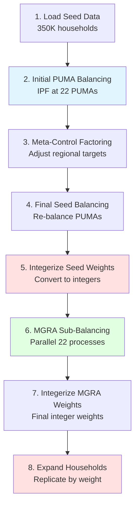

# Algorithm Details

How PopulationSim balances 56 control variables to create synthetic populations.

## Overview

PopulationSim uses a sophisticated balancing algorithm to adjust household weights from the ACS PUMS sample until they match all control totals. The core technique is **Iterative Proportional Fitting (IPF)** with several enhancements for production use.

### The Challenge

Given:
- **Seed data:** 350,000 ACS PUMS households with initial weights
- **56 control variables:** Target totals for demographics across ~24,321 MGRAs
- **Constraints:** Weights must remain reasonable (max 30× original)

Produce:
- **Integer weights** for each seed household at each MGRA
- **Match controls** as closely as possible
- **Preserve correlations** within households from seed data

## Algorithm Flow



## Iterative Proportional Fitting (IPF)

### Basic IPF Process

IPF adjusts weights iteratively to match control totals:

**Step 1: Initialize**
```python
# Start with original PUMS weights
for household in seed_data:
    weight[household] = WGTP[household]
```

**Step 2: Iterate Over Controls**
```python
for control in controls_sorted_by_importance:
    # Calculate current weighted total
    current_total = sum(weight[h] * matches_control(h, control) 
                       for h in households)
    
    # Compute adjustment factor
    adjustment = target[control] / current_total
    
    # Update weights for matching households
    for household in households:
        if matches_control(household, control):
            weight[household] *= adjustment
            
    # Apply maximum expansion constraint
    for household in households:
        max_weight = max_expansion_factor * WGTP[household]
        if weight[household] > max_weight:
            weight[household] = max_weight
```

**Step 3: Check Convergence**
```python
converged = True
for control in controls:
    current = calculate_total(control)
    relative_error = abs(current - target[control]) / target[control]
    
    if relative_error > tolerance:  # Default: 0.0001 = 0.01%
        converged = False
        break

if converged or iterations > max_iterations:
    stop_iterating()
```

### Why IPF Works

**Mathematical Foundation:**
- IPF minimizes the Kullback-Leibler divergence between adjusted and original weights
- Guaranteed to converge if a feasible solution exists
- Preserves household characteristics (correlations) from seed data

**Practical Benefits:**
- Fast: Typically converges in 50-200 iterations
- Stable: Handles conflicting controls gracefully
- Interpretable: Each adjustment has clear meaning

### Importance Weights

Controls are processed in order of **importance weight**:

| Importance | Priority | Typical Deviation After IPF |
|-----------|----------|----------------------------|
| 1,000,000,000 | Critical | <0.001% |
| 1,000,000 | Very High | <0.01% |
| 250,000 | High | <0.1% |
| 100,000 | Medium | <0.5% |

**Higher importance = tighter constraint during balancing**

### Expansion Factor Constraint

The `max_expansion_factor` prevents extreme weight adjustments:

```python
max_expansion_factor = 30  # SANDAG setting

# Example:
# Household has WGTP = 50 (represents 50 actual households)
# Maximum allowed weight = 30 × 50 = 1,500
# Cannot represent more than 1,500 households
```

**Why 30?**
- Too low (e.g., 10): May not be able to meet all controls
- Too high (e.g., 100): Single households dominate, less realistic variation
- 30: Empirically determined balance for San Diego

## Geographic Hierarchy

PopulationSim balances in **stages** respecting the geographic hierarchy:

```
Region (1)
  ├── PUMA 7301 (8,342 MGRAs)
  │     ├── MGRA 1
  │     ├── MGRA 2
  │     └── ...
  ├── PUMA 7302 (7,901 MGRAs)
  │     ├── MGRA 8343
  │     └── ...
  └── ... (22 PUMAs total)
```

### Phase 1: Initial Seed Balancing (PUMA Level)

**Geography:** 22 PUMAs  
**Purpose:** Create base weights that sum correctly at PUMA level  
**Controls:** MGRA controls aggregated to PUMA (implicit controls)

```python
# For each PUMA, aggregate MGRA targets
for puma in PUMAs:
    target[puma][control] = sum(mgra_targets[control] 
                                for mgra in puma.MGRAs)
    
    # Run IPF to match PUMA totals
    run_IPF(puma.seed_households, target[puma])
```

**Output:** `initial_seed_weights` (fractional)  
**Runtime:** ~5-7 minutes

### Phase 2: Meta-Control Factoring (Region Level)

**Purpose:** Ensure PUMA results are consistent with regional employment controls

```python
# Calculate what PUMA balancing actually achieved
puma_region_total = sum(result[puma][control] for puma in PUMAs)

# Adjust regional target to match
adjusted_target[control] = puma_region_total

# Now regional and PUMA totals are mathematically consistent
```

**Why Needed?**
- Regional employment controls from external source (Economic Team CSV)
- PUMA-level IPF may produce slightly different regional totals
- Adjustment ensures no conflicting constraints

**Output:** `adjusted_region_controls`  
**Runtime:** <1 minute

### Phase 3: Final Seed Balancing (PUMA Level)

**Purpose:** Re-balance with fully consistent control set

```python
for puma in PUMAs:
    # Combine PUMA-level and adjusted regional controls
    all_controls = mgra_controls_aggregated + adjusted_region_controls
    
    # Re-run IPF
    run_IPF(puma.seed_households, all_controls)
```

**Output:** `final_seed_weights` (fractional)  
**Runtime:** ~5-7 minutes

### Phase 4: Seed Weight Integerization (PUMA Level)

**Purpose:** Convert fractional PUMA weights to integers

```python
# Mixed Integer Linear Programming problem
minimize:
    sum(importance[c] * (result[c] - target[c])^2 for c in controls)

subject to:
    # Weights must be integers
    weight[h] in {0, 1, 2, ..., max_expansion_factor * WGTP[h]}
    
    # Backstopped controls exactly met
    for critical_control in backstopped_controls:
        sum(weight[h] * matches(h, control)) == target[control]
```

**Backstopped Controls** (exactly met):
- `Total_HH` (importance: 1,000,000,000)
- `lfp_black`, `lfp_hispanic`, `lfp_other`, `lfp_white` (importance: 1,225,000)

**Output:** `integer_seed_weights` (integers)  
**Runtime:** ~3-5 minutes  
**Solver:** OR-Tools or GLPK

### Phase 5: MGRA Sub-Balancing (Parallel)

**Purpose:** Allocate PUMA households to individual MGRAs

**Process:**
1. **For each MGRA** (within its parent PUMA):
   ```python
   # Get eligible seed households (from this MGRA's PUMA)
   eligible_households = puma.seed_households
   
   # Start with integer PUMA weights
   initial_weights = integer_seed_weights
   
   # Run list balancing (IPF variant)
   run_IPF(eligible_households, mgra_controls[mgra], 
           starting_weights=initial_weights)
   ```

2. **List Balancing Algorithm:**
   - Similar to standard IPF
   - Starts from integer seed weights (not original WGTP)
   - Produces fractional MGRA weights
   - Faster convergence than starting from scratch

**Parallelization:**
- 22 separate Python processes (one per PUMA)
- Each process handles ~1,100 MGRAs
- No inter-process communication needed
- Wall-clock time: ~40 minutes (vs. ~13 hours sequential)

**Output:** `mgra_weights` (fractional)  
**Runtime:** ~40 minutes (parallelized)

### Phase 6: MGRA Weight Integerization

**Purpose:** Final conversion to integer weights

```python
for mgra in MGRAs:
    # Integerize with backstopping
    minimize:
        sum(importance[c] * deviation[c]^2)
    
    subject to:
        weight[h] in integers
        Total_HH exactly met
```

**Output:** `final_mgra_weights` (integers)  
**Runtime:** ~5-10 minutes

## Integerization Details

### Why Integerization?

IPF produces **fractional weights** (e.g., 15.7), but we need **integers** to physically replicate households.

**Example:**
```
Household ID 12345 has final weight = 15.7

Can't create "15.7 copies" in synthetic population!
Must decide: Create 15 copies? Or 16 copies?
```

### Simultaneous vs. Sequential

**Simultaneous Integerization** (SANDAG uses this):
```python
# Consider ALL controls at once
# Find integer solution that best satisfies entire control set
# MILP (Mixed Integer Linear Programming) problem
```

**Pros:**
- Globally optimal solution
- Better quality (lower total deviation)
- Respects control interactions

**Cons:**
- Slower (~3-5 minutes vs. <1 minute)
- More complex solver required

**Sequential Integerization** (alternative):
```python
# Round one control at a time
# May accumulate errors across controls
```

### Backstopping Mechanism

**Backstopped controls** are guaranteed exact match after integerization:

```python
# In settings.yaml
INTEGERIZE_WITH_BACKSTOPPED_CONTROLS: True

# Controls with importance > 500,000,000 are backstopped
backstopped = [
    'Total_HH',           # 1,000,000,000
    'lfp_black',          # 1,225,000
    'lfp_hispanic',       # 1,225,000
    'lfp_other',          # 1,225,000
    'lfp_white'           # 1,225,000
]
```

**Implementation:**
```python
# MILP constraint
for control in backstopped_controls:
    sum(integer_weight[h] * matches(h, control)) == target[control]
    # Must equal exactly, not approximately
```

**Result:**
- Total household counts always exact (no rounding error)
- Labor force participation rates always exact
- Other controls may show small deviations (typically <0.5%)

## Multiprocessing Architecture

### Why Parallel Processing?

**Sequential execution:**
- Process 24,321 MGRAs one at a time
- ~2 seconds per MGRA
- Total: ~13.5 hours per year

**Parallel execution (22 processes):**
- Process all MGRAs in one PUMA simultaneously
- Still ~2 seconds per MGRA, but 1,100 in parallel
- Total: ~40 minutes per year
- **20× speedup!**

### Parallelization Strategy

```python
# Main process spawns 22 child processes
for puma in PUMAs:
    process = multiprocessing.Process(
        target=balance_puma_mgras,
        args=(puma, seed_data, controls)
    )
    process.start()

# Each child process handles one PUMA
def balance_puma_mgras(puma, seed_data, controls):
    for mgra in puma.MGRAs:
        weights = run_IPF(mgra, seed_data, controls)
        save_results(mgra, weights)
```

### Data Slicing

**What gets sliced** (each process gets its own copy):
- MGRA controls for this PUMA's MGRAs
- Geographic crosswalk for this PUMA

**What doesn't get sliced** (shared read-only):
- Seed data (all processes use same households/persons)
- Algorithm settings
- Control specifications

### Hardware Requirements

**CPU:**
- Minimum: 22 logical cores (for full parallelization)
- With fewer cores: Set `num_processes` to match available cores
- Example: 11 cores → runtime ~2 hours instead of 40 minutes

**Memory:**
- Each process uses ~3 GB
- 22 processes × 3 GB = ~66 GB RAM needed
- With less RAM: Reduce `num_processes`

**Disk:**
- Separate log files per process: `populationsim_PUMA7301.log`, etc.
- Temporary outputs coalesced at end

## Key Algorithm Parameters

### Settings Location

`populationsim/configs/settings.yaml`

### Critical Parameters

```yaml
# Expansion limit
max_expansion_factor: 30
# Higher = more flexibility, but less realistic
# Lower = may not be able to meet controls

# Convergence criteria
max_iterations: 5000
# Stop after this many IPF iterations

absolute_convergence: 0.0001
# Stop when all controls within this absolute difference

relative_convergence: 0.0001
# Stop when all controls within 0.01% relative difference

# Integerization
INTEGERIZE_WITH_BACKSTOPPED_CONTROLS: True
# Ensure critical controls exactly met

USE_SIMUL_INTEGERIZER: True
# Use simultaneous integerization (better quality)

SUB_BALANCE_WITH_FLOAT_SEED_WEIGHTS: False
# Use integer seed weights at MGRA level (faster)
```

### When to Adjust

**Convergence failures:**
- Increase `max_iterations` to 10000
- Loosen `absolute_convergence` to 0.001

**Too much variation in weights:**
- Decrease `max_expansion_factor` to 20 or 15
- Review control totals for conflicts

**Better quality needed:**
- Increase `max_expansion_factor` to 40 or 50
- Review importance weights in `controls.csv`

## Performance Characteristics

### Runtime Breakdown (Per Year)

| Phase | Duration | % of Total |
|-------|----------|-----------|
| Seed data extraction | 3 min | 4% |
| Phase 1-3: PUMA balancing | 15 min | 23% |
| Phase 4: Seed integerization | 5 min | 8% |
| Phase 5: MGRA sub-balancing | 40 min | 60% |
| Phase 6: MGRA integerization | 3 min | 5% |
| **Total** | **~66 min** | **100%** |

### Scalability

**Problem size:**
- 350K seed households
- 56 control variables
- 24,321 geographic zones

**Computation:**
- ~50 IPF iterations typical at PUMA level
- ~100 IPF iterations typical at MGRA level
- ~5-10 seconds to solve integerization MILP per zone

**Memory:**
- Incidence matrix: Sparse, ~500 MB
- Weights: ~10 MB per geography
- Total: ~3 GB per parallel process

## Quality Metrics

### Typical Results (2022 SANDAG)

| Control Type | Mean Absolute % Error |
|-------------|---------------------|
| Total_HH | 0.000% (exact) |
| Labor force | 0.000% (exact) |
| Household size | 0.12% |
| Income | 0.31% |
| Age groups | 0.18% |
| Race/ethnicity | 0.24% |
| Workers | 0.15% |

### Deviation Patterns

**By Geography:**
- Small MGRAs (HH < 50): Higher % deviations acceptable
- Large MGRAs (HH > 500): Should be within ±1%
- PUMA totals: Should be within ±0.5%
- Regional totals: Exact (backstopped)

**By Control:**
- Higher importance → smaller deviation
- Controls with fewer matching households → harder to balance
- Conflicting controls → one may deviate more to satisfy the other

## Algorithm Comparison

### IPF vs. Alternatives

| Method | Speed | Quality | Complexity |
|--------|-------|---------|------------|
| **IPF (SANDAG)** | Fast | High | Medium |
| Entropy maximization | Slow | Very High | High |
| Linear programming | Very Slow | High | High |
| Simple raking | Very Fast | Medium | Low |

**Why IPF?**
- Best speed-quality tradeoff for production use
- Proven track record in population synthesis
- Handles 56 controls across 24,321 zones in reasonable time
- Produces stable, interpretable results

## Troubleshooting Common Issues

### Convergence Failure

**Symptom:** IPF doesn't converge after 5000 iterations

**Causes:**
1. Conflicting control totals (impossible to satisfy all)
2. Insufficient seed diversity
3. Too restrictive `max_expansion_factor`

**Solutions:**
1. Check control totals sum correctly
2. Increase `max_iterations` or loosen convergence criteria
3. Increase `max_expansion_factor`
4. Review importance weights (lower less critical controls)

### Large Deviations

**Symptom:** Some controls show >5% deviation from targets

**Causes:**
1. Small sample size in seed for rare household types
2. Conflicting controls forcing tradeoffs
3. Geographic misalignment (controls don't match seed PUMAs)

**Solutions:**
1. Review control totals for reasonableness
2. Adjust importance weights to prioritize critical controls
3. Check geographic crosswalk accuracy

### Memory Errors

**Symptom:** Process killed or crashes with memory error

**Solutions:**
1. Reduce `num_processes` in `configs_mp/settings.yaml`
2. Close other applications
3. Increase system virtual memory
4. Consider sequential processing (set `multiprocess: False`)

## Next Steps

✅ Understand balancing? → [Running PopulationSim](Running-PopulationSim)  
✅ Want to adjust parameters? → [Configuration Reference](Configuration-Reference)  
✅ Need control details? → [Control Variables](Control-Variables)  
❓ Having issues? → [Troubleshooting](Troubleshooting)

---

**For detailed mathematical proofs and advanced topics:** See [SANDAG_PopulationSim_Documentation.md](../documentation/SANDAG_PopulationSim_Documentation.md) Section 2.5
