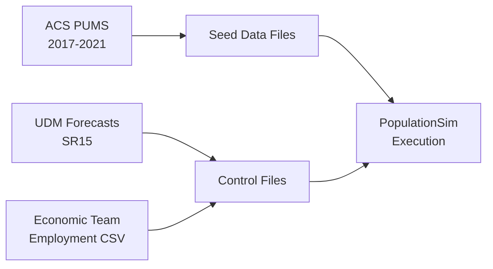

# Data Preparation

Overview of data sources, extraction, and transformation processes.

## Overview

Data preparation transforms raw data from multiple sources into structured inputs for PopulationSim:



## Data Sources

### 1. ACS PUMS (American Community Survey Public Use Microdata Sample)

**Purpose:** Seed population (sample households and persons)

**Source:**
- Database: `[acs].[pums]`
- Tables: `vi_5y_2017_2021_households_sd`, `vi_5y_2017_2021_persons_sd`
- Geographic: San Diego County only
- Vintage: 5-year pooled estimates (2017-2021)

**Key Fields Extracted:**
- **Households:** SERIALNO, PUMA, WGTP (weight), NP (size), HINCP (income), HHT, HUPAC, VEH, BLD, TYPEHUGQ
- **Persons:** SERIALNO, SPORDER, WGTP, PWGTP, AGEP, SEX, RAC1P, HISP, ESR, COW, WKHP, SCHG, MIL, SCHL, OCCP, WKW, NAICSP, SOCP

**Sample Size:**
- ~400,000 households
- ~1,000,000 persons
- Weighted to represent ~1.2M actual households in San Diego

### 2. UDM Forecasts (Urban Data Management)

**Purpose:** Control totals by MGRA and year

**Source:**
- Database: UDM staging
- Schema: `[udm_staging].[sr15]` (Series 15 forecasts)
- Tables: `pop_ase_mgra`, `hh_characteristics_mgra`, `mgrabase`

**Forecast Years:** 2022, 2026, 2029, 2032, 2035, 2040, 2050

**Key Controls Generated:**
- **Age/sex:** 42 cells (Male/Female × 21 age groups)
- **Race/ethnicity:** 6 categories (Hispanic, White alone, Black, Asian, Two or More, Other)
- **Household size:** 4 categories (1, 2, 3, 4+)
- **Income:** 10 categories ($0-10K, $10K-20K, ... $150K+)
- **Workers:** 4 categories (0, 1, 2, 3+)
- **Children:** 3 categories (0, 1, 2+)

### 3. Economic Team Controls

**Purpose:** Employment by industry sector (18 categories)

**Source:**
- File: `data/Economic Team Region Controls.csv`
- Provided by: SANDAG Economics Team
- Updated: Quarterly or as needed

**Industries (NAICS-based):**
- job_1 through job_18 (by 2-digit NAICS sectors)
- Examples: Agriculture, Construction, Manufacturing, Retail, Healthcare, etc.
- Special: Military employment (job_2) adjusted to remove GQ military

### 4. Geographic Crosswalk

**Purpose:** MGRA ↔ PUMA ↔ Region mapping

**Source:**
- File: `populationsim/data/geo_cross_walk.csv`
- Manually maintained
- Based on 2010 PUMA boundaries (for ACS PUMS 2017-2021)

**Structure:**
```csv
mgra,PUMA,region
1,7301,1
2,7301,1
...
```

## Data Extraction Queries

### Seed Households Query

Located in: `sql/seed_households.sql`

**Key Transformations:**
1. **Filter:** San Diego County only (PUMA 7301-7322)
2. **Inflation Adjustment:** CPI adjustment for income (HINCP) by survey year
3. **Group Quarters:** Split into HH vs. GQ based on TYPEHUGQ
4. **Household ID:** Assign sequential hhid using ROW_NUMBER()

**Output:** 
- `seed_households_hh.csv` (~350K regular households)
- `seed_households_gq.csv` (~50K GQ "households")

### Seed Persons Query

Located in: `sql/seed_persons.sql`

**Key Transformations:**
1. **Join:** Link persons to households via SERIALNO
2. **Industry/Occupation:** Derive NAICS2, SOC2 from detailed codes
3. **Military Flag:** Extract from MIL field
4. **Labor Force:** Derive from ESR (Employment Status Recode)
5. **Group Quarters:** Split persons matching GQ households

**Output:**
- `seed_persons_hh.csv` (~950K persons in regular households)
- `seed_persons_gq.csv` (~50K persons in GQ)

### MGRA Controls Query

Located in: `sql/mgra_controls.sql`

**Purpose:** Generate 42 control variables × ~24,321 MGRAs for specific year

**Data Flow:**
```sql
SELECT 
    mgra,
    -- Age/Sex (42 controls)
    male_0_4, male_5_17, male_18_24, ..., female_85plus,
    -- Household size (4 controls)
    hhs1, hhs2, hhs3, hhs4plus,
    -- Income (10 controls)
    i1, i2, i3, i4, i5, i6, i7, i8, i9, i10,
    -- Workers (4 controls)
    hh_wrk0, hh_wrk1, hh_wrk2, hh_wrk3plus,
    -- Children (3 controls)
    hh_kid0, hh_kid1, hh_kid2plus,
    -- Total households
    hh as Total_HH
FROM [udm_staging].[sr15].hh_characteristics_mgra
WHERE yr = @year
```

**Output:** `mgra_controls.csv` (~24K rows × 43 columns, regenerated for each year)

### Regional Controls Query

Located in: `sql/region_controls.sql`

**Purpose:** Generate employment controls at regional level

**Data Sources:**
1. **Military GQ:** From UDM `pop_ase_mgra` (gq_mil column)
2. **Employment by industry:** From Economic Team CSV file

**Military Adjustment:**
```sql
-- Subtract military GQ from job_2 to avoid double-counting
job_2_adjusted = job_2_total - SUM(gq_mil)
```

**Output:** `region_controls.csv` (~18 rows, one per employment sector)

### ABM Land Use File Query

Located in: `sql/mgrabase.sql`

**Purpose:** Generate `mgra15_based_input_{year}.csv` for ABM consumption

**Key Fields (~75 columns):**
- Geography: mgra, taz, LUZ, pseudomsa, zip
- Population: pop, hhp, hh, gq_civ, gq_mil
- Income Distribution: i1-i10
- Employment: emp_total, emp_gov, emp_mil, emp_ag_min, emp_bus_svcs, etc. (19 fields)
- Education: enrollgradekto8, enrollgrade9to12, collegeenroll, etc.
- Land Use: parkactive, openspaceparkpreserve, beachactive, hotelroomtotal

**Output:** `mgra15_based_input_{year}.csv` (~24K MGRAs, 5 MB)

## Data Transformations

### CPI Inflation Adjustment

**Purpose:** Adjust ACS PUMS income to forecast year dollars

**Method:** CPI-U for San Diego (FRED code: CUUSA424SA0)

**Multipliers (to 2022 dollars):**
| Survey Year | CPI Index | Multiplier | Adjustment |
|-------------|-----------|------------|------------|
| 2017 | 283.012 | 1.217 | +21.7% |
| 2018 | 292.547 | 1.177 | +17.7% |
| 2019 | 299.433 | 1.150 | +15.0% |
| 2020 | 303.932 | 1.133 | +13.3% |
| 2021 | 319.761 | 1.077 | +7.7% |

**Application:**
```sql
HHADJINC = CASE 
    WHEN LEFT(SERIALNO, 4) = '2021' THEN HINCP * 1.077
    WHEN LEFT(SERIALNO, 4) = '2020' THEN HINCP * 1.133
    WHEN LEFT(SERIALNO, 4) = '2019' THEN HINCP * 1.150
    WHEN LEFT(SERIALNO, 4) = '2018' THEN HINCP * 1.177
    WHEN LEFT(SERIALNO, 4) = '2017' THEN HINCP * 1.217
END
```

### Worker Count Derivation

**Purpose:** Calculate number of workers per household from person-level ESR

**Logic:**
```python
# For each household, count persons with ESR in (1,2,4,5)
# ESR values: 1=Employed at work, 2=Employed absent, 4=Armed forces at work, 5=Armed forces absent
workers = persons.groupby('household_id').apply(
    lambda x: x[x['ESR'].isin([1,2,4,5])].shape[0]
)
```

**Result:** Integer field (0, 1, 2, 3+) added to household records

### Race/Ethnicity Hierarchy

**Purpose:** Create consistent 6-category race classification

**Hierarchy:**
1. **Hispanic:** HISP ≠ 1 (any Hispanic origin)
2. **White alone:** RAC1P = 1 AND HISP = 1
3. **Black or African American alone:** RAC1P = 2 AND HISP = 1
4. **Asian alone:** RAC1P = 6 AND HISP = 1
5. **Two or More Races:** RAC1P = 9 AND HISP = 1
6. **Other:** All other combinations

**Implementation:**
```python
def assign_race(row):
    if row['HISP'] != 1:
        return 'Hispanic'
    elif row['RAC1P'] == 1:
        return 'White alone'
    elif row['RAC1P'] == 2:
        return 'Black or African American alone'
    elif row['RAC1P'] == 6:
        return 'Asian alone'
    elif row['RAC1P'] == 9:
        return 'Two or More Races'
    else:
        return 'Other'

persons['race'] = persons.apply(assign_race, axis=1)
```

### NAICS/SOC Code Simplification

**Purpose:** Group detailed occupation/industry codes into 2-digit categories

**NAICS (Industry):**
```python
# Standard: First 2 digits
persons['NAICS2'] = persons['NAICSP'].astype(str).str[:2]

# Exception: Accommodation/Food (721, 722 → keep 3 digits)
persons.loc[persons['NAICSP'].astype(str).str[:2] == '72', 'NAICS2'] = \
    persons['NAICSP'].astype(str).str[:3]

# Military: Special code 'MIL'
persons.loc[persons['MIL'] == 1, 'NAICS2'] = 'MIL'
```

**SOC (Occupation):**
```python
# Always first 2 digits
persons['SOC2'] = persons['SOCP'].astype(str).str[:2]
```

## Data Quality Checks

### Pre-Processing Validation

✓ **Seed data completeness**
- All required fields present
- SERIALNO matches between households and persons
- PUMA codes valid (7301-7322)

✓ **Control total consistency**
- MGRAs sum to PUMA totals
- PUMAs sum to regional totals
- Household size categories sum to Total_HH

✓ **Geographic crosswalk**
- All MGRAs assigned to valid PUMA
- No duplicate MGRA entries
- Region always = 1

### Post-Processing Validation

✓ **Income adjustment**
- All HHADJINC values ≥ 0
- Mean adjusted income within expected range
- Inflation factors correctly applied by year

✓ **Worker counts**
- Workers ≤ household size
- No negative values
- Distribution reasonable

✓ **File sizes**
- Seed households: ~350K rows HH + ~50K GQ
- Seed persons: ~950K rows HH + ~50K GQ
- MGRA controls: ~24,321 rows
- Regional controls: ~18 rows

## Execution Module

Data preparation is orchestrated by `python/build_seed_data.py` and `python/build_controls.py`:

```python
# Called by main.py during initialization
seed_households = get_seed_households(engine, config["sql"]["seed_households"])
seed_persons = get_seed_persons(engine, config["sql"]["seed_persons"])

# Called for each forecast year
mgra_controls = get_mgra_controls(engine, config["sql"]["mgra_controls"], year)
region_controls = get_region_controls(engine, config["sql"]["region_controls"], year)
```

## Updating Data Sources

### When to Update Seed Data
- New ACS PUMS vintage released (annually in October)
- Geographic boundary changes (PUMA redefinition every 10 years)
- Methodological improvements to seed extraction

### When to Update Control Totals
- New UDM forecast series released (e.g., SR16, SR17)
- Economic Team provides updated employment forecasts
- ABM land use file structure changes

### How to Update
1. Update SQL queries in `sql/` directory
2. Update `config.yml` with new file paths/schema names
3. Update `secrets.yml` with new database references
4. Test with single year before full 7-year run
5. Document changes in Git commit message

## Next Steps

✅ Understand data flow? → [Running PopulationSim](Running-PopulationSim)  
✅ Need to configure? → [Configuration Reference](Configuration-Reference)  
❓ Questions about controls? → [Control Variables](Control-Variables)

---

**For detailed technical documentation:** See [SANDAG_PopulationSim_Documentation.md](../documentation/SANDAG_PopulationSim_Documentation.md) Section 3
