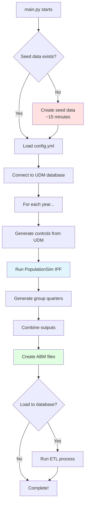
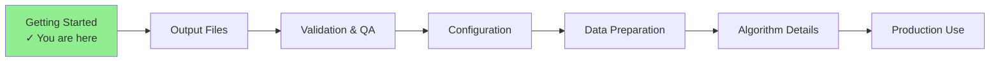

# Getting Started with SANDAG PopulationSim

This quick start guide will help you run your first PopulationSim synthesis in about 30 minutes.

## Prerequisites

Before you begin, ensure you have:

✅ Windows 10/11 or Linux environment  
✅ Python 3.9, 3.10, 3.11, or 3.12 installed  
✅ Access to SANDAG's UDM staging database (for control data)  
✅ ODBC Driver 17 for SQL Server (if using database features)  
✅ ~5GB free disk space for outputs  

## Quick Start (5 Steps)

### Step 1: Clone the Repository

```powershell
git clone https://github.com/SANDAG/Population-Sim.git
cd Population-Sim
git checkout new_populationsim
```

### Step 2: Install Dependencies with uv

```powershell
# Install uv package manager (if not already installed)
pip install uv

# Create virtual environment and install dependencies
uv venv
.venv\Scripts\Activate.ps1
uv pip install -e .
```

### Step 3: Verify Installation

```powershell
# Check if populationsim can be imported
python -c "import populationsim; print('PopulationSim imported successfully')"

# Check installed version
uv pip show populationsim
# Should show: Version: 0.10.0
```

### Step 4: Review Configuration

Open `config.yml` and verify the settings:

```yaml
version: "15.01"
seed_data: "pums_2017_2021"
years:
  - 2022
  - 2026
  # ... other years
```

### Step 5: Run PopulationSim

```powershell
# Run for a single year (recommended for first run)
python main.py
```

This will:
1. Create seed data (one-time, ~15 minutes)
2. Generate controls from UDM database
3. Run population synthesis for all configured years
4. Create ABM output files
5. Optionally load to database

## What Happens During a Run?



## Expected Output Files

After a successful run, you'll find:

```
output/
└── 2022/
    ├── final_households.csv        # All households
    ├── final_persons.csv           # All persons
    ├── abm/
    │   ├── households.csv          # ABM format
    │   ├── persons.csv             # ABM format
    │   └── mgra_based_input_2022.csv
    └── summary/
        ├── summary_region.csv      # Regional totals
        ├── summary_puma.csv        # PUMA-level totals
        └── summary_mgra.csv        # MGRA-level totals
```

## Validation Dashboard

Launch the interactive validation dashboard:

```powershell
cd report
streamlit run report.py
```

This opens a web interface at `http://localhost:8501` showing:
- Control vs. result comparisons
- Geographic distributions
- Demographic breakdowns
- Quality metrics

## Common First-Run Issues

### Issue: "Module 'populationsim' not found"

**Solution:**
```powershell
# Ensure virtual environment is activated
.venv\Scripts\Activate.ps1

# Reinstall in editable mode
uv pip install -e .
```

### Issue: "pyodbc.Error: Data source name not found"

**Solution:** Install ODBC Driver 17:
```powershell
# Download from Microsoft:
# https://learn.microsoft.com/en-us/sql/connect/odbc/download-odbc-driver-for-sql-server

# Then verify in config that connection string is correct
```

### Issue: "KeyError: 'SERIALNO' in seed data"

**Solution:** Seed data creation failed. Delete and recreate:
```powershell
Remove-Item -Recurse populationsim\data\seed_*.csv
python -c "from python.build_seed_data import main; main()"
```

### Issue: Very slow execution (~hours)

**Causes:**
- First run creates seed data (~15 minutes - this is normal)
- Running all 7 years takes ~2-3 hours total
- Database queries may be slow depending on network

**Solution:** Run one year first to verify:
```yaml
# In config.yml, comment out other years:
years:
  - 2022
  # - 2026
  # - 2029
  # ... etc
```

## Performance Expectations

| Task | Time | Notes |
|------|------|-------|
| Seed data creation | ~15 min | One-time operation |
| Control generation | ~5 min | Per year |
| PopulationSim synthesis | ~60-75 min | Per year, 22 parallel processes |
| Group quarters | ~2 min | Per year |
| ABM output creation | ~3 min | Per year |
| **Total (1 year)** | **~80 min** | After seed data exists |
| **Total (all 7 years)** | **~8-10 hours** | Including seed data |

## Next Steps

✅ **You've completed your first run!** Now you can:

1. **[Understand the outputs](Output-Files)** - Learn about file formats and specifications
2. **[Run validation](Validation-and-QA)** - Use the Streamlit dashboard
3. **[Customize configuration](Configuration-Reference)** - Adjust settings for your needs
4. **[Deep dive into methodology](Algorithm-Details)** - Understand the IPF algorithm
5. **[Prepare for production](Running-PopulationSim)** - Full workflow with all options

## Learning Path



**Next recommended page:** [Output Files](Output-Files) - Understanding what you just created

---

**Need help?** Check the [Troubleshooting](Troubleshooting) guide or [FAQ](FAQ)
