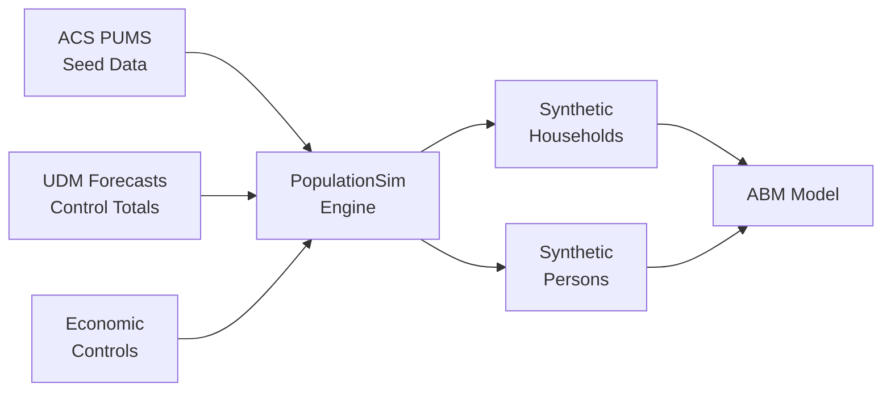

# SANDAG PopulationSim Wiki

Welcome to the SANDAG Population Synthesizer documentation wiki! This system generates synthetic populations for the San Diego region using the ActivitySim PopulationSim framework.

## 🚀 Quick Links

- **[Getting Started](Getting-Started)** - New to PopulationSim? Start here
- **[Installation & Setup](Installation-and-Setup)** - Install dependencies and configure the system
- **[Running PopulationSim](Running-PopulationSim)** - Execute synthesis runs step-by-step
- **[Output Files](Output-Files)** - Understanding the generated data
- **[Validation & QA](Validation-and-QA)** - Quality assurance procedures

## 📖 Documentation Sections

### For New Users
- [Getting Started](Getting-Started) - Quick start guide for first-time users
- [System Overview](System-Overview) - Architecture and key concepts
- [FAQ](FAQ) - Frequently asked questions

### For Technical Staff
- [Installation & Setup](Installation-and-Setup) - Python environment and dependencies
- [Running PopulationSim](Running-PopulationSim) - Complete execution workflow
- [Data Preparation](Data-Preparation) - Seed data and control generation
- [Configuration Reference](Configuration-Reference) - Settings and parameters
- [Troubleshooting](Troubleshooting) - Common issues and solutions

## 🎯 What is PopulationSim?

SANDAG's PopulationSim creates synthetic households and persons that match regional forecasts:

- **Input:** Aggregate demographic forecasts (e.g., "1,000 households in MGRA 12345")
- **Output:** Individual synthetic households and persons with detailed attributes
- **Coverage:** ~23,000 MGRAs across San Diego County
- **Forecast Years:** 2022, 2026, 2029, 2032, 2035, 2040, 2050



## 📊 Key Features

✅ **56 control variables** - Demographics, income, household size, workers, age, race/ethnicity  
✅ **Three-level geography** - Region → 22 PUMAs → ~23,000 MGRAs  
✅ **Parallel processing** - 22 simultaneous PUMA processes  
✅ **Group quarters** - Military, college dorms, other institutional  
✅ **Quality assurance** - Interactive Streamlit validation dashboard  
✅ **ABM-ready outputs** - Direct integration with activity-based travel model  

## 🔧 Technology Stack

- **PopulationSim:** v0.10.0 (ActivitySim framework)
- **Python:** 3.9 - 3.12 (3.13+ not yet supported)
- **Package Manager:** uv (fast dependency resolution)
- **Database:** Microsoft SQL Server (optional, legacy)
- **Data Lake:** Azure/cloud storage (in development)
- **Validation:** Streamlit dashboard

## 📝 Current Version

**Version:** TBD  
**Date:** June 2, 2026  
**Seed Data:** ACS PUMS 5-year 2017-2021  
**Branch:** new_populationsim  

## 🤝 Support

For questions or issues:
1. Check the [FAQ](FAQ) and [Troubleshooting](Troubleshooting) pages
2. Review the [comprehensive technical documentation](../documentation/SANDAG_PopulationSim_Documentation.md)
3. Contact the SANDAG Modeling team

## 📂 Repository Structure

```
Population-Sim/
├── config.yml                 # Main configuration file
├── main.py                    # Entry point for full workflow
├── pyproject.toml            # Python dependencies
├── data/                     # Input data files
├── documentation/            # Complete technical documentation
├── populationsim/            # PopulationSim execution scripts
│   ├── configs/             # PopulationSim settings
│   ├── data/                # Geographic crosswalk
│   └── output/              # Synthesis results
├── python/                   # Data preparation modules
│   ├── build_controls.py    # Control generation
│   ├── build_seed_data.py   # Seed data preparation
│   ├── etl.py               # Database ETL (legacy)
│   └── outputs.py           # ABM output creation
├── report/                   # Validation dashboard
└── sql/                      # SQL queries for data extraction
```

---

**Ready to get started?** → [Installation & Setup](Installation-and-Setup)
