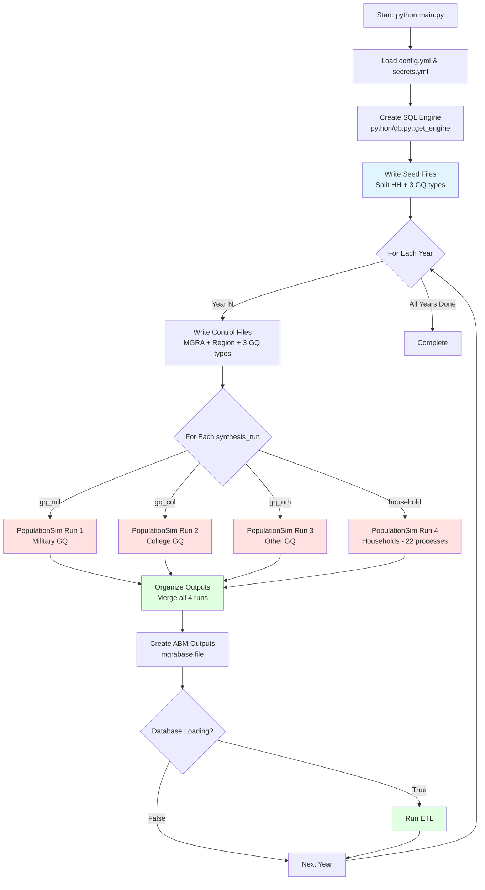

# Running PopulationSim

Complete guide to executing population synthesis runs.

## Pre-Execution Checklist

Before running `main.py`, verify:

1. ✓ Python environment activated (`.venv\Scripts\Activate.ps1`)
2. ✓ All configuration files present and valid
   - `config.yml` exists
   - `secrets.yml` created with correct credentials
   - `populationsim/configs/settings.yaml` exists
   - `populationsim/configs/controls.csv` exists
3. ✓ Database connectivity tested
4. ✓ Sufficient disk space (~10 GB per year)
5. ✓ No conflicting processes using data directories
6. ✓ Expected runtime: ~4-5 hours for all 7 years

## Basic Execution

```Command Pompt Window
# Navigate to repository root
cd C:\Projects\Population-Sim

# Activate environment
.venv\Scripts\Activate.ps1

# Run main script
python main.py
```

### Expected Console Output

```
2026-06-02 09:00:15 - INFO - Building controls for 2022
[SQL queries executing...]
2026-06-02 09:02:30 - INFO - Running populationsim for 2022
[PopulationSim detailed logging...]
2026-06-02 10:05:45 - INFO - Simulation run successful
2026-06-02 10:06:00 - INFO - PopSim outputs organized for 2022
2026-06-02 10:08:15 - INFO - ABM outputs created for 2022

2026-06-02 10:08:20 - INFO - Building controls for 2026
[Process repeats for each year...]

2026-06-02 16:45:30 - INFO - All years processed successfully.
```

## Execution Workflow



## Execution Steps Breakdown

### Step 1: Initialization (~1 second)
- Load `config.yml` and `secrets.yml`
- Create database connection via `python/db.py::get_engine()`
- Includes TrustServerCertificate=yes for ODBC Driver 18 compatibility
- Verify configuration

### Step 2: Seed Data Extraction (~2-3 minutes)
- Extract ACS PUMS households and persons from SQL
- Split into regular households (HH) and group quarters (GQ)
- Split GQ by type (military, college, other) using GQ_TYPES registry
- Write 8 seed files to `populationsim/data/`:
  - `seed_households_hh.csv` (~350K rows)
  - `seed_persons_hh.csv` (~950K rows)
  - `seed_households_gq_mil.csv` (~2,500 rows)
  - `seed_persons_gq_mil.csv` (~2,500 rows)
  - `seed_households_gq_col.csv` (~2,500 rows)
  - `seed_persons_gq_col.csv` (~2,500 rows)
  - `seed_households_gq_oth.csv` (~2,700 rows)
  - `seed_persons_gq_oth.csv` (~2,700 rows)
  - `seed_persons_hh.csv` (~950K rows)

### Step 3: For Each Year

#### 3a. Build Controls (~10-15 seconds per year)
- Generate MGRA-level control totals (42 controls × ~24,321 MGRAs)
- Generate regional control totals (18 employment sectors)
- Split GQ controls by type using `write_gq_control_files()`
- Write to `populationsim/data/`:
  - `mgra_controls.csv` (all household controls)
  - `mgra_controls_gq_mil.csv` (MGRAs with military GQ only)
  - `mgra_controls_gq_col.csv` (MGRAs with college GQ only)
  - `mgra_controls_gq_oth.csv` (MGRAs with other GQ only)
  - `region_controls.csv` (employment controls)

#### 3b. Run PopulationSim Multiple Times (~40 minutes total per year)

The workflow executes 4 separate PopulationSim runs as defined in `config.yml: synthesis_runs`:

**Run 1: Military GQ (~1 minutes)**
```bash
python run_populationsim.py -c ./configs_gq_mil -c ./configs_common -d ./data -o ./output_gq_mil
```
- Uses `seed_households_gq_mil.csv`, `seed_persons_gq_mil.csv`
- Uses `mgra_controls_gq_mil.csv` (only MGRAs with military GQ)
- Single process (num_processes=1)
- Outputs to `populationsim/output_gq_mil/`

**Run 2: College GQ (~1 minutes)**
```bash
python run_populationsim.py -c ./configs_gq_col -c ./configs_common -d ./data -o ./output_gq_col
```
- Uses `seed_households_gq_col.csv`, `seed_persons_gq_col.csv`
- Uses `mgra_controls_gq_col.csv` (only MGRAs with college GQ)
- Single process (num_processes=1)
- Outputs to `populationsim/output_gq_col/`

**Run 3: Other GQ (~1 minutes)**
```bash
python run_populationsim.py -c ./configs_gq_oth -c ./configs_common -d ./data -o ./output_gq_oth
```
- Uses `seed_households_gq_oth.csv`, `seed_persons_gq_oth.csv`
- Uses `mgra_controls_gq_oth.csv` (only MGRAs with other GQ)
- Single process (num_processes=1)
- Outputs to `populationsim/output_gq_oth/`

**Run 4: Households (~35-40 minutes)**
```bash
python run_populationsim.py -c ./configs_mp -c ./configs -c ./configs_common -d ./data -o ./output -m 22
```
- Uses `seed_households_hh.csv`, `seed_persons_hh.csv`
- Uses `mgra_controls.csv` (all 42 household controls)
- 22 parallel processes (one per PUMA)
- Outputs to `populationsim/output/`

**Output files from all runs:**
- `output_gq_mil/synthetic_households_gq.csv`, `synthetic_persons_gq.csv`
- `output_gq_col/synthetic_households_gq.csv`, `synthetic_persons_gq.csv`
- `output_gq_oth/synthetic_households_gq.csv`, `synthetic_persons_gq.csv`
- `output/synthetic_households.csv`, `synthetic_persons.csv`
- Each run also produces summary files and timing logs

#### 3c. Organize Outputs (~10 seconds)
- Merge all 4 run outputs using `merge_synthetic_population()`
- Renumber household IDs sequentially to avoid conflicts:
  - gq_mil: household_ids 1 to N₁
  - gq_col: household_ids N₁+1 to N₂
  - gq_oth: household_ids N₂+1 to N₃
  - household: household_ids N₃+1 to N₄
- Drop PUMA column from combined files
- Fill NULL values for GQ-specific fields
- Copy ancillary files (timing logs, summaries from household run)
- Write to `output/{year}/`

#### 3d. Create ABM Outputs (~2-3 minutes)
- Query mgrabase data from SQL (land use, demographics by MGRA)
- Write `mgra15_based_input_{year}.csv` for ABM consumption

**Final output files** in `output/{year}/`:
- `synthetic_households.csv` (~1.3M households combined, 77 MB)
- `synthetic_persons.csv` (~3.3M persons combined, 292 MB)
- `mgra15_based_input_{year}.csv` (~24K MGRAs, 5 MB)
- `final_summary_mgra.csv` (from household run)
- `final_summary_mgra_PUMA.csv` (from household run)
- `final_summary_region_1.csv` (from household run)
- `timing_log.csv` (from household run)

**GQ-specific outputs remain in separate directories:**
- `populationsim/output_gq_mil/` (for validation)
- `populationsim/output_gq_col/` (for validation)
- `populationsim/output_gq_oth/` (for validation)

#### 3e. Optional Database ETL (~5-10 minutes, if enabled)
- Load all outputs to production database
- Track run metadata
- Enable validation dashboard

## Runtime Expectations

### Per-Year Breakdown

| Phase | Duration | Cumulative |
|-------|----------|------------|
| Controls generation | 15 sec | 0:00:15 |
| PopulationSim Run 1 (gq_mil) | 1 min | 0:01:15 |
| PopulationSim Run 2 (gq_col) | 1 min | 0:02:15 |
| PopulationSim Run 3 (gq_oth) | 1 min | 0:03:15 |
| PopulationSim Run 4 (household) | 40 min | 0:43:15 |
| Output organization | 10 sec | 0:43:25 |
| ABM output creation | 3 min | 0:46:25 |
| Database ETL (optional) | 8 min | 0:54:25 |

**Total Per Year:** ~40-50 minutes (without ETL), ~50-55 minutes (with ETL)

### Total for All Years
- **7 years without ETL:** ~4 hours
- **7 years with ETL:** ~5 hours

### Factors Affecting Runtime
- Database query performance (network latency, server load)
- Number of parallel processes (fewer → slower on household run)
- Disk I/O speed (SSD vs. HDD)
- CPU performance (core speed, not just core count)
- Convergence speed (varies by year's controls)
- GQ runs have minimal impact on total runtime (only ~15 min combined)

## Monitoring Progress

### Real-Time Log Monitoring

```powershell
# Open PowerShell window and tail the log
Get-Content populationsim.log -Wait -Tail 20

# Or monitor output directory size
while ($true) {
    Get-ChildItem output\ -Recurse | Measure-Object -Property Length -Sum
    Start-Sleep -Seconds 60
}
```

### Progress Indicators

**Console Messages:**
```
Building controls for {year}       → Controls phase started
Running populationsim for {year}   → PopSim executing (longest phase)
Simulation run successful          → PopSim completed
PopSim outputs organized for {year} → Files moved to output folder
ABM outputs created for {year}     → Year complete
```

**File System Indicators:**
- `populationsim/output/` populated → PopSim running
- `output/{year}/` created → Year processing
- `synthetic_households.csv` appears → Year complete

**PopulationSim Log Messages:**
```
INFO - step_01_input_pre_processor starting
INFO - step_03_initial_seed_balancing starting iteration 1
INFO - step_03_initial_seed_balancing iteration 50 converged
INFO - step_07_sub_balancing.geography=mgra starting parallel processing
INFO - step_07_sub_balancing.geography=mgra completed (22 processes)
```

## Handling Interruptions

### Safe Interruption Points

1. **Between years** (safest)
   - Can resume by removing completed years from `config.yml`
   - No data loss

2. **During PopulationSim execution** (moderate risk)
   - Can use `resume_after` in `configs_mp/settings.yaml`
   - May need to delete partial outputs

### Resume After Interruption

**Scenario 1: Completed 2022, 2026; stopped during 2029**

Edit `config.yml`:
```yaml
years:
  # - 2022  # Already done
  # - 2026  # Already done
  - 2029    # Resume here
  - 2032
  - 2035
  - 2040
  - 2050
```

**Scenario 2: PopulationSim crashed mid-run**

Edit `populationsim/configs_mp/settings.yaml`:
```yaml
# Uncomment to resume from specific step
resume_after: integerize_final_seed_weights
# Options: step name from models list
```

## Common Execution Issues

| Issue | Symptom | Resolution |
|-------|---------|------------|
| Database timeout | SQL query hangs | Check network, increase timeout in connection string |
| PopulationSim convergence failure | Balancing never converges | Increase max_iterations, check control totals |
| Memory error | Process killed or crashes | Reduce num_processes, close other applications |
| Disk full | I/O error writing files | Free disk space, check ~10 GB per year available |
| Permission denied | Cannot write to output/ | Run as administrator or check folder permissions |
| ODBC driver error | Connection fails | Reinstall ODBC Driver 17, verify in pyodbc.drivers() |
| Controls mismatch | Synthesis produces warnings | Verify control totals sum correctly, check MGRA/PUMA alignment |

## Debug Mode

```powershell
# Run with verbose logging (if main.py supports it)
python main.py --verbose

# Or modify logging level in main.py:
# logging.basicConfig(level=logging.DEBUG, ...)
```

## Running a Single Year (Testing)

To test with just one year, edit `config.yml`:

```yaml
years:
  - 2026  # Test with just one year
```

Expected runtime: ~70 minutes

## Next Steps

✅ Run complete? → [Validation & QA](Validation-and-QA)  
✅ Understand outputs? → [Output Files](Output-Files)  
❓ Something went wrong? → [Troubleshooting](Troubleshooting)

---

**For detailed technical documentation:** See [SANDAG_PopulationSim_Documentation.md](../documentation/SANDAG_PopulationSim_Documentation.md) Section 4.3
