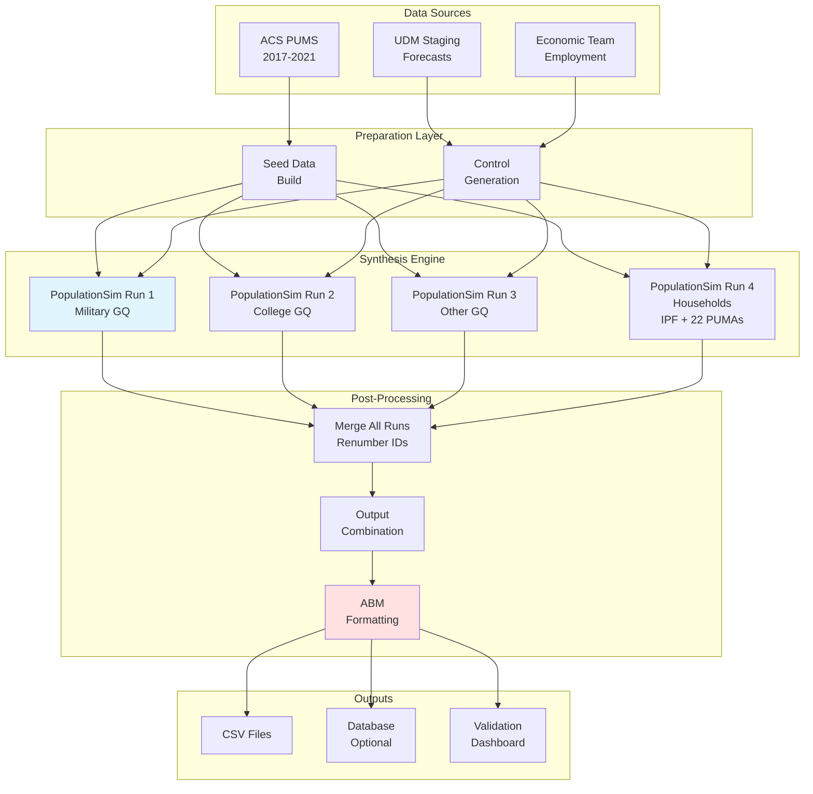
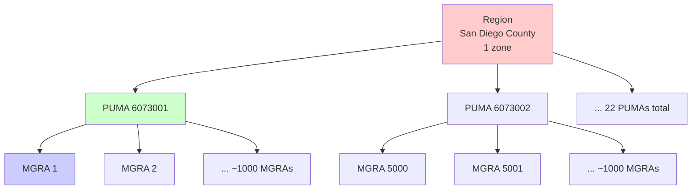
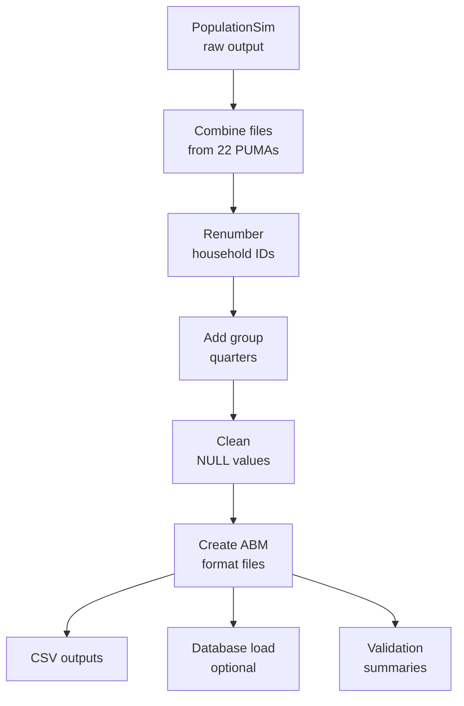

# System Overview

Understanding the architecture and key concepts of SANDAG PopulationSim.

## What is Population Synthesis?

Population synthesis translates **aggregate demographic forecasts** into **individual-level microdata**:

| Input | Process | Output |
|-------|---------|--------|
| "1,000 households in MGRA 12345" | Population Synthesis | 1,000 individual household records |
| "500 males age 25-34 in MGRA 12345" | Statistical matching | 500 individual person records |
| Aggregate totals across 56 controls | Iterative optimization | Synthetic population with detailed attributes |

**Key benefit:** Enables micro-simulation models (like ABM) while maintaining consistency with macro-level forecasts.

## System Architecture



## Key Components

### 1. Data Sources

#### ACS PUMS (American Community Survey Public Use Microdata Sample)
- **Purpose:** Seed data - actual surveyed households and persons
- **Vintage:** 2017-2021 5-year estimates
- **Coverage:** San Diego County PUMAs
- **Attributes:** 100+ demographic variables per household/person
- **Sample Size:** ~15,000 PUMS households represent ~1.2M actual households

#### UDM Staging Database
- **Purpose:** Demographic control totals (forecasts)
- **Source:** SANDAG Estimates & Forecast team
- **Years:** 2022, 2026, 2029, 2032, 2035, 2040, 2050
- **Geography:** MGRA-level (23,000 zones)
- **Variables:** Population, households, age, sex, race/ethnicity

#### Economic Controls
- **Purpose:** Employment and labor force totals
- **Source:** SANDAG Economic Team
- **File:** `data/Economic Team Region Controls.csv`
- **Variables:** Total employment, civilian workers, military

### 2. Geographic Structure

Three-level hierarchy ensures consistent aggregation:



| Level | Count | Purpose | Size |
|-------|-------|---------|------|
| **Region** | 1 | San Diego County | ~3.3M pop |
| **PUMA** | 22 | Public Use Microdata Areas | ~150K pop |
| **MGRA** | ~23,000 | Master Geographic Reference Areas | ~150 pop |

**Why hierarchy?**
- Controls can be specified at any level
- Balancing happens hierarchically (region → PUMA → MGRA)
- Ensures sub-geography totals sum to parent geography

### 3. Control Variables

56 demographic controls constrain the synthesis:

**Household Controls (18):**
- Total households (highest priority)
- Size: 1, 2, 3, 4+ persons
- Income: 7 brackets ($0-$14K to $200K+)
- Workers: 0, 1, 2, 3+
- Children: none, 1+

**Person Controls (38):**
- Sex: Male, Female
- Age: 9 brackets (0-4, 5-9, ..., 85+)
- Race/Ethnicity: 7 categories
- Employment: Workers, unemployed, not in labor force
- Labor force participation

**Group Quarters (3):**
- Military GQ
- College dorms
- Other GQ

See [Control Variables](Control-Variables) for complete list.

### 4. PopulationSim Algorithm

#### Iterative Proportional Fitting (IPF)


**Steps:**

1. **Initialize:** Each seed household starts with PUMS weight
2. **Iterate:** Adjust weights to match control totals
3. **Balance:** Ensure consistency across geographic levels
4. **Integerize:** Convert fractional weights to whole numbers
5. **Expand:** Replicate households according to integer weights

**Example:**

| Seed HH | Initial Weight | After IPF | Integerized | Replications |
|---------|----------------|-----------|-------------|--------------|
| HH001 | 15.3 | 18.7 | 19 | 19 households |
| HH002 | 8.2 | 12.3 | 12 | 12 households |
| HH003 | 12.1 | 0.4 | 0 | Not selected |

#### Constraints

PopulationSim solves an optimization problem:

**Objective:** Minimize difference between controls and results

**Constraints:**
- Each control must be matched (within tolerance)
- Higher importance controls matched more precisely
- Weights must be non-negative integers
- Geographic consistency maintained

#### Multiprocessing

```
Region balancing (single process)
   ↓
PUMA balancing (22 parallel processes)
   ↓
MGRA sub-balancing (22 parallel processes)
   ↓
Expansion (combines all results)
```

**Benefits:**
- 22x speedup for MGRA-level processing
- Each process handles ~1,000 MGRAs
- Results combine seamlessly

### 5. Group Quarters Handling

Group quarters (GQ) are handled separately from households:

```python
# GQ controls specified in settings
gq_controls:
  - gq_mil_pop    # Military
  - gq_college_pop  # College dorms
  - gq_other_pop   # Other institutional
```

**Process:**
1. Synthesis creates household population
2. GQ module samples GQ persons from seed data
3. GQ persons added to output separately
4. Total population = household pop + GQ pop

**Why separate?**
- GQ persons don't fit household structure
- Different demographic profiles (e.g., college students)
- Exact sampling used (not IPF)

### 6. Output Processing



**Transformations:**
- Household IDs: Renumbered 1, 2, 3, ... globally
- Geographic codes: Validated against crosswalk
- NULL handling: Filled with defaults or removed
- ABM format: Subset of columns, specific schema

### 7. Validation & QA

Multiple validation layers:

**Automated Checks:**
- ✅ Control totals matched within tolerance
- ✅ Household-person linkage valid
- ✅ No orphan persons
- ✅ Geographic coverage complete
- ✅ No NULL values in critical fields

**Streamlit Dashboard:**
- Interactive control comparisons
- Geographic drill-down
- Demographic visualizations
- Export validation reports

**Summary Statistics:**
- Region, PUMA, MGRA-level totals
- Percent differences calculated
- Outlier MGRAs flagged

## Workflow Execution

### Full Run Process

```mermaid
gantt
    title PopulationSim Full Run Timeline
    dateFormat mm:ss
    section Initialization
    Load config         :00:00, 1m
    Connect to database :01:00, 1m
    section Seed Data
    Create seed data    :02:00, 15m
    section Year 2022
    Generate controls   :17:00, 5m
    Run synthesis       :22:00, 25m
    Generate GQ         :47:00, 2m
    Create outputs      :49:00, 3m
    section Year 2026
    Generate controls   :52:00, 5m
    Run synthesis       :57:00, 25m
    section Continue
    ... 5 more years    :82:00, 100m
```

**Total time:** ~3-4 hours for all 7 years (first run)

### Component Responsibilities

| Component | Input | Output | Time |
|-----------|-------|--------|------|
| `build_seed_data.py` | ACS PUMS | seed_*.csv | ~15 min |
| `build_controls.py` | UDM queries | controls.csv | ~5 min |
| `run_populationsim.py` | Seed + controls | final_*.csv | ~25 min |
| `generate_gq.py` | GQ controls | GQ persons | ~2 min |
| `outputs.py` | final_*.csv | ABM/*.csv | ~3 min |
| `etl.py` | ABM/*.csv | Database | ~5 min |

## Key Design Decisions

### Why IPF?

**Advantages:**
- ✅ Statistically rigorous
- ✅ Handles multiple constraints simultaneously
- ✅ Maintains correlation structure from seed data
- ✅ Well-established methodology

**Alternatives considered:**
- ❌ Pure sampling: Doesn't guarantee control matches
- ❌ Synthetic reconstruction: Loses micro-correlations
- ❌ Agent-based generation: Computationally expensive

### Why Three Geographic Levels?

- **Region:** Ensures county-wide totals correct
- **PUMA:** Matches ACS PUMS geography (data availability)
- **MGRA:** Fine spatial resolution for ABM (TAZ assignment)

Could add intermediate levels (e.g., city, tract) but increases complexity.

### Why 22 Parallel Processes?

- Matches 22 PUMAs in San Diego County
- Each PUMA is independent after PUMA-level balancing
- Optimal for modern multi-core CPUs (16-32 cores)

### Why max_expansion_factor = 30?

Balances:
- **Diversity:** Don't over-replicate single seed households
- **Coverage:** Allow sufficient flexibility to match controls
- **Realism:** 30x replication is reasonable for rare demographics

Lower = more diversity but harder to match controls  
Higher = easier matching but less diversity

## Technology Stack

### Core Dependencies

| Package | Version | Purpose |
|---------|---------|---------|
| **populationsim** | 0.10.0 | Core synthesis engine |
| **pandas** | ≥2.2.0 | Data manipulation |
| **numpy** | Latest | Numerical operations |
| **cvxpy** | ≥1.6.5 | Optimization solver |
| **ortools** | ≥9.14 | Linear programming |
| **pyodbc** | ≥5.0.1 | Database connectivity |
| **sqlalchemy** | ≥2.0.25 | Database ORM |
| **streamlit** | ≥1.20.0 | Validation dashboard |
| **numba** | ≥0.60.0 | JIT compilation |

### Development Tools

- **uv:** Fast package manager
- **pyproject.toml:** Dependency specification
- **Git:** Version control
- **VS Code:** Recommended IDE

## Scalability Considerations

**Current scale:**
- 23,000 MGRAs
- 1.2M households
- 3.5M persons
- 56 controls
- 7 forecast years

**Could scale to:**
- ✅ More MGRAs (up to ~50K with current approach)
- ✅ More controls (up to ~100 without major changes)
- ✅ More forecast years (unlimited)
- ⚠️ Larger regions would need more PUMAs (memory constraints)

**Bottlenecks:**
- MGRA-level optimization (most time-consuming)
- Memory for 22 parallel processes
- Database query performance

## Next Steps

Now that you understand the system architecture:

1. **[Getting Started](Getting-Started)** - Run your first synthesis
2. **[Algorithm Details](Algorithm-Details)** - Deep dive into IPF methodology
3. **[Data Preparation](Data-Preparation)** - Understand data sources
4. **[Running PopulationSim](Running-PopulationSim)** - Production workflows

---

**Questions?** Check the [FAQ](FAQ) or [Troubleshooting](Troubleshooting) guide.
